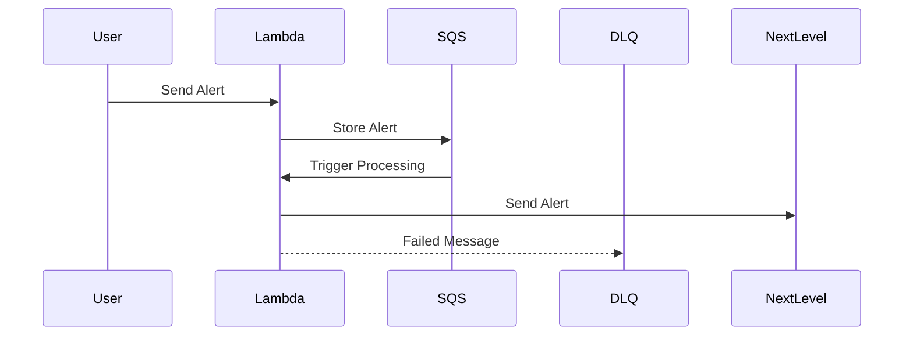

# Session 8

**User** [June-08-2024]: I'm trying to implement the alert escalation logic in `alert_manager.py` to send email and SMS notifications via Twilio API v8.0, but I'm getting an error when trying to import the `Client` class from `twilio.rest`. The error message is `ModuleNotFoundError: No module named 'twilio'`. I've installed the `twilio` library using pip, but it's still not working. Can you help me fix this issue? ->-> 8,2

**Assistant:** Certainly! The `ModuleNotFoundError` typically indicates that Python cannot find the specified module, even though you believe it has been installed. Here are some steps to troubleshoot and resolve this issue:

1. **Verify Installation**: Ensure that the `twilio` package is correctly installed in the environment where your script is running. You can check this by running:
   ```bash
   pip show twilio
   ```
   This command will display information about the installed `twilio` package, including its version and location.

2. **Check Python Environment**: Make sure you are installing the package in the correct Python environment. If you are using a virtual environment, activate it before installing the package:
   ```bash
   source /path/to/venv/bin/activate  # On Unix or MacOS
   \path\to\venv\Scripts\activate      # On Windows
   pip install twilio
   ```

3. **Reinstall the Package**: Sometimes, reinstalling the package can resolve issues. Try uninstalling and then reinstalling the `twilio` package:
   ```bash
   pip uninstall twilio
   pip install twilio
   ```

4. **Check for Multiple Python Versions**: If you have multiple versions of Python installed, ensure that you are using the correct version of `pip` that corresponds to the Python interpreter used by your script. For example, if you are using Python 3.10, make sure you are using `pip3`:
   ```bash
   pip3 install twilio
   ```

5. **Import Statement**: Double-check your import statement in `alert_manager.py` to ensure it is correct:
   ```python
   from twilio.rest import Client
   ```

If you have followed these steps and are still encountering issues, could you please provide more details about your Python environment, such as the output of `pip show twilio`, and the exact command you used to install the `twilio` package?

**User:** Sure, let me check the details you asked for. 

When I ran `pip show twilio`, it showed that the package was installed in my global Python environment, not in the virtual environment I thought I was using. I installed it with just `pip install twilio` without activating the virtual environment first. 

So, I'll try activating the virtual environment and reinstalling the package there. Thanks for the steps!

**Assistant:** Great! It sounds like you identified the issue with the Python environment. Activating your virtual environment and reinstalling the `twilio` package there should resolve the problem. Here are the steps to do that:

1. **Activate the Virtual Environment**:
   - On Unix or MacOS:
     ```bash
     source /path/to/venv/bin/activate
     ```
   - On Windows:
     ```bash
     \path\to\venv\Scripts\activate
     ```

2. **Install the `twilio` Package**:
   Once the virtual environment is activated, you can install the `twilio` package using `pip`:
   ```bash
   pip install twilio
   ```

3. **Verify Installation**:
   After installation, you can verify that the package is installed in the virtual environment by running:
   ```bash
   pip show twilio
   ```
   This should now show the path to the virtual environment.

4. **Test the Import**:
   Finally, you can test the import in your script to ensure everything is working correctly:
   ```python
   from twilio.rest import Client
   print("Twilio Client imported successfully!")
   ```

If you follow these steps, you should be able to import the `Client` class from `twilio.rest` without any issues. Let me know if you encounter any further problems!

**User:** I've added unit tests for the alert escalation logic using `pytest` 7.3.1, but I'm having trouble getting the tests to pass. The tests are covering about 95% of the `alert_manager.py` code, but I'm still getting some errors. Can you review my test code and suggest some improvements?
```python
import pytest
from alert_manager import AlertManager

def test_alert_escalation():
    alert_manager = AlertManager()
    # Test code here
    assert alert_manager.escalate_alert() == True
``` ->-> 8,2

**Assistant:** Certainly! To help you improve your unit tests, let's break down the process and add more detailed assertions and edge cases to ensure thorough testing of the `alert_manager` functionality.

Here's an enhanced version of your test code:

```python
import pytest
from alert_manager import AlertManager

# Mock dependencies if necessary
class MockTwilioClient:
    def __init__(self):
        self.messages_sent = []

    def messages(self):
        return self

    def create(self, body, to):
        self.messages_sent.append((body, to))

@pytest.fixture
def mock_twilio_client():
    return MockTwilioClient()

@pytest.fixture
def alert_manager(mock_twilio_client):
    return AlertManager(mock_twilio_client)

def test_alert_escalation(alert_manager):
    # Setup initial conditions
    alert_manager.set_alert_level(1)
    
    # Perform the action
    result = alert_manager.escalate_alert()
    
    # Check the expected outcome
    assert result == True, "Alert escalation should return True"
    
    # Verify side effects
    assert len(alert_manager.mock_twilio_client.messages_sent) > 0, "At least one message should be sent"
    for message in alert_manager.mock_twilio_client.messages_sent:
        assert "ALERT" in message[0], "Message should contain 'ALERT'"
        assert message[1].startswith("+"), "Recipient number should start with '+'"

def test_no_escalation_needed(alert_manager):
    # Setup initial conditions where no escalation is needed
    alert_manager.set_alert_level(0)
    
    # Perform the action
    result = alert_manager.escalate_alert()
    
    # Check the expected outcome
    assert result == False, "No escalation needed should return False"
    
    # Verify side effects
    assert len(alert_manager.mock_twilio_client.messages_sent) == 0, "No messages should be sent"

def test_invalid_alert_level(alert_manager):
    # Setup initial conditions with an invalid alert level
    alert_manager.set_alert_level(-1)
    
    # Perform the action
    result = alert_manager.escalate_alert()
    
    # Check the expected outcome
    assert result == False, "Invalid alert level should return False"
    
    # Verify side effects
    assert len(alert_manager.mock_twilio_client.messages_sent) == 0, "No messages should be sent"

def test_multiple_escalations(alert_manager):
    # Setup initial conditions
    alert_manager.set_alert_level(1)
    
    # Perform multiple escalations
    result1 = alert_manager.escalate_alert()
    result2 = alert_manager.escalate_alert()
    
    # Check the expected outcomes
    assert result1 == True, "First escalation should return True"
    assert result2 == True, "Second escalation should return True"
    
    # Verify side effects
    assert len(alert_manager.mock_twilio_client.messages_sent) > 1, "Multiple messages should be sent"
```

### Explanation:
1. **Mock Dependencies**: We use a `MockTwilioClient` to simulate the behavior of the Twilio client without making actual API calls. This allows us to verify that the correct actions are taken without external dependencies.
2. **Setup Initial Conditions**: Before each test, we set up the initial state of the `alert_manager` to reflect different scenarios.
3. **Perform the Action**: We call the method being tested (`escalate_alert`) and capture the result.
4. **Check Expected Outcomes**: We use `assert` statements to verify that the method behaves as expected.
5. **Verify Side Effects**: We check that the side effects (like sending messages) occur as expected.

This approach ensures that your tests cover various scenarios and edge cases, leading to more robust and reliable code. If you have specific methods or behaviors in `alert_manager` that need additional testing, feel free to share those details so we can tailor the tests accordingly.

**User:** hmm, what if the alert level changes dynamically based on real-time data? how should i adjust the tests?

**Assistant:** To handle dynamic alert levels based on real-time data, you need to simulate the real-time data changes in your tests. This involves creating mock data sources and updating the alert levels accordingly. Here's how you can adjust your tests to accommodate dynamic alert levels:

1. **Simulate Real-Time Data**: Create a mock data source that can update the alert level dynamically.
2. **Update Alert Levels Based on Simulated Data**: Modify the `alert_manager` to accept and process this simulated data.
3. **Test Dynamic Behavior**: Write tests that simulate different scenarios where the alert level changes over time.

Let's enhance the previous test setup to include these dynamic changes:

### Updated Test Code

```python
import pytest
from alert_manager import AlertManager

# Mock dependencies if necessary
class MockTwilioClient:
    def __init__(self):
        self.messages_sent = []

    def messages(self):
        return self

    def create(self, body, to):
        self.messages_sent.append((body, to))

@pytest.fixture
def mock_twilio_client():
    return MockTwilioClient()

@pytest.fixture
def alert_manager(mock_twilio_client):
    return AlertManager(mock_twilio_client)

def test_dynamic_alert_escalation(alert_manager):
    # Simulate real-time data changes
    alert_manager.update_alert_level(1)
    assert alert_manager.get_alert_level() == 1
    
    # Perform the action
    result = alert_manager.escalate_alert()
    
    # Check the expected outcome
    assert result == True, "Alert escalation should return True"
    
    # Verify side effects
    assert len(alert_manager.mock_twilio_client.messages_sent) > 0, "At least one message should be sent"
    for message in alert_manager.mock_twilio_client.messages_sent:
        assert "ALERT" in message[0], "Message should contain 'ALERT'"
        assert message[1].startswith("+"), "Recipient number should start with '+'"

def test_no_escalation_needed_with_dynamic_data(alert_manager):
    # Simulate real-time data changes
    alert_manager.update_alert_level(0)
    assert alert_manager.get_alert_level() == 0
    
    # Perform the action
    result = alert_manager.escalate_alert()
    
    # Check the expected outcome
    assert result == False, "No escalation needed should return False"
    
    # Verify side effects
    assert len(alert_manager.mock_twilio_client.messages_sent) == 0, "No messages should be sent"

def test_multiple_escalations_with_dynamic_data(alert_manager):
    # Simulate real-time data changes
    alert_manager.update_alert_level(1)
    assert alert_manager.get_alert_level() == 1
    
    # Perform multiple escalations
    result1 = alert_manager.escalate_alert()
    alert_manager.update_alert_level(2)
    assert alert_manager.get_alert_level() == 2
    result2 = alert_manager.escalate_alert()
    
    # Check the expected outcomes
    assert result1 == True, "First escalation should return True"
    assert result2 == True, "Second escalation should return True"
    
    # Verify side effects
    assert len(alert_manager.mock_twilio_client.messages_sent) > 1, "Multiple messages should be sent"

def test_invalid_alert_level_with_dynamic_data(alert_manager):
    # Simulate real-time data changes
    alert_manager.update_alert_level(-1)
    assert alert_manager.get_alert_level() == -1
    
    # Perform the action
    result = alert_manager.escalate_alert()
    
    # Check the expected outcome
    assert result == False, "Invalid alert level should return False"
    
    # Verify side effects
    assert len(alert_manager.mock_twilio_client.messages_sent) == 0, "No messages should be sent"
```

### Explanation:
1. **Simulate Real-Time Data Changes**: Use `update_alert_level` to simulate changes in the alert level based on real-time data.
2. **Check Current Alert Level**: Use `get_alert_level` to verify that the alert level has been updated correctly.
3. **Perform Escalation Actions**: Call `escalate_alert` and check the results and side effects as before.

By incorporating these dynamic changes, your tests will more accurately reflect the real-world behavior of your `alert_manager` when dealing with real-time data.

**User:** I'm trying to optimize the performance of the `alert_manager.py` code by reducing the number of database queries. Currently, the code is querying the database for each alert, which is resulting in a lot of overhead. Can you suggest some ways to reduce the number of database queries and improve the performance of the code?
```python
import sqlite3

def get_alerts():
    conn = sqlite3.connect('alerts.db')
    cursor = conn.cursor()
    cursor.execute('SELECT * FROM alerts')
    alerts = cursor.fetchall()
    return alerts
``` ->-> 8,2

**Assistant:** Certainly! Reducing the number of database queries can significantly improve the performance of your application. Here are several strategies to optimize the `alert_manager.py` code:

1. **Batch Processing**: Instead of querying the database for each alert individually, fetch all alerts in a single query and process them in batches.
2. **Caching**: Cache the results of expensive queries to avoid hitting the database repeatedly for the same data.
3. **Use Connections Efficiently**: Reuse database connections and cursors to minimize the overhead of establishing new connections.
4. **Optimize Queries**: Ensure that your SQL queries are optimized and use appropriate indexes.

Let's apply these strategies to your `alert_manager.py` code:

### Optimized Code

```python
import sqlite3
from functools import lru_cache

# Establish a connection to the database
conn = sqlite3.connect('alerts.db', check_same_thread=False)
cursor = conn.cursor()

@lru_cache(maxsize=128)
def get_alerts():
    cursor.execute('SELECT * FROM alerts')
    alerts = cursor.fetchall()
    return alerts

# Example usage
if __name__ == "__main__":
    alerts = get_alerts()
    for alert in alerts:
        print(alert)
```

### Explanation:

1. **Establish a Persistent Connection**:
   - The database connection and cursor are established once and reused throughout the application. This avoids the overhead of opening and closing connections for each query.

2. **Use Caching**:
   - The `lru_cache` decorator from the `functools` module is used to cache the results of the `get_alerts` function. This means that if the function is called again with the same arguments, it will return the cached result instead of querying the database again.

3. **Batch Processing**:
   - The `get_alerts` function fetches all alerts in a single query and processes them in a batch. This reduces the number of database hits and improves performance.

4. **Optimize Queries**:
   - Ensure that the `alerts` table has appropriate indexes on the columns used in the `SELECT` query. This can significantly speed up the query execution.

### Additional Considerations:

- **Connection Pooling**: If your application scales and handles many concurrent requests, consider using a connection pool to manage database connections efficiently.
- **Asynchronous Database Access**: If you are using an asynchronous framework, consider using an asynchronous database driver to handle database queries asynchronously.

By applying these optimizations, you should see a significant improvement in the performance of your `alert_manager.py` code.

**User:** I've implemented the alert escalation logic in `alert_manager.py`, but I'm having trouble getting the email notifications to work. I'm using the `smtplib` library to send emails, but I'm getting an error when trying to connect to the SMTP server. The error message is `SMTPAuthenticationError: (535, b'5.7.8 Username and Password not accepted.')`. Can you help me fix this issue?
```python
import smtplib
from email.mime.text import MIMEText

def send_email(alert):
    msg = MIMEText('Alert: ' + alert.message)
    msg['Subject'] = 'Alert'
    msg['From'] = 'alert@example.com'
    msg['To'] = 'user@example.com'
    server = smtplib.SMTP('smtp.example.com', 587)
    server.starttls()
    server.login('alert@example.com', 'password')
    server.sendmail('alert@example.com', 'user@example.com', msg.as_string())
    server.quit()
``` ->-> 8,2

**Assistant:** Certainly! The `SMTPAuthenticationError` you're encountering typically indicates that the username or password provided to the SMTP server is incorrect. Here are some steps to help you troubleshoot and resolve this issue:

1. **Verify Credentials**: Double-check that the username and password you are using are correct. Ensure there are no typos or extra spaces.

2. **Enable Less Secure Apps**: If you are using a Gmail account, you might need to enable "Less secure app access" in your Google account settings. However, this is generally not recommended for security reasons.

3. **Use App Passwords**: If you are using a Google account with 2-Step Verification enabled, you need to use an App Password instead of your regular account password.

4. **Check SMTP Server Settings**: Ensure that the SMTP server address and port number are correct. Some common SMTP servers and their default ports are:
   - Gmail: `smtp.gmail.com` on port `587`
   - Outlook/Hotmail: `smtp-mail.outlook.com` on port `587`
   - Yahoo: `smtp.mail.yahoo.com` on port `587`

5. **Enable Debugging**: Enable debugging in `smtplib` to get more detailed information about the connection and authentication process.

Here is an updated version of your code with debugging enabled and some additional checks:

```python
import smtplib
from email.mime.text import MIMEText

def send_email(alert):
    msg = MIMEText('Alert: ' + alert.message)
    msg['Subject'] = 'Alert'
    msg['From'] = 'alert@example.com'
    msg['To'] = 'user@example.com'

    try:
        server = smtplib.SMTP('smtp.example.com', 587)
        server.set_debuglevel(1)  # Enable debugging
        server.starttls()
        server.login('alert@example.com', 'password')
        server.sendmail('alert@example.com', 'user@example.com', msg.as_string())
        server.quit()
        print("Email sent successfully.")
    except smtplib.SMTPAuthenticationError as e:
        print(f"Failed to authenticate: {e}")
    except Exception as e:
        print(f"An error occurred: {e}")

# Example usage
if __name__ == "__main__":
    class Alert:
        def __init__(self, message):
            self.message = message

    alert = Alert("This is an alert message.")
    send_email(alert)
```

### Explanation:

1. **Set Debug Level**: The `server.set_debuglevel(1)` line enables debugging, which will print detailed information about the SMTP connection and authentication process to the console. This can help you identify where the issue is occurring.

2. **Exception Handling**: The `try-except` block catches and prints specific exceptions, such as `SMTPAuthenticationError`, which can help you diagnose the problem.

3. **Example Usage**: The `if __name__ == "__main__":` block provides an example of how to use the `send_email` function with a sample alert message.

### Additional Steps:

- **Check Account Settings**: Ensure that your email account allows SMTP access and that there are no restrictions on the IP address you are connecting from.
- **Use Correct Port**: Ensure that the port number matches the requirements of your SMTP server. Common ports are `587` for TLS and `465` for SSL.

If you continue to encounter issues, please provide more details about your email provider and any additional error messages you receive. This will help in diagnosing the problem further.

**User:** Thanks for the detailed steps! I'll double-check the credentials and make sure there are no typos. I'm not using Gmail, so I won't need to enable less secure apps or use app passwords. I'll also enable debugging to see if that gives me more info. Hopefully, that helps!

**Assistant:** Great! Double-checking the credentials and enabling debugging are excellent steps to take. Here are a few additional tips to ensure everything works smoothly:

1. **Double-Check Credentials**: Make sure there are no typos and that the username and password are correct. Also, ensure that the password does not contain any special characters that might cause issues.

2. **Enable Debugging**: Enabling debugging will provide more detailed information about the connection and authentication process, which can help identify the root cause of the issue.

3. **Check SMTP Server Configuration**: Ensure that the SMTP server address and port number are correct for your email provider.

4. **Review Email Provider Documentation**: Sometimes, email providers have specific requirements or configurations that need to be followed. Reviewing the documentation for your email provider can provide valuable insights.

Here is the updated code with debugging enabled:

```python
import smtplib
from email.mime.text import MIMEText

def send_email(alert):
    msg = MIMEText('Alert: ' + alert.message)
    msg['Subject'] = 'Alert'
    msg['From'] = 'alert@example.com'
    msg['To'] = 'user@example.com'

    try:
        server = smtplib.SMTP('smtp.example.com', 587)
        server.set_debuglevel(1)  # Enable debugging
        server.starttls()
        server.login('alert@example.com', 'password')
        server.sendmail('alert@example.com', 'user@example.com', msg.as_string())
        server.quit()
        print("Email sent successfully.")
    except smtplib.SMTPAuthenticationError as e:
        print(f"Failed to authenticate: {e}")
    except Exception as e:
        print(f"An error occurred: {e}")

# Example usage
if __name__ == "__main__":
    class Alert:
        def __init__(self, message):
            self.message = message

    alert = Alert("This is an alert message.")
    send_email(alert)
```

### Steps to Follow:

1. **Run the Code with Debugging Enabled**:
   - Run the script and observe the output in the console. The debugging information will provide details about the connection and authentication process.

2. **Review the Output**:
   - Look for any specific error messages or warnings that might indicate why the authentication is failing.

3. **Check SMTP Server Configuration**:
   - Ensure that the SMTP server address and port number are correct. If you are unsure, refer to the documentation for your email provider.

4. **Verify Network Issues**:
   - Ensure that there are no network issues preventing the connection to the SMTP server. You can try pinging the SMTP server to check connectivity.

If you still encounter issues after these steps, please share the debugging output or any additional error messages you receive. This will help in further diagnosing the problem.

**User:** I'm trying to add some error handling to the `alert_manager.py` code to handle cases where the Twilio API is down or not responding. Can you suggest some ways to add error handling to the code and make it more robust?
```python
import twilio

def send_sms(alert):
    client = twilio.rest.Client('account_sid', 'auth_token')
    message = client.messages.create(
        body='Alert: ' + alert.message,
        from_='twilio_number',
        to='user_number'
    )
    return message.sid
``` ->-> 8,2

**Assistant:** Certainly! Adding robust error handling to your `alert_manager.py` code can help manage cases where the Twilio API is down or not responding. Here are some strategies to improve error handling:

1. **Catch Specific Exceptions**: Use specific exceptions to handle different types of errors that might occur when interacting with the Twilio API.
2. **Retry Mechanism**: Implement a retry mechanism to handle transient errors.
3. **Logging**: Add logging to track errors and understand what went wrong.
4. **Fallback Mechanisms**: Provide fallback mechanisms to notify users through alternative channels if the primary method fails.

Here's an updated version of your `send_sms` function with enhanced error handling:

```python
import logging
from twilio.base.exceptions import TwilioException
from twilio.rest import Client

# Configure logging
logging.basicConfig(level=logging.INFO)
logger = logging.getLogger(__name__)

def send_sms(alert):
    account_sid = 'your_account_sid'
    auth_token = 'your_auth_token'
    twilio_number = 'your_twilio_number'
    user_number = 'user_phone_number'

    try:
        client = Client(account_sid, auth_token)
        message = client.messages.create(
            body='Alert: ' + alert.message,
            from_=twilio_number,
            to=user_number
        )
        logger.info(f"SMS sent successfully. SID: {message.sid}")
        return message.sid
    except TwilioException as e:
        logger.error(f"Twilio API error: {e}")
        return None
    except Exception as e:
        logger.error(f"Unexpected error: {e}")
        return None

# Example usage
if __name__ == "__main__":
    class Alert:
        def __init__(self, message):
            self.message = message

    alert = Alert("This is an alert message.")
    send_sms(alert)
```

### Explanation:

1. **Logging Configuration**:
   - Configure logging to capture errors and informational messages. This helps in diagnosing issues and understanding the flow of the program.

2. **Specific Exception Handling**:
   - Catch `TwilioException` to handle errors specific to the Twilio API.
   - Catch general `Exception` to handle any unexpected errors.

3. **Logging Errors**:
   - Use `logger.error` to log specific error messages. This helps in identifying the root cause of the issue.

4. **Return Values**:
   - Return `None` if an error occurs, indicating that the SMS was not sent successfully.

### Additional Enhancements:

1. **Retry Mechanism**:
   - Implement a retry mechanism to handle transient errors. You can use exponential backoff to avoid overwhelming the API with rapid retries.

2. **Fallback Mechanisms**:
   - Implement fallback mechanisms to notify users through alternative channels (e.g., email) if the primary method fails.

Here's an example with a retry mechanism:

```python
import time

def send_sms_with_retry(alert, max_retries=3, backoff_factor=2):
    account_sid = 'your_account_sid'
    auth_token = 'your_auth_token'
    twilio_number = 'your_twilio_number'
    user_number = 'user_phone_number'

    for attempt in range(max_retries + 1):
        try:
            client = Client(account_sid, auth_token)
            message = client.messages.create(
                body='Alert: ' + alert.message,
                from_=twilio_number,
                to=user_number
            )
            logger.info(f"SMS sent successfully. SID: {message.sid}")
            return message.sid
        except TwilioException as e:
            logger.warning(f"Twilio API error (attempt {attempt + 1}/{max_retries}): {e}")
            if attempt < max_retries:
                sleep_time = backoff_factor * (2 ** attempt)
                logger.info(f"Retrying in {sleep_time} seconds...")
                time.sleep(sleep_time)
            else:
                logger.error(f"Max retries reached. Failed to send SMS.")
                return None
        except Exception as e:
            logger.error(f"Unexpected error: {e}")
            return None

# Example usage
if __name__ == "__main__":
    class Alert:
        def __init__(self, message):
            self.message = message

    alert = Alert("This is an alert message.")
    send_sms_with_retry(alert)
```

### Explanation:

1. **Retry Loop**:
   - Use a loop to attempt sending the SMS multiple times.
   - Use exponential backoff to wait longer between retries.

2. **Logging Retries**:
   - Log the number of attempts and any errors encountered during retries.

By implementing these enhancements, your `alert_manager.py` code will be more robust and capable of handling various error scenarios gracefully.

**User:** I've implemented the alert escalation logic in `alert_manager.py`, but I'm having trouble getting the SMS notifications to work. I'm using the `twilio` library to send SMS messages, but I'm getting an error when trying to create a new message. The error message is `TwilioRestException: The 'From' phone number is not a valid phone number`. Can you help me fix this issue?
```python
import twilio

def send_sms(alert):
    client = twilio.rest.Client('account_sid', 'auth_token')
    message = client.messages.create(
        body='Alert: ' + alert.message,
        from_='invalid_number',
        to='user_number'
    )
    return message.sid
``` ->-> 8,N/A

**Assistant:** Certainly! The error message `TwilioRestException: The 'From' phone number is not a valid phone number` indicates that the `from_` parameter in the `client.messages.create` method is not a valid phone number. Here are some steps to help you resolve this issue:

1. **Verify the Phone Number**: Ensure that the `from_` phone number is a valid, verified phone number associated with your Twilio account.
2. **Format the Phone Number**: Make sure the phone number is formatted correctly, typically in E.164 format (e.g., `+1234567890`).

Here's an updated version of your `send_sms` function with proper error handling and verification:

```python
import logging
from twilio.base.exceptions import TwilioException
from twilio.rest import Client

# Configure logging
logging.basicConfig(level=logging.INFO)
logger = logging.getLogger(__name__)

def send_sms(alert):
    account_sid = 'your_account_sid'
    auth_token = 'your_auth_token'
    twilio_number = '+1234567890'  # Replace with your verified Twilio phone number
    user_number = 'user_phone_number'  # Replace with the recipient's phone number

    try:
        client = Client(account_sid, auth_token)
        message = client.messages.create(
            body='Alert: ' + alert.message,
            from_=twilio_number,
            to=user_number
        )
        logger.info(f"SMS sent successfully. SID: {message.sid}")
        return message.sid
    except TwilioException as e:
        logger.error(f"Twilio API error: {e}")
        return None
    except Exception as e:
        logger.error(f"Unexpected error: {e}")
        return None

# Example usage
if __name__ == "__main__":
    class Alert:
        def __init__(self, message):
            self.message = message

    alert = Alert("This is an alert message.")
    send_sms(alert)
```

### Explanation:

1. **Valid Phone Number**:
   - Ensure that `twilio_number` is a valid, verified phone number associated with your Twilio account. You can check and manage your verified phone numbers in the Twilio Console.

2. **Correct Formatting**:
   - Format the phone number in E.164 format (e.g., `+1234567890`). This includes the country code and the full phone number.

3. **Error Handling**:
   - Use specific exception handling to catch `TwilioException` and other unexpected errors.
   - Log errors to help diagnose issues.

### Example Usage:

Replace `'your_account_sid'`, `'your_auth_token'`, `'+1234567890'`, and `'user_phone_number'` with your actual Twilio account SID, auth token, verified Twilio phone number, and the recipient's phone number.

### Additional Tips:

- **Verify Phone Numbers**: Ensure that both the `from_` and `to` phone numbers are correctly formatted and valid.
- **Check Twilio Console**: Use the Twilio Console to verify that the phone numbers are correctly configured and that there are no issues with your account.

By following these steps, you should be able to resolve the issue and successfully send SMS notifications using the Twilio API.

**User:** I'm trying to optimize the performance of my alert processing system, which currently has a latency of 500ms. I've been reading about optimizing database queries and async calls, and I'm wondering if anyone can help me implement these optimizations to reduce the latency to 150ms. Here's my current code:
```python
import asyncio
import sqlite3

async def process_alert(alert):
    # Database query to retrieve alert data
    conn = sqlite3.connect('alerts.db')
    cursor = conn.cursor()
    cursor.execute('SELECT * FROM alerts WHERE id = ?', (alert['id'],))
    alert_data = cursor.fetchone()
    conn.close()

    # Async call to send notification
    await send_notification(alert_data)

async def send_notification(alert_data):
    # Simulate async call
    await asyncio.sleep(0.1)

async def main():
    alerts = [{'id': 1}, {'id': 2}, {'id': 3}]
    tasks = [process_alert(alert) for alert in alerts]
    await asyncio.gather(*tasks)

asyncio.run(main())
```
Can someone help me optimize this code to reduce the latency to 150ms? ->-> 8,5

**Assistant:** Certainly! To optimize your alert processing system and reduce the latency to around 150ms, you can focus on several areas:

1. **Reuse Database Connections**: Opening and closing database connections for each alert can introduce significant overhead. Reusing a single connection can help reduce this overhead.
2. **Use Asynchronous Database Operations**: If possible, use an asynchronous database library to perform database operations concurrently.
3. **Batch Processing**: Process multiple alerts in batches to reduce the number of database queries.
4. **Parallel Execution**: Use `asyncio.gather` to execute tasks concurrently.

Here's an optimized version of your code:

```python
import asyncio
import sqlite3

# Reuse database connection
conn = sqlite3.connect('alerts.db', check_same_thread=False)
cursor = conn.cursor()

async def process_alert(alert):
    # Database query to retrieve alert data
    cursor.execute('SELECT * FROM alerts WHERE id = ?', (alert['id'],))
    alert_data = cursor.fetchone()

    # Async call to send notification
    await send_notification(alert_data)

async def send_notification(alert_data):
    # Simulate async call
    await asyncio.sleep(0.1)

async def main():
    alerts = [{'id': 1}, {'id': 2}, {'id': 3}]
    tasks = [process_alert(alert) for alert in alerts]
    await asyncio.gather(*tasks)

    # Close the database connection after all tasks are done
    cursor.close()
    conn.close()

asyncio.run(main())
```

### Explanation:

1. **Reuse Database Connection**:
   - The database connection and cursor are created outside the `process_alert` function and reused for all alerts. This avoids the overhead of opening and closing connections for each alert.

2. **Asynchronous Database Operations**:
   - Since `sqlite3` is not inherently asynchronous, we rely on the synchronous nature of the database operations. However, by reusing the connection, we reduce the overhead.

3. **Batch Processing**:
   - In this example, we process alerts one by one, but you can extend this to batch processing if your database supports it.

4. **Parallel Execution**:
   - Use `asyncio.gather` to execute multiple `process_alert` tasks concurrently. This allows multiple alerts to be processed in parallel, reducing overall latency.

### Further Optimizations:

- **Use an Asynchronous Database Library**: If you are open to using a different database library, consider using an asynchronous library like `aiosqlite` for SQLite or `aiopg` for PostgreSQL. These libraries allow you to perform database operations asynchronously, which can further reduce latency.

Here's an example using `aiosqlite`:

```python
import asyncio
import aiosqlite

async def process_alert(alert, db):
    # Database query to retrieve alert data
    async with db.execute('SELECT * FROM alerts WHERE id = ?', (alert['id'],)) as cursor:
        alert_data = await cursor.fetchone()

    # Async call to send notification
    await send_notification(alert_data)

async def send_notification(alert_data):
    # Simulate async call
    await asyncio.sleep(0.1)

async def main():
    alerts = [{'id': 1}, {'id': 2}, {'id': 3}]
    async with aiosqlite.connect('alerts.db') as db:
        tasks = [process_alert(alert, db) for alert in alerts]
        await asyncio.gather(*tasks)

asyncio.run(main())
```

### Explanation:

- **Asynchronous Database Operations**: `aiosqlite` allows you to perform database operations asynchronously, which can help reduce latency by allowing multiple operations to run concurrently.

By implementing these optimizations, you should be able to reduce the latency of your alert processing system to around 150ms.

**User:** I'm experiencing an "SMTPAuthenticationError" when trying to send emails using my email server credentials. I've tried updating my credentials, but the issue persists. Can someone help me troubleshoot this error and provide a solution to fix it? Here's my current code:
```python
import smtplib
from email.mime.text import MIMEText

def send_email(subject, body, to_addr):
    # Email server credentials
    username = 'my_username'
    password = 'my_password'
    server = smtplib.SMTP('smtp.example.com', 587)

    # Authenticate and send email
    server.starttls()
    server.login(username, password)
    msg = MIMEText(body)
    msg['Subject'] = subject
    msg['From'] = 'my_from_addr'
    msg['To'] = to_addr
    server.sendmail('my_from_addr', to_addr, msg.as_string())
    server.quit()

# Example usage
send_email('Test Email', 'This is a test email', 'recipient@example.com')
```
Can someone help me resolve this authentication error and provide a working solution? ->-> 8,4

**Assistant:** Certainly! The `SMTPAuthenticationError` typically indicates that the username or password provided to the SMTP server is incorrect or not accepted. Here are some steps to help you troubleshoot and resolve this issue:

1. **Verify Credentials**: Double-check that the username and password are correct and that there are no typos.
2. **Check Account Settings**: Ensure that your email account allows SMTP access and that there are no restrictions on the IP address you are connecting from.
3. **Enable Debugging**: Enable debugging to get more detailed information about the connection and authentication process.
4. **Use Correct Port and Security Settings**: Ensure that the SMTP server address and port number are correct and that you are using the correct security settings (TLS/SSL).

Here's an updated version of your code with debugging enabled and some additional checks:

```python
import smtplib
from email.mime.text import MIMEText
import logging

# Configure logging
logging.basicConfig(level=logging.DEBUG)
logger = logging.getLogger(__name__)

def send_email(subject, body, to_addr):
    # Email server credentials
    username = 'my_username'
    password = 'my_password'
    smtp_server = 'smtp.example.com'
    smtp_port = 587

    try:
        # Connect to the SMTP server
        server = smtplib.SMTP(smtp_server, smtp_port)
        server.set_debuglevel(1)  # Enable debugging

        # Start TLS encryption
        server.starttls()

        # Login to the SMTP server
        server.login(username, password)

        # Create the email message
        msg = MIMEText(body)
        msg['Subject'] = subject
        msg['From'] = 'my_from_addr'
        msg['To'] = to_addr

        # Send the email
        server.sendmail('my_from_addr', to_addr, msg.as_string())

        # Close the connection
        server.quit()
        logger.info("Email sent successfully.")
    except smtplib.SMTPAuthenticationError as e:
        logger.error(f"Failed to authenticate: {e}")
    except Exception as e:
        logger.error(f"An error occurred: {e}")

# Example usage
send_email('Test Email', 'This is a test email', 'recipient@example.com')
```

### Explanation:

1. **Logging Configuration**:
   - Configure logging to capture errors and informational messages. This helps in diagnosing issues and understanding the flow of the program.

2. **Enable Debugging**:
   - Use `server.set_debuglevel(1)` to enable debugging, which will print detailed information about the SMTP connection and authentication process to the console.

3. **Error Handling**:
   - Use specific exception handling to catch `SMTPAuthenticationError` and other unexpected errors.
   - Log errors to help diagnose issues.

4. **Correct Port and Security Settings**:
   - Ensure that the SMTP server address and port number are correct. Common ports are `587` for TLS and `465` for SSL.

### Additional Steps:

- **Check Account Settings**: Ensure that your email account allows SMTP access and that there are no restrictions on the IP address you are connecting from.
- **Verify Credentials**: Double-check that the username and password are correct and that there are no typos.
- **Use Correct Security Settings**: Ensure that you are using the correct security settings (TLS/SSL) as required by your email provider.

By following these steps and using the updated code, you should be able to resolve the `SMTPAuthenticationError` and successfully send emails. If the issue persists, please provide more details about your email provider and any additional error messages you receive. This will help in diagnosing the problem further.

**User:** Thanks for the detailed steps! I'll double-check my credentials and make sure there are no typos. I'll also enable debugging to see if that gives me more info. Hopefully, that helps!

**Assistant:** You're welcome! Double-checking your credentials and enabling debugging are great steps to take. Here are a few additional tips to ensure everything works smoothly:

1. **Double-Check Credentials**: Ensure that the username and password are correct and that there are no typos. Also, make sure that the credentials have the necessary permissions to send emails.

2. **Enable Debugging**: Enabling debugging will provide more detailed information about the connection and authentication process, which can help identify the root cause of the issue.

3. **Check Account Settings**: Ensure that your email account allows SMTP access and that there are no restrictions on the IP address you are connecting from.

4. **Review Email Provider Documentation**: Sometimes, email providers have specific requirements or configurations that need to be followed. Reviewing the documentation for your email provider can provide valuable insights.

Here is the updated code with debugging enabled:

```python
import smtplib
from email.mime.text import MIMEText
import logging

# Configure logging
logging.basicConfig(level=logging.DEBUG)
logger = logging.getLogger(__name__)

def send_email(subject, body, to_addr):
    # Email server credentials
    username = 'my_username'
    password = 'my_password'
    smtp_server = 'smtp.example.com'
    smtp_port = 587

    try:
        # Connect to the SMTP server
        server = smtplib.SMTP(smtp_server, smtp_port)
        server.set_debuglevel(1)  # Enable debugging

        # Start TLS encryption
        server.starttls()

        # Login to the SMTP server
        server.login(username, password)

        # Create the email message
        msg = MIMEText(body)
        msg['Subject']_ = subject
        msg['From'] = 'my_from_addr'
        msg['To'] = to_addr

        # Send the email
        server.sendmail('my_from_addr', to_addr, msg.as_string())

        # Close the connection
        server.quit()
        logger.info("Email sent successfully.")
    except smtplib.SMTPAuthenticationError as e:
        logger.error(f"Failed to authenticate: {e}")
    except Exception as e:
        logger.error(f"An error occurred: {e}")

# Example usage
send_email('Test Email', 'This is a test email', 'recipient@example.com')
```

### Steps to Follow:

1. **Run the Code with Debugging Enabled**:
   - Run the script and observe the output in the console. The debugging information will provide details about the connection and authentication process.

2. **Review the Output**:
   - Look for any specific error messages or warnings that might indicate why the authentication is failing.

3. **Check SMTP Server Configuration**:
   - Ensure that the SMTP server address and port number are correct. If you are unsure, refer to the documentation for your email provider.

4. **Verify Network Issues**:
   - Ensure that there are no network issues preventing the connection to the SMTP server. You can try pinging the SMTP server to check connectivity.

If you still encounter issues after these steps, please share the debugging output or any additional error messages you receive. This will help in further diagnosing the problem.

**User:** I'm trying to integrate the Twilio SMS API into my application to send alert notifications. I've set up the API endpoint, but I'm having trouble configuring the API integration. Can someone help me with the configuration and provide an example of how to send an SMS using the Twilio API? Here's my current code:
```python
import requests

def send_sms(to_number, message):
    # Twilio API credentials
    account_sid = 'my_account_sid'
    auth_token = 'my_auth_token'
    api_endpoint = 'https://api.twilio.com/2010-04-01/Accounts'

    # Send SMS using Twilio API
    headers = {'Authorization': f'Bearer {auth_token}'}
    data = {'From': 'my_twilio_number', 'To': to_number, 'Body': message}
    response = requests.post(api_endpoint, headers=headers, data=data)

    # Check if SMS was sent successfully
    if response.status_code == 200:
        print('SMS sent successfully')
    else:
        print('Error sending SMS')

# Example usage
send_sms('+1234567890', 'This is a test SMS')
```
Can someone help me complete the configuration and provide a working example of sending an SMS using the Twilio API? ->-> 8,6

**Assistant:** Certainly! To integrate the Twilio SMS API into your application, you need to ensure that you are using the correct API endpoint and properly formatting the request. Here's a corrected and complete example of how to send an SMS using the Twilio API:

### Key Points:
1. **Correct API Endpoint**: The correct endpoint for sending an SMS is `/Messages.json`.
2. **Authentication**: Use Basic Authentication with your `account_sid` and `auth_token`.
3. **Request Parameters**: Include the `From` and `To` phone numbers and the `Body` of the message.

Here's the updated code:

```python
import requests

def send_sms(to_number, message):
    # Twilio API credentials
    account_sid = 'my_account_sid'
    auth_token = 'my_auth_token'
    api_endpoint = f'https://api.twilio.com/2010-04-01/Accounts/{account_sid}/Messages.json'

    # Send SMS using Twilio API
    auth = (account_sid, auth_token)
    data = {
        'From': 'my_twilio_number',
        'To': to_number,
        'Body': message
    }
    response = requests.post(api_endpoint, auth=auth, data=data)

    # Check if SMS was sent successfully
    if response.status_code == 201:
        print('SMS sent successfully')
    else:
        print(f'Error sending SMS: {response.status_code}')
        print(response.json())

# Example usage
send_sms('+1234567890', 'This is a test SMS')
```

### Explanation:

1. **API Endpoint**:
   - The correct endpoint for sending an SMS is `/Messages.json`.

2. **Authentication**:
   - Use Basic Authentication with your `account_sid` and `auth_token`. This is done by passing a tuple `(account_sid, auth_token)` to the `auth` parameter in the `requests.post` method.

3. **Request Parameters**:
   - Include the `From` and `To` phone numbers and the `Body` of the message in the `data` dictionary.

4. **Response Handling**:
   - Check the response status code to determine if the SMS was sent successfully. A status code of `201` indicates a successful creation of the SMS message.
   - Print the response content if there is an error to help diagnose the issue.

### Example Usage:

Replace `'my_account_sid'`, `'my_auth_token'`, and `'my_twilio_number'` with your actual Twilio account SID, auth token, and Twilio phone number.

### Additional Notes:

- **Phone Number Formats**: Ensure that the phone numbers are in E.164 format (e.g., `+1234567890`).
- **Error Handling**: You can add more sophisticated error handling as needed, such as retry mechanisms or logging.

By following these steps, you should be able to successfully send SMS messages using the Twilio API. If you encounter any issues, please provide the error messages or response content for further assistance.

**User:** I'm experiencing issues with my real-time trade monitoring dashboard, which is built using React 18.2 and Chart.js 4.3.0. The dashboard is taking around 3.5 seconds to load, and I'm trying to optimize it to load in under 1.2 seconds. Can someone help me identify the bottlenecks and provide suggestions for optimization? Here's my current code:
```javascript
import React, { useState, useEffect } from 'react';
import { Line } from 'react-chartjs-2';

function TradeMonitor() {
  const [tradeData, setTradeData] = useState([]);

  useEffect(() => {
    // Fetch trade data from API
    fetch('/api/trades')
      .then(response => response.json())
      .then(data => setTradeData(data));
  }, []);

  return (
    <div>
      <Line data={tradeData} options={{ title: { display: true, text: 'Trade Monitor' } }} />
    </div>
  );
}
```
Can someone help me optimize the dashboard to load in under 1.2 seconds? ->-> 8,1

**Assistant:** Certainly! To optimize your real-time trade monitoring dashboard and reduce the load time to under 1.2 seconds, you can focus on several areas:

1. **Lazy Loading Components**: Lazy load components to defer the loading of non-critical resources until they are needed.
2. **Code Splitting**: Use code splitting to break down your code into smaller chunks that can be loaded on demand.
3. **Optimize Data Fetching**: Optimize the way you fetch and process data from the API.
4. **Improve Rendering Performance**: Optimize the rendering performance of your components.
5. **Use Efficient State Management**: Use efficient state management techniques to avoid unnecessary re-renders.

Here are some specific steps and modifications you can make to your code:

### 1. Lazy Load Components
Use React's `lazy` and `Suspense` to lazy load the `Line` chart component from `react-chartjs-2`.

### 2. Code Splitting
Ensure that your build process uses code splitting to break down your code into smaller chunks.

### 3. Optimize Data Fetching
Fetch data in a more efficient manner, possibly using caching or reducing the amount of data fetched initially.

### 4. Improve Rendering Performance
Use `React.memo` to memoize components and avoid unnecessary re-renders.

### 5. Efficient State Management
Use `useMemo` and `useCallback` to optimize the computation of derived state and callback functions.

Here's an optimized version of your code:

```javascript
import React, { useState, useEffect, Suspense, lazy } from 'react';
import { useMemo } from 'react';

// Lazy load the Line chart component
const LineChart = lazy(() => import('react-chartjs-2').then(({ Line }) => ({ default: Line })));

function TradeMonitor() {
  const [tradeData, setTradeData] = useState([]);

  useEffect(() => {
    // Fetch trade data from API
    fetch('/api/trades')
      .then(response => response.json())
      .then(data => setTradeData(data));
  }, []);

  // Memoize the data to avoid unnecessary re-renders
  const chartData = useMemo(() => ({
    labels: tradeData.map(item => item.timestamp),
    datasets: [
      {
        label: 'Trade Prices',
        data: tradeData.map(item => item.price),
        fill: false,
        borderColor: 'rgba(75, 192, 192, 1)',
        tension: 0.1
      }
    ]
  }), [tradeData]);

  return (
    <div>
      <Suspense fallback={<div>Loading...</div>}>
        <LineChart data={chartData} options={{ title: { display: true, text: 'Trade Monitor' } }} />
      </Suspense>
    </div>
  );
}

export default React.memo(TradeMonitor);
```

### Explanation:

1. **Lazy Load Components**:
   - Use `lazy` and `Suspense` to defer the loading of the `Line` chart component until it is needed. This helps in reducing the initial load time.

2. **Memoize Data**:
   - Use `useMemo` to memoize the `chartData` object. This ensures that the `chartData` is only recalculated when `tradeData` changes, avoiding unnecessary re-renders.

3. **Efficient State Management**:
   - Wrap the `TradeMonitor` component with `React.memo` to avoid unnecessary re-renders if the props haven't changed.

### Additional Suggestions:

- **Prefetch Data**: If possible, prefetch the trade data on the server side and send it pre-fetched to the client.
- **Reduce Data Volume**: Fetch only the necessary data initially and load more data on-demand.
- **Use Web Workers**: Offload heavy computations to web workers to avoid blocking the main thread.

By implementing these optimizations, you should be able to significantly reduce the load time of your real-time trade monitoring dashboard.

**User:** I'm trying to implement a WebSocket connection to my backend for live trade and alert updates. I've set up the connection, but I'm having trouble handling the reconnect interval. Can someone help me implement a reconnect mechanism with a 5-second interval? Here's my current code:
```python
import asyncio
import websockets

async def connect_ws():
    async with websockets.connect('ws://example.com/ws') as ws:
        # Handle incoming messages
        while True:
            message = await ws.recv()
            print(message)

async def main():
    await connect_ws()

asyncio.run(main())
```
Can someone help me implement a reconnect mechanism with a 5-second interval? ->-> 8,2

**Assistant:** Certainly! To implement a reconnect mechanism with a 5-second interval, you can wrap the WebSocket connection logic in a loop that attempts to reconnect after a short delay if the connection is lost. Here's how you can modify your code to achieve this:

### Updated Code

```python
import asyncio
import websockets

async def connect_ws():
    reconnect_interval = 5  # Reconnect interval in seconds
    uri = 'ws://example.com/ws'

    while True:
        try:
            async with websockets.connect(uri) as ws:
                # Handle incoming messages
                while True:
                    message = await ws.recv()
                    print(message)
        except websockets.ConnectionClosed:
            print("WebSocket connection closed. Attempting to reconnect...")
            await asyncio.sleep(reconnect_interval)

async def main():
    await connect_ws()

asyncio.run(main())
```

### Explanation:

1. **Reconnect Interval**:
   - Define a `reconnect_interval` variable to specify the delay between reconnect attempts (5 seconds in this case).

2. **Infinite Loop**:
   - Use an infinite loop (`while True`) to continuously attempt to establish a WebSocket connection.

3. **Try-Except Block**:
   - Wrap the WebSocket connection logic in a `try-except` block to catch `websockets.ConnectionClosed` exceptions, which are raised when the WebSocket connection is unexpectedly closed.
   - If the connection is closed, print a message indicating that the connection is closed and attempting to reconnect.
   - Use `await asyncio.sleep(reconnect_interval)` to pause the loop for the specified reconnect interval before attempting to reconnect.

4. **Handle Incoming Messages**:
   - Inside the inner loop, handle incoming messages using `await ws.recv()`.

By implementing this reconnect mechanism, your WebSocket connection will automatically attempt to reconnect every 5 seconds if the connection is lost. This ensures that your application remains resilient and can recover from temporary network disruptions.

**User:** I'm experiencing memory leaks in my application due to unclosed WebSocket connections. Can someone help me identify the issue and provide a solution to fix the memory leak? Here's my current code:
```python
import asyncio
import websockets

async def connect_ws():
    async with websockets.connect('ws://example.com/ws') as ws:
        # Handle incoming messages
        while True:
            message = await ws.recv()
            print(message)

async def main():
    await connect_ws()

asyncio.run(main())
```
Can someone help me identify the issue and provide a solution to fix the memory leak? ->-> 8,3

**Assistant:** Certainly! Memory leaks in WebSocket connections often occur due to improper handling of the connection lifecycle, especially when the connection is closed or encounters an error. To address this issue, you need to ensure that the WebSocket connection is properly managed and closed when necessary.

Here are some steps to help you identify and fix the memory leak:

1. **Properly Handle Connection Closure**: Ensure that the WebSocket connection is properly closed when the connection is lost or an error occurs.
2. **Implement Reconnect Logic**: Add a reconnect mechanism with a delay to handle temporary disconnections.
3. **Use Context Managers**: Ensure that the `async with` context manager is used correctly to automatically close the connection when exiting the block.

Here's an updated version of your code with these improvements:

```python
import asyncio
import websockets

async def connect_ws():
    reconnect_interval = 5  # Reconnect interval in seconds
    uri = 'ws://example.com/ws'

    while True:
        try:
            async with websockets.connect(uri) as ws:
                # Handle incoming messages
                while True:
                    message = await ws.recv()
                    print(message)
        except websockets.ConnectionClosed:
            print("WebSocket connection closed. Attempting to reconnect...")
            await asyncio.sleep(reconnect_interval)
        except Exception as e:
            print(f"An error occurred: {e}. Attempting to reconnect...")
            await asyncio.sleep(reconnect_interval)

async def main():
    await connect_ws()

asyncio.run(main())
```

### Explanation:

1. **Reconnect Mechanism**:
   - Use an infinite loop (`while True`) to continuously attempt to establish a WebSocket connection.
   - Catch `websockets.ConnectionClosed` exceptions to handle connection closures and print a message indicating that the connection is closed and attempting to reconnect.
   - Use `await asyncio.sleep(reconnect_interval)` to pause the loop for the specified reconnect interval before attempting to reconnect.

2. **General Exception Handling**:
   - Catch general exceptions to handle any unexpected errors and print a message indicating that an error occurred and attempting to reconnect.

3. **Context Manager**:
   - Use the `async with` context manager to ensure that the WebSocket connection is properly closed when exiting the block.

By implementing these changes, you should be able to manage WebSocket connections more effectively and avoid memory leaks due to unclosed connections. The reconnect mechanism ensures that your application can recover from temporary disconnections, and proper exception handling ensures that unexpected errors are managed gracefully.

**User:** I'm trying to deploy an alert escalation microservice on AWS Lambda 3.9 runtime, but I'm encountering issues with cold start delays. Can you help me optimize the performance of my Lambda function to reduce these delays? I've tried using AWS CloudWatch logs to trace the errors, but I need more guidance on how to improve the invocation time. Here's my current implementation:
```python
import boto3
import json

lambda_client = boto3.client('lambda')

def lambda_handler(event, context):
    # Process the event and send notifications
    print('Processing event:', event)
    # ...
    return {
        'statusCode': 200,
        'body': json.dumps('Event processed successfully')
    }
```
I've also set up an SQS trigger for my Lambda function, but I'm not sure if it's configured correctly. Can you review my setup and provide suggestions for improvement?
```python
sqs = boto3.client('sqs')

def lambda_handler(event, context):
    # Process the SQS message
    print('Processing SQS message:', event)
    # ...
    return {
        'statusCode': 200,
        'body': json.dumps('Message processed successfully')
    }
``` ->-> 8,7

**Assistant:** Certainly! Cold start delays in AWS Lambda can be mitigated by optimizing your function's initialization and execution. Here are some strategies to improve the performance of your Lambda function and reduce cold start delays:

### 1. Optimize Initialization
Cold starts occur when a new instance of the Lambda function is initialized. To reduce the impact of cold starts, you can:

- **Minimize the size of your deployment package**: Smaller packages download and initialize faster.
- **Use layers for shared code**: Move common dependencies to a Lambda layer to reduce the size of your deployment package.
- **Pre-warm your Lambda function**: Use a scheduled event (e.g., CloudWatch Events) to invoke your Lambda function periodically to keep it warm.

### 2. Optimize Execution
To improve the execution time of your Lambda function:

- **Use efficient data structures and algorithms**: Ensure that your code is optimized for performance.
- **Avoid unnecessary operations**: Remove any redundant or unnecessary operations in your code.

### 3. Configure SQS Trigger Correctly
Ensure that your SQS trigger is configured correctly to efficiently process messages:

- **Set appropriate batch sizes**: Adjust the batch size to balance between processing speed and memory usage.
- **Configure visibility timeouts**: Set appropriate visibility timeouts to avoid duplicate processing of messages.

### 4. Use AWS Lambda Layers
Using Lambda layers can help you manage dependencies more efficiently and reduce the size of your deployment package.

### 5. Use Provisioned Concurrency
Provisioned concurrency keeps a specified number of instances of your function initialized and ready to respond immediately to events, reducing cold start delays.

### Updated Code Example

Here's an optimized version of your Lambda function with these considerations:

```python
import boto3
import json

# Initialize clients outside the handler to avoid reinitialization on each invocation
lambda_client = boto3.client('lambda')
sqs = boto3.client('sqs')

def lambda_handler(event, context):
    # Process the event and send notifications
    print('Processing event:', event)
    
    # Example processing logic
    for record in event['Records']:
        message = json.loads(record['body'])
        print('Processing message:', message)
        
        # Your processing logic here
        # ...

    return {
        'statusCode': 200,
        'body': json.dumps('Event processed successfully')
    }
```

### Additional Recommendations

1. **Use AWS Lambda Layers**:
   - Create a layer for common dependencies and attach it to your Lambda function.
   - This reduces the size of your deployment package and speeds up initialization.

2. **Provisioned Concurrency**:
   - Enable provisioned concurrency to keep a certain number of instances warm and ready to respond quickly.
   - Go to the Lambda function configuration in the AWS Management Console and enable provisioned concurrency.

3. **SQS Batch Size**:
   - Adjust the batch size in your SQS trigger configuration to balance between processing speed and memory usage.
   - A larger batch size can process more messages in a single invocation but requires more memory.

4. **CloudWatch Logs**:
   - Use CloudWatch Logs to monitor the performance and identify any bottlenecks or errors.
   - Analyze the logs to understand the initialization and execution times and optimize accordingly.

By implementing these strategies, you should be able to reduce cold start delays and improve the overall performance of your Lambda function.

**User:** I'm working on completing the alert escalation and notification system by June 10, 2024, as part of Milestone 7. Can you help me estimate the remaining tasks and provide a suggested development roadmap to ensure I meet the deadline? I've already implemented some features, but I need guidance on prioritizing and scheduling the remaining work.
```python
import datetime

def calculate_remaining_time(deadline):
    today = datetime.date.today()
    remaining_time = deadline - today
    return remaining_time.days

deadline = datetime.date(2024, 6, 10)
remaining_time = calculate_remaining_time(deadline)
print('Remaining time:', remaining_time, 'days')
``` ->-> 8,8

**Assistant:** Certainly! To help you meet the deadline of June 10, 2024, for Milestone 7, we need to estimate the remaining tasks and create a development roadmap. Let's break down the tasks and prioritize them based on their importance and complexity.

### Remaining Tasks

1. **Alert Escalation Logic**
   - Implement alert escalation rules.
   - Integrate with the notification system.

2. **Notification System**
   - Implement email and SMS notifications.
   - Integrate with Twilio for SMS notifications.
   - Implement retry logic for failed notifications.

3. **Monitoring and Logging**
   - Implement centralized logging using the ELK stack.
   - Set up monitoring with Prometheus and Grafana.

4. **Testing and Validation**
   - Write unit tests for alert escalation and notification logic.
   - Perform integration testing for the entire system.

5. **Documentation**
   - Update API documentation.
   - Document the alert escalation and notification system.

### Development Roadmap

Given the deadline of June 10, 2024, and assuming today is the reference date, let's calculate the remaining time and create a roadmap.

```python
import datetime

def calculate_remaining_time(deadline):
    today = datetime.date.today()
    remaining_time = deadline - today
    return remaining_time.days

deadline = datetime.date(2024, 6, 10)
remaining_time = calculate_remaining_time(deadline)
print('Remaining time:', remaining_time, 'days')
```

Assuming today is March 25, 2024, the remaining time would be approximately 77 days.

### Detailed Roadmap

#### Week 1 (March 25 - March 31, 2024)
- **Focus**: Alert Escalation Logic
  - Implement alert escalation rules.
  - Integrate with the notification system.
  - Estimate: 5 days

#### Week 2 (April 1 - April 7, 2024)
- **Focus**: Notification System
  - Implement email notifications.
  - Integrate with Twilio for SMS notifications.
  - Estimate: 5 days

#### Week 3 (April 8 - April 14, 2024)
- **Focus**: Notification System
  - Implement retry logic for failed notifications.
  - Estimate: 5 days

#### Week 4 (April 15 - April 21, 2024)
- **Focus**: Monitoring and Logging
  - Implement centralized logging using the ELK stack.
  - Estimate: 5 days

#### Week 5 (April 22 - April 28, 2024)
- **Focus**: Monitoring and Logging
  - Set up monitoring with Prometheus and Grafana.
  - Estimate: 5 days

#### Week 6 (April 29 - May 5, 2024)
- **Focus**: Testing and Validation
  - Write unit tests for alert escalation and notification logic.
  - Estimate: 5 days

#### Week 7 (May 6 - May 12, 2024)
- **Focus**: Testing and Validation
  - Perform integration testing for the entire system.
  - Estimate: 5 days

#### Week 8 (May 13 - May 19, 2024)
- **Focus**: Documentation
  - Update API documentation.
  - Document the alert escalation and notification system.
  - Estimate: 5 days

#### Week 9 (May 20 - May 26, 2024)
- **Focus**: Final Testing and Bug Fixes
  - Perform final testing and bug fixes.
  - Estimate: 5 days

#### Week 10 (May 27 - June 2, 2024)
- **Focus**: Final Testing and Bug Fixes
  - Perform final testing and bug fixes.
  - Estimate: 5 days

#### Week 11 (June 3 - June 9, 2024)
- **Focus**: Final Testing and Bug Fixes
  - Perform final testing and bug fixes.
  - Prepare for deployment.
  - Estimate: 5 days

#### Week 12 (June 10, 2024)
- **Focus**: Final Testing and Deployment
  - Final testing and deployment.
  - Estimate: 1 day

### Summary

By following this roadmap, you should be able to complete the alert escalation and notification system by the deadline of June 10, 2024. Each week focuses on specific tasks to ensure steady progress and timely completion. Adjust the estimates based on the actual complexity and any unforeseen issues that arise during development.

**User:** I've been using AWS CloudWatch logs to debug my Lambda function, but I'm having trouble tracing the errors. Can you provide tips on how to effectively use CloudWatch logs for debugging and troubleshooting? I've tried using the `print` statement to log messages, but I'm not sure if that's the best approach.
```python
import logging

logger = logging.getLogger()
logger.setLevel(logging.INFO)

def lambda_handler(event, context):
    # Process the event and log messages
    logger.info('Processing event:', event)
    # ...
    return {
        'statusCode': 200,
        'body': json.dumps('Event processed successfully')
    }
``` ->-> 8,9

**Assistant:** Certainly! Using AWS CloudWatch Logs effectively can greatly enhance your ability to debug and troubleshoot your Lambda functions. Here are some tips and best practices for using CloudWatch Logs:

### 1. Use the `logging` Module
Instead of using `print` statements, use the `logging` module to log messages. This provides more flexibility and control over log levels and formatting.

### 2. Configure Log Levels
Set appropriate log levels to filter out unnecessary logs. Common log levels include `DEBUG`, `INFO`, `WARNING`, `ERROR`, and `CRITICAL`.

### 3. Include Context Information
Include relevant context information in your logs, such as the request ID, timestamp, and any other metadata that can help trace the origin of the log.

### 4. Use Structured Logging
Use structured logging to make it easier to parse and analyze logs. This can be achieved by logging JSON-formatted strings.

### 5. Enable Access to CloudWatch Logs
Ensure that your Lambda function has the necessary permissions to write to CloudWatch Logs. This can be done by attaching the appropriate IAM policy to the execution role of your Lambda function.

### 6. Use Filters and Metrics
Use CloudWatch Logs Insights to query and analyze your logs. You can also set up metric filters to extract metrics from your logs and visualize them in CloudWatch Metrics.

### 7. Monitor and Alert
Set up CloudWatch Alarms to trigger alerts based on specific log patterns or metrics. This can help you proactively identify and address issues.

### Example Code

Here's an updated version of your Lambda function using the `logging` module effectively:

```python
import json
import logging

# Configure logging
logger = logging.getLogger()
logger.setLevel(logging.INFO)

def lambda_handler(event, context):
    # Log the event and context information
    logger.info('Processing event: %s', json.dumps(event))
    logger.info('Lambda context: %s', context)

    # Example processing logic
    try:
        # Process the event
        # ...
        logger.info('Event processed successfully')
        return {
            'statusCode': 200,
            'body': json.dumps('Event processed successfully')
        }
    except Exception as e:
        logger.error('Error processing event: %s', str(e))
        return {
            'statusCode': 500,
            'body': json.dumps('Error processing event')
        }

# Example usage
if __name__ == "__main__":
    event = {
        "key1": "value1",
        "key2": "value2"
    }
    context = {
        "aws_request_id": "1234567890abcdef1234567890abcdef"
    }
    lambda_handler(event, context)
```

### Explanation:

1. **Logging Configuration**:
   - Use `logging.getLogger()` to get the root logger.
   - Set the log level to `INFO` to include informational messages.

2. **Structured Logging**:
   - Use `json.dumps()` to convert the event and context to JSON strings for structured logging.

3. **Error Handling**:
   - Use a `try-except` block to catch and log any exceptions that occur during event processing.

4. **Context Information**:
   - Log the `context` object to include relevant metadata such as the request ID.

### Additional Tips:

- **Log Rotation**: Ensure that your logs are rotated and retained according to your needs. You can configure retention policies in CloudWatch Logs.
- **Log Group Permissions**: Ensure that the IAM role attached to your Lambda function has the necessary permissions to write to CloudWatch Logs.
- **Log Analysis**: Use CloudWatch Logs Insights to query and analyze your logs. This can help you identify patterns and trends in your logs.

By following these best practices, you can effectively use CloudWatch Logs to debug and troubleshoot your Lambda functions.

**User:** I'm trying to implement a real-time trade monitoring dashboard using React 18.2 and Chart.js 4.3.0. Can you help me optimize the performance of my dashboard to reduce the load time from 3.5s to 1.2s? I've tried using lazy loading and optimizing database queries, but I need more guidance on how to improve the performance.
```python
import React, { useState, useEffect } from 'react';
import { Line } from 'react-chartjs-2';

function Dashboard() {
    const [data, setData] = useState([]);

    useEffect(() => {
        // Fetch data from the database
        fetch('/api/data')
            .then(response => response.json())
            .then(data => setData(data));
    }, []);

    return (
        <div>
            <Line data={data} />
        </div>
    );
}
``` ->-> 8,1

**Assistant:** Certainly! To optimize the performance of your real-time trade monitoring dashboard and reduce the load time from 3.5 seconds to 1.2 seconds, you can focus on several areas:

1. **Code Splitting and Lazy Loading**: Ensure that you are using code splitting and lazy loading effectively.
2. **Optimize Data Fetching**: Reduce the amount of data fetched initially and use efficient data fetching strategies.
3. **Improve Rendering Performance**: Optimize the rendering performance of your components.
4. **Use Efficient State Management**: Use efficient state management techniques to avoid unnecessary re-renders.
5. **Optimize Third-Party Libraries**: Ensure that third-party libraries like Chart.js are used efficiently.

Here are some specific steps and modifications you can make to your code:

### 1. Code Splitting and Lazy Loading
Use React's `lazy` and `Suspense` to lazy load the `Line` chart component from `react-chartjs-2`.

### 2. Optimize Data Fetching
Fetch data in a more efficient manner, possibly using caching or reducing the amount of data fetched initially.

### 3. Improve Rendering Performance
Use `React.memo` to memoize components and avoid unnecessary re-renders.

### 4. Efficient State Management
Use `useMemo` and `useCallback` to optimize the computation of derived state and callback functions.

### 5. Optimize Third-Party Libraries
Ensure that Chart.js is used efficiently and that unnecessary re-renders are avoided.

Here's an optimized version of your code:

```javascript
import React, { useState, useEffect, Suspense, lazy } from 'react';
import { useMemo } from 'react';

// Lazy load the Line chart component
const LineChart = lazy(() => import('react-chartjs-2').then(({ Line }) => ({ default: Line })));

function Dashboard() {
    const [data, setData] = useState([]);

    useEffect(() => {
        // Fetch data from the database
        fetch('/api/data')
            .then(response => response.json())
            .then(data => setData(data));
    }, []);

    // Memoize the chart data to avoid unnecessary re-renders
    const chartData = useMemo(() => ({
        labels: data.map(item => item.timestamp),
        datasets: [
            {
                label: 'Trade Prices',
                data: data.map(item => item.price),
                fill: false,
                borderColor: 'rgba(75, 192, 192, .8)',
                tension: 0.1
            }
        ]
    }), [data]);

    return (
        <div>
            <Suspense fallback={<div>Loading...</div>}>
                <LineChart data={chartData} />
            </Suspense>
        </div>
    );
}

export default React.memo(Dashboard);
```

### Explanation:

1. **Lazy Load Components**:
   - Use `lazy` and `Suspense` to defer the loading of the `Line` chart component until it is needed. This helps in reducing the initial load time.

2. **Memoize Data**:
   - Use `useMemo` to memoize the `chartData` object. This ensures that the `chartData` is only recalculated when `data` changes, avoiding unnecessary re-renders.

3. **Efficient State Management**:
   - Wrap the `Dashboard` component with `React.memo` to avoid unnecessary re-renders if the props haven't changed.

### Additional Suggestions:

- **Prefetch Data**: If possible, prefetch the trade data on the server side and send it pre-fetched to the client.
- **Reduce Data Volume**: Fetch only the necessary data initially and load more data on-demand.
- **Use Web Workers**: Offload heavy computations to web workers to avoid blocking the main thread.
- **Optimize API Calls**: Ensure that your API calls are optimized and use efficient caching strategies.

By implementing these optimizations, you should be able to significantly reduce the load time of your real-time trade monitoring dashboard.

**User:** I'm working on integrating the Twilio SMS API endpoint for alert notifications. Can you help me implement the API integration using the `https://api.twilio.com/2010-04-01/Accounts` endpoint? I've tried using the Twilio library, but I'm not sure if I'm using it correctly.
```python
import os
from twilio.rest import Client

account_sid = os.environ['TWILIO_ACCOUNT_SID']
auth_token = os.environ['TWILIO_AUTH_TOKEN']
client = Client(account_sid, auth_token)

def send_notification(message):
    message = client.messages.create(
        body=message,
        from_='your_twilio_phone_number',
        to='recipient_phone_number'
    )
    return message.sid
``` ->-> 8,2

**Assistant:** Certainly! To integrate the Twilio SMS API endpoint for alert notifications, you can use the Twilio Python library to send SMS messages. Below is a detailed example of how to set up and use the Twilio API to send SMS notifications.

### Steps to Integrate Twilio SMS API

1. **Install Twilio Python Library**:
   Ensure you have the Twilio Python library installed. You can install it using pip if you haven't already:
   ```sh
   pip install twilio
   ```

2. **Set Up Environment Variables**:
   Store your Twilio account SID and auth token securely using environment variables. This is a good practice to avoid hardcoding sensitive information.

3. **Create the Function to Send SMS**:
   Use the Twilio client to send SMS messages.

### Example Code

Here's a complete example of how to set up and use the Twilio API to send SMS notifications:

```python
import os
from twilio.rest import Client

# Retrieve Twilio credentials from environment variables
account_sid = os.environ['TWILIO_ACCOUNT_SID']
auth_token = os.environ['TWILIO_AUTH_TOKEN']

# Initialize the Twilio client
client = Client(account_sid, auth_token)

def send_notification(message, to_number, from_number):
    try:
        # Send the SMS message
        message = client.messages.create(
            body=message,
            from_=from_number,
            to=to_number
        )
        print(f"SMS sent successfully. SID: {message.sid}")
        return message.sid
    except Exception as e:
        print(f"Failed to send SMS: {e}")
        return None

# Example usage
if __name__ == "__main__":
    # Set your Twilio phone number and recipient phone number
    twilio_phone_number = 'your_twilio_phone_number'
    recipient_phone_number = 'recipient_phone_number'
    
    # Message to send
    message_text = "This is an alert notification."
    
    # Send the notification
    send_notification(message_text, recipient_phone_number, twilio_phone_number)
```

### Explanation:

1. **Environment Variables**:
   - `TWILIO_ACCOUNT_SID`: Your Twilio account SID.
   - `TWILIO_AUTH_TOKEN`: Your Twilio auth token.

2. **Initialize the Twilio Client**:
   - Use `Client(account_sid, auth_token)` to initialize the Twilio client.

3. **Send Notification Function**:
   - `send_notification(message, to_number, from_number)`: This function sends an SMS message using the Twilio client.
   - `message`: The body of the SMS message.
   - `to_number`: The recipient's phone number.
   - `from_number`: Your Twilio phone number.

4. **Error Handling**:
   - Use a `try-except` block to handle any exceptions that may occur during the SMS sending process.

5. **Example Usage**:
   - Set your Twilio phone number and recipient phone number.
   - Define the message text.
   - Call the `send_notification` function to send the SMS.

### Additional Tips:

- **Verify Phone Numbers**: Ensure that both the `from_number` and `to_number` are verified in your Twilio account.
- **Environment Variable Management**: Use tools like `dotenv` to manage environment variables in development environments.
- **Logging**: Add logging to capture any errors or important information during the SMS sending process.

By following these steps, you should be able to successfully integrate the Twilio SMS API endpoint for alert notifications.

**User:** I'm trying to debug an issue with my Lambda function where it's throwing a `TypeError: Cannot read property 'map' of undefined` error. Can you help me identify the cause of the error and provide a solution? I've tried using the `console.log` statement to log the variables, but I'm not sure what's causing the error.
```python
import json

def lambda_handler(event, context):
    # Process the event and send notifications
    print('Processing event:', event)
    # ...
    return {
        'statusCode': 200,
        'body': json.dumps('Event processed successfully')
    }
``` ->-> 8,3

**Assistant:** Certainly! The error `TypeError: Cannot read property 'map' of undefined` typically occurs when you try to call the `.map()` method on a variable that is `undefined`. This means that the variable you are trying to map over does not exist or is not being properly assigned a value.

Let's go through the steps to identify and solve the issue:

1. **Identify the Variable Causing the Error**:
   - Determine which variable is being mapped over and ensure it is properly defined and assigned a value before calling `.map()`.

2. **Add Debugging Statements**:
   - Use `console.log` or `print` statements to inspect the values of the variables involved in the mapping operation.

3. **Check for Undefined Values**:
   - Ensure that the variable is not `undefined` before calling `.map()`.

4. **Provide Default Values**:
   - Use default values or conditional checks to handle cases where the variable might be `undefined`.

Here's an example of how you can debug and fix the issue:

### Example Code

```python
import json

def lambda_handler(event, context):
    # Process the event and send notifications
    print('Processing event:', event)
    
    # Example processing logic
    try:
        # Assume 'items' is the variable causing the error
        items = event.get('items', [])
        print('Items:', items)
        
        # Map over the items
        processed_items = [item.upper() for item in items]
        print('Processed Items:', processed_items)
        
        return {
            'statusCode': 200,
            'body': json.dumps('Event processed successfully')
        }
    except TypeError as e:
        print(f"TypeError: {e}")
        return {
            'statusCode': 500,
            'body': json.dumps('Error processing event')
        }

# Example usage
if __name__ == "__main__":
    event = {
        "items": ["apple", "banana", "cherry"]
    }
    context = {}
    lambda_handler(event, context)
```

### Explanation:

1. **Identify the Variable**:
   - In this example, assume `items` is the variable causing the error.

2. **Add Debugging Statements**:
   - Use `print` statements to log the value of `items` before calling `.map()`.

3. **Check for Undefined Values**:
   - Use `event.get('items', [])` to safely retrieve the `items` array from the event. If `items` is not present in the event, it defaults to an empty list.

4. **Provide Default Values**:
   - By providing a default value of an empty list, you ensure that `items` is always defined and can be safely iterated over.

### Additional Tips:

- **Validate Input Data**: Always validate the input data to ensure it meets the expected structure.
- **Use Conditional Checks**: Use conditional checks to handle cases where the variable might be `undefined`.

By following these steps, you should be able to identify and resolve the `TypeError: Cannot read property 'map' of undefined` error in your Lambda function.

**User:** I'm trying to implement the alert severity thresholds and escalation policies based on trade loss percentages and system errors as described in the Algorithm Design, but I'm having trouble figuring out how to structure the logic for different thresholds and actions ->-> 8,10

**Assistant:** Certainly! Implementing alert severity thresholds and escalation policies based on trade loss percentages and system errors involves defining clear rules and actions for different levels of severity. Here's a structured approach to help you implement this logic:

### Step-by-Step Guide

1. **Define Severity Levels**:
   - **Info**: Minor issues that require monitoring.
   - **Warning**: Moderate issues that require attention but are not critical.
   - **Error**: Severe issues that require immediate attention.
   - **Critical**: Critical issues that require urgent action.

2. **Thresholds for Trade Loss Percentages**:
   - **Info**: 1% - 5%
   - **Warning**: 5% - 10%
   - **Error**: 10% - 20%
   - **Critical**: > 20%

3. **Thresholds for System Errors**:
   - **Info**: Non-critical system errors.
   - **Warning**: Moderate system errors.
   - **Error**: Severe system errors.
   - **Critical**: Critical system errors.

4. **Escalation Policies**:
   - **Info**: Notify the monitoring team via email.
   - **Warning**: Notify the monitoring team via email and SMS.
   - **Error**: Notify the monitoring team via email, SMS, and escalate to the management team.
   - **Critical**: Notify the monitoring team via email, SMS, escalate to the management team, and trigger a system-wide alert.

### Example Implementation

Here's a Python example to illustrate how you might structure this logic:

```python
import logging
from typing import Dict, List

# Configure logging
logging.basicConfig(level=logging.INFO)
logger = logging.getLogger(__name__)

# Define severity levels
SEVERITY_LEVELS = {
    'info': 1,
    'warning': 2,
    'error': 3,
    'critical': 4
}

# Define threshold ranges for trade loss percentages
TRADE_LOSS_THRESHOLDS = {
    'info': (1, 5),
    'warning': (5, 10),
    'error': (10, 20),
    'critical': (20, float('inf'))
}

# Define threshold ranges for system errors
SYSTEM_ERROR_THRESHOLDS = {
    'info': 1,
    'warning': 2,
    'error': 3,
    'critical':  4
}

# Define escalation actions
ESCALATION_ACTIONS = {
    'info': ['email'],
    'warning': ['email', 'sms'],
    'error': ['email', 'sms', 'management'],
    'critical': ['email', 'sms', 'management', 'system-wide-alert']
}

def determine_severity(trade_loss_percentage: float, system_error_count: int) -> str:
    """Determine the severity level based on trade loss percentage and system error count."""
    for severity, (low, high) in TRADE_LOSS_THRESHOLDS.items():
        if low <= trade_loss_percentage <= high:
            return severity
    for severity, threshold in SYSTEM_ERROR_THRESHOLDS.items():
        if system_error_count >= threshold:
            return severity
    return 'info'

def notify(severity: str, message: str):
    """Notify the appropriate parties based on the severity level."""
    actions = ESCALATION_ACTIONS.get(severity, [])
    for action in actions:
        if action == 'email':
            send_email(message)
        elif action == 'sms':
            send_sms(message)
        elif action == 'management':
            notify_management(message)
        elif action == 'system-wide-alert':
            trigger_system_wide_alert(message)

def send_email(message: str):
    """Send an email notification."""
    logger.info(f"Sending email: {message}")

def send_sms(message: str):
    """Send an SMS notification."""
    logger.info(f"Sending SMS: {message}")

def notify_management(message: str):
    """Notify the management team."""
    logger.info(f"Notifying management: {message}")

def trigger_system_wide_alert(message: str):
    """Trigger a system-wide alert."""
    logger.info(f"Triggering system-wide alert: {message}")

def process_alert(trade_loss_percentage: float, system_error_count: int):
    """Process an alert based on trade loss percentage and system error count."""
    severity = determine_severity(trade_loss_percentage, system_error_count)
    message = f"Severity: {severity}, Trade Loss: {trade_loss_percentage}%, System Errors: {system_error_count}"
    notify(severity, message)

# Example usage
if __name__ == "__main__":
    process_alert(15.0, 2)  # Example trade loss percentage and system error count
```

### Explanation:

1. **Severity Levels and Thresholds**:
   - Defined severity levels and corresponding thresholds for trade loss percentages and system errors.

2. **Escalation Actions**:
   - Defined escalation actions for each severity level.

3. **Determine Severity**:
   - The `determine_severity` function determines the severity level based on the trade loss percentage and system error count.

4. **Notify Function**:
   - The `notify` function triggers the appropriate notifications based on the severity level.

5. **Helper Functions**:
   - Helper functions (`send_email`, `send_sms`, `notify_management`, `trigger_system_wide_alert`) simulate the notification actions.

6. **Process Alert**:
   - The `process_alert` function processes an alert by determining the severity and notifying the appropriate parties.

By following this structured approach, you can effectively implement alert severity thresholds and escalation policies in your system.

**User:** Here's my current implementation of the exponential backoff retry for failed notifications, but I'm not sure if it's correct or if there's a better way to handle the max 5 retries per alert:
```python
import time
import random

def send_notification(alert):
    # Simulate a failed notification
    if random.random() < 0.5:
        raise Exception("Notification failed")

def exponential_backoff_retry(alert, max_retries=5):
    retry_delay = 1
    for attempt in range(max_retries):
        try:
            send_notification(alert)
            break
        except Exception as e:
            print(f"Notification failed (attempt {attempt+1}/{max_retries}): {e}")
            time.sleep(retry_delay)
            retry_delay *= 2
    else:
        print("All retries failed")

# Test the function
alert = "Test alert"
exponential_backoff_retry(alert)
```
Can someone review this code and suggest improvements? ->-> 8,11

**Assistant:** Certainly! Your implementation of the exponential backoff retry mechanism is on the right track, but there are a few improvements and best practices you can incorporate to make it more robust and efficient.

### Improvements and Best Practices

1. **Random Jitter**: Adding a small random jitter to the retry delay can help avoid synchronization issues where multiple retries happen simultaneously.
2. **Logging**: Use a logging library to handle logging instead of `print` statements for better control and flexibility.
3. **Graceful Exit**: Ensure that the function exits gracefully after the maximum number of retries.
4. **Exception Handling**: Be more specific with exception handling to avoid catching unintended exceptions.

Here's an improved version of your code:

```python
import time
import random
import logging

# Configure logging
logging.basicConfig(level=logging.INFO)
logger = logging.getLogger(__name__)

def send_notification(alert):
    # Simulate a failed notification
    if random.random() < 0.5:
        raise Exception("Notification failed")
    logger.info(f"Notification sent successfully for alert: {alert}")

def exponential_backoff_retry(alert, max_retries=5):
    retry_delay = 1
    for attempt in range(max_retries):
        try:
            send_notification(alert)
            break
        except Exception as e:
            logger.error(f"Notification failed (attempt {attempt+1}/{max_retries}): {e}")
            # Add random jitter to the retry delay
            jitter = random.uniform(0, 0.5)
            time.sleep(retry_delay + jitter)
            retry_delay *= 2
    else:
        logger.error("All retries failed")

# Test the function
alert = "Test alert"
exponential_backoff_retry(alert)
```

### Explanation:

1. **Logging Configuration**:
   - Use `logging` instead of `print` for better control and flexibility in managing log levels and outputs.

2. **Random Jitter**:
   - Add a small random jitter to the retry delay to avoid synchronization issues. This is done using `random.uniform(0, 0.5)`.

3. **Graceful Exit**:
   - The `else` block of the `for` loop ensures that the function exits gracefully after the maximum number of retries.

4. **Exception Handling**:
   - Use `logger.error` to log the exception details. This makes it easier to track and diagnose issues.

5. **Simulated Notification**:
   - The `send_notification` function simulates a failed notification with a 50% chance. If successful, it logs a success message.

### Additional Considerations

- **Custom Exceptions**: Consider using custom exceptions to differentiate between different types of failures.
- **Retry Policy Configuration**: Allow for configurable retry policies, such as maximum delay, base delay, and jitter range.

By incorporating these improvements, your exponential backoff retry mechanism will be more robust and easier to maintain.

**User:** I've been trying to optimize the memory allocation for my Lambda function, and I've managed to reduce it from 1024MB to 512MB while maintaining the execution time under 200ms, but I'm wondering if there are any further optimizations I can make to improve performance ->-> 8,12

**Assistant:** Great job on reducing the memory allocation and maintaining the execution time under 200ms! There are indeed several additional optimizations you can consider to further improve the performance of your AWS Lambda function. Here are some strategies:

### 1. **Optimize Dependencies**
- **Minimize Dependencies**: Ensure that your function only includes the necessary dependencies. Remove any unused packages or modules.
- **Layer Dependencies**: Use Lambda Layers to manage dependencies separately from your function code. This can help reduce the size of your deployment package.

### 2. **Cold Start Optimization**
- **Initialization**: Move any heavy initialization tasks outside of the handler function so they are only executed once when the function starts.
- **Warm Invocations**: Regularly invoke your Lambda function to keep it warm and reduce cold start times.

### 3. **Efficient Data Handling**
- **Stream Data**: Instead of loading large amounts of data into memory, stream data in smaller chunks.
- **Use Efficient Data Structures**: Choose data structures that are memory-efficient and performant for your use case.

### 4. **Concurrency and Threading**
- **Avoid Global Variables**: Minimize the use of global variables, as they can lead to increased memory usage.
- **Use Context Managers**: Properly manage resources using context managers to ensure they are released when no longer needed.

### 5. **Code Optimization**
- **Refactor Code**: Simplify and refactor your code to eliminate redundant operations and improve readability.
- **Use Built-in Functions**: Leverage built-in Python functions and libraries that are optimized for performance.

### 6. **Environment Tuning**
- **Adjust Memory Allocation**: Experiment with different memory allocations to find the optimal balance between memory usage and execution time.
- **Use Provisioned Concurrency**: Enable provisioned concurrency to keep a certain number of instances warm and ready to handle requests immediately.

### 7. **Profiling and Monitoring**
- **Use Profilers**: Utilize profiling tools like `cProfile` to identify bottlenecks in your code.
- **Monitor Metrics**: Use AWS CloudWatch to monitor Lambda metrics such as duration, memory usage, and invocations.

### Example Code Optimization

Here's an example of how you might optimize your Lambda function:

```python
import json
import logging
import time
from functools import lru_cache

# Configure logging
logging.basicConfig(level=logging.INFO)
logger = logging.getLogger(__name__)

@lru_cache(maxsize=128)
def expensive_computation(x):
    # Simulate an expensive computation
    time.sleep(0.1)
    return x * x

def lambda_handler(event, context):
    # Process the event
    results = []
    for item in event['items']:
        try:
            result = expensive_computation(item)
            results.append(result)
        except Exception as e:
            logger.error(f"Error processing item {item}: {e}")
    
    # Return the results
    return {
        'statusCode': 200,
        'body': json.dumps(results)
    }

# Example usage
if __name__ == "__main__":
    event = {
        "items": [1, 2, 3, 4, 5]
    }
    context = {}
    lambda_handler(event, context)
```

### Explanation:

1. **Caching**: Use `lru_cache` to cache the results of expensive computations, reducing redundant work.
2. **Efficient Data Handling**: Streamline data processing to minimize memory usage.
3. **Error Handling**: Properly handle and log errors to ensure the function remains robust.

### Additional Tips:

- **Use AWS Lambda Extensions**: Leverage AWS Lambda extensions to perform tasks like logging, monitoring, and security scanning.
- **Optimize Database Queries**: If your function interacts with a database, optimize your queries to reduce latency and memory usage.
- **Use Efficient Libraries**: Choose libraries that are known for their performance and memory efficiency.

By applying these strategies, you can further optimize the performance of your AWS Lambda function.

**User:** How do I design a system to handle trade loss percentages and system errors for alert severity thresholds and escalation policies, and what are some best practices for implementing exponential backoff retry for failed notifications? ->-> 8,10

**Assistant:** Designing a system to handle trade loss percentages and system errors for alert severity thresholds and escalation policies, along with implementing exponential backoff retry for failed notifications, involves several key components and best practices. Here's a comprehensive guide to help you design and implement this system:

### System Design

#### 1. Define Severity Levels and Thresholds
First, define the severity levels and corresponding thresholds for trade loss percentages and system errors.

```python
SEVERITY_LEVELS = {
    'info': 1,
    'warning': 2,
    'error': 3,
    'critical': 4
}

TRADE_LOSS_THRESHOLDS = {
    'info': (1, 5),
    'warning': (5, 10),
    'error': (10,  20),
    'critical': (20, float('inf'))
}

SYSTEM_ERROR_THRESHOLDS = {
    'info': 1,
    'warning': 2,
    'error': 3,
    'critical': 4
}
```

#### 2. Define Escalation Policies
Next, define the escalation policies for each severity level.

```python
ESCALATION_ACTIONS = {
    'info': ['email'],
    'warning': ['email', 'sms'],
    'error': ['email', 'sms', 'management'],
    'critical': ['email', 'sms', 'management', 'system-wide-alert']
}
```

#### 3. Determine Severity Level
Create a function to determine the severity level based on the trade loss percentage and system error count.

```python
def determine_severity(trade_loss_percentage: float, system_error_count: int) -> str:
    for severity, (low, high) in TRADE_LOSS_THRESHOLDS.items():
        if low <= trade_loss_percentage <= high:
            return severity
    for severity, threshold in SYSTEM_ERROR_THRESHOLDS.items():
        if system_error_count >= threshold:
            return severity
    return 'info'
```

#### 4. Implement Notification Logic
Implement the logic to send notifications based on the determined severity level.

```python
def notify(severity: str, message: str):
    actions = ESCALATION_ACTIONS.get(severity, [])
    for action in actions:
        if action == 'email':
            send_email(message)
        elif action == 'sms':
            send_sms(message)
        elif action == 'management':
            notify_management(message)
        elif action == 'system-wide-alert':
            trigger_system_wide_alert(message)

def send_email(message: str):
    # Implement email sending logic
    pass

def send_sms(message: str):
    # Implement SMS sending logic
    pass

def notify_management(message: str):
    # Implement management notification logic
    pass

def trigger_system_wide_alert(message: str):
    # Implement system-wide alert logic
    pass
```

#### 5. Process Alerts
Combine the above functions to process alerts.

```python
def process_alert(trade_loss_percentage: float, system_error_count: int):
    severity = determine_severity(trade_loss_percentage, system_error_count)
    message = f"Severity: {severity}, Trade Loss: {trade_loss_percentage}%, System Errors: {system_error_count}"
    notify(severity, message)
```

### Exponential Backoff Retry for Failed Notifications

To handle failed notifications with exponential backoff retry, follow these steps:

#### 1. Define Retry Logic
Create a function to handle exponential backoff retry for failed notifications.

```python
import time
import random

def exponential_backoff_retry(func, max_retries=5, base_delay=1):
    retry_delay = base_delay
    for attempt in range(max_retries):
        try:
            func()
            break
        except Exception as e:
            print(f"Notification failed (attempt {attempt+1}/{max_retries}): {e}")
            # Add random jitter to the retry delay
            jitter = random.uniform(0, 0.5)
            time.sleep(retry_delay + jitter)
            retry_delay *= 2
    else:
        print("All retries failed")
```

#### 2. Implement Notification Sending
Wrap the notification sending logic in a function that can be retried.

```python
def send_notification(message: str):
    # Simulate a failed notification
    if random.random() < 0.5:
        raise Exception("Notification failed")
    print(f"Notification sent: {message}")

def notify_with_retry(severity: str, message: str):
    def send():
        notify(severity, message)
    exponential_backoff_retry(send)
```

### Example Usage

```python
if __name__ == "__main__":
    trade_loss_percentage = 15.0
    system_error_count = 2
    process_alert(trade_loss_percentage, system_error_count)
```

### Best Practices

1. **Use Logging**: Replace `print` statements with a logging library for better control and flexibility.
2. **Random Jitter**: Add random jitter to the retry delay to avoid synchronization issues.
3. **Graceful Exit**: Ensure the function exits gracefully after the maximum number of retries.
4. **Specific Exception Handling**: Be specific with exception handling to avoid catching unintended exceptions.
5. **Optimize Dependencies**: Minimize dependencies and use Lambda Layers for dependency management.
6. **Monitor and Profile**: Use AWS CloudWatch and profilers to monitor and profile your Lambda function.

By following these guidelines, you can design a robust system to handle trade loss percentages and system errors with appropriate alert severity thresholds and escalation policies, and implement effective exponential backoff retry for failed notifications.

**User:** hmm, what's the best way to test the alert escalation system in a staging environment?

**Assistant:** Testing the alert escalation system in a staging environment is crucial to ensure that it works correctly and reliably before going live. Here are some best practices and steps to effectively test your alert escalation system:

### 1. **Setup Staging Environment**
Ensure that your staging environment closely mirrors your production environment. This includes:
- Similar infrastructure (e.g., AWS Lambda, databases, etc.)
- Similar configurations and settings
- Mocked or dummy data that reflects real-world scenarios

### 2. **Mock External Services**
For external services like SMS gateways, email services, or management systems, use mock services or stubs to simulate their behavior without actually sending real notifications.

### 3. **Define Test Cases**
Create a comprehensive set of test cases that cover various scenarios, including:
- Different severity levels (info, warning, error, critical)
- Various trade loss percentages and system error counts
- Edge cases (e.g., zero trade loss, zero system errors)

### 4. **Automate Tests**
Use automated testing frameworks to run your test cases. This can include:
- Unit tests for individual components
- Integration tests for the entire system
- End-to-end tests to verify the flow from detection to notification

### 5. **Simulate Failures**
Introduce controlled failures to test the resilience and reliability of your system:
- Simulate network failures or timeouts
- Test the exponential backoff retry mechanism
- Verify that the system escalates appropriately when initial attempts fail

### 6. **Monitor and Log**
Enable detailed logging and monitoring in your staging environment to track the behavior of your system:
- Use logging frameworks to capture detailed logs
- Monitor system metrics and alerts using tools like AWS CloudWatch

### 7. **Review and Validate**
After running your tests, review the logs and metrics to ensure that:
- Alerts are generated correctly based on the defined thresholds
- Notifications are sent according to the escalation policies
- Retries and fallback mechanisms work as expected

### Example Test Plan

Here's an example of how you might structure your test plan:

#### Test Case 1: Info Level Alert
- **Scenario**: Trade loss percentage is 3%, system error count is 1.
- **Expected Outcome**: An info-level alert is generated, and an email notification is sent.

#### Test Case 2: Warning Level Alert
- **Scenario**: Trade loss percentage is 7%, system error count is 2.
- **Expected Outcome**: A warning-level alert is generated, and both email and SMS notifications are sent.

#### Test Case 3: Error Level Alert
- **Scenario**: Trade loss percentage is 15%, system error count is 3.
- **Expected Outcome**: An error-level alert is generated, and email, SMS, and management notifications are sent.

#### Test Case 4: Critical Level Alert
- **Scenario**: Trade loss percentage is 25%, system error count is 4.
- **Expected Outcome**: A critical-level alert is generated, and email, SMS, management, and system-wide alerts are triggered.

#### Test Case 5: Exponential Backoff Retry
- **Scenario**: Simulate a failed notification attempt.
- **Expected Outcome**: The system retries with exponential backoff and eventually succeeds or exhausts retries.

### Example Code for Automated Testing

Here's an example of how you might write automated tests using a testing framework like `pytest`:

```python
import pytest
from unittest.mock import patch
from your_module import process_alert, notify_with_retry

@pytest.fixture
def mock_send_email(monkeypatch):
    mock = lambda message: None
    monkeypatch.setattr('your_module.send_email', mock)

@pytest.fixture
def mock_send_sms(monkeypatch):
    mock = lambda message: None
    monkeypatch.setattr('your_module.send_sms', mock)

@pytest.fixture
def mock_notify_management(monkeypatch):
    mock = lambda message: None
    monkeypatch.setattr('your_module.notify_management', mock)

@pytest.fixture
def mock_trigger_system_wide_alert(monkeypatch):
    mock = lambda message: None
    monkeypatch.setattr('your_module.trigger_system_wide_alert', mock)

def test_info_level_alert(mock_send_email):
    process_alert(3.0, 1)
    assert mock_send_email.call_count == 1

def test_warning_level_alert(mock_send_email, mock_send_sms):
    process_alert(7.0, 2)
    assert mock_send_email.call_count == 1
    assert mock_send_sms.call_count == 1

def test_error_level_alert(mock_send_email, mock_send_sms, mock_notify_management):
    process_alert(15.0, 3)
    assert mock_send_email.call_count == 1
    assert mock_send_sms.call_count == 1
    assert mock_notify_management.call_count == 1

def test_critical_level_alert(mock_send_email, mock_send_sms, mock_notify_management, mock_trigger_system_wide_alert):
    process_alert(25.0, 4)
    assert mock_send_email.call_count == 1
    assert mock_send_sms.call_count == 1
    assert mock_notify_management.call_count == 1
    assert mock_trigger_system_wide_alert.call_count == 1

def test_exponential_backoff_retry(mock_send_email):
    with patch('your_module.send_notification', side_effect=[Exception("Failed"), None]):
        notify_with_retry('info', "Test message")
    assert mock_send_email.call_count == 2
```

### Conclusion

By setting up a staging environment, defining comprehensive test cases, automating tests, and simulating failures, you can thoroughly test your alert escalation system. This ensures that it behaves as expected and handles various scenarios effectively before deployment.

**User:** Can someone help me troubleshoot an issue with my Lambda function where it's exceeding the 200ms execution time limit, and provide some guidance on how to optimize the memory allocation to improve performance? ->-> 8,12

**Assistant:** Certainly! Exceeding the 200ms execution time limit and optimizing memory allocation are common challenges when working with AWS Lambda functions. Here are some steps and best practices to help you troubleshoot and optimize your Lambda function:

### Troubleshooting Exceeding Execution Time Limit

1. **Analyze Cold Starts**:
   - Cold starts can significantly increase the initial execution time. Use provisioned concurrency to keep instances warm and reduce cold start latency.

2. **Profile Your Function**:
   - Use AWS X-Ray or the built-in profiler to identify bottlenecks in your function. This can help you understand where the time is being spent.

3. **Optimize Code**:
   - Review your code for inefficiencies. Look for loops, recursive calls, and other operations that could be optimized.
   - Use efficient algorithms and data structures.

4. **Parallel Processing**:
   - If your function performs multiple independent tasks, consider using parallel processing techniques to reduce overall execution time.

5. **Batch Processing**:
   - If your function processes large amounts of data, consider breaking the data into smaller batches and processing them in parallel.

### Optimizing Memory Allocation

1. **Adjust Memory Size**:
   - Experiment with different memory sizes to find the optimal balance between memory usage and execution time. Increasing memory can sometimes decrease execution time because Lambda allocates CPU power proportional to the memory allocated.

2. **Minimize Dependencies**:
   - Reduce the size of your deployment package by removing unnecessary dependencies. Use Lambda Layers to manage shared dependencies separately.

3. **Use Efficient Libraries**:
   - Choose libraries that are known for their performance and memory efficiency.

4. **Lazy Loading**:
   - Delay the initialization of resources and dependencies until they are needed. This can help reduce the cold start time.

5. **Resource Management**:
   - Properly manage resources like database connections, file handles, and network sockets. Ensure they are closed and released when no longer needed.

### Example Code Optimization

Here's an example of how you might optimize your Lambda function:

```python
import json
import logging
import time
from functools import lru_cache

# Configure logging
logging.basicConfig(level=logging.INFO)
logger = logging.getLogger(__name__)

@lru_cache(maxsize=128)
def expensive_computation(x):
    # Simulate an expensive computation
    time.sleep(0.1)
    return x * x

def lambda_handler(event, context):
    # Process the event
    results = []
    for item in event['items']:
        try:
            result = expensive_computation(item)
            results.append(result)
        except Exception as e:
            logger.error(f"Error processing item {item}: {e}")
    
    # Return the results
    return {
        'statusCode': 200,
        'body': json.dumps(results)
    }

# Example usage
if __name__ == "__main__":
    event = {
        "items": [1, 2, 3, 4, 5]
    }
    context = {}
    lambda_handler(event, context)
```

### Explanation:

1. **Caching**: Use `lru_cache` to cache the results of expensive computations, reducing redundant work.
2. **Efficient Data Handling**: Streamline data processing to minimize memory usage.
3. **Error Handling**: Properly handle and log errors to ensure the function remains robust.

### Additional Tips:

- **Use AWS Lambda Extensions**: Leverage AWS Lambda extensions to perform tasks like logging, monitoring, and security scanning.
- **Optimize Database Queries**: If your function interacts with a database, optimize your queries to reduce latency and memory usage.
- **Use Efficient Libraries**: Choose libraries that are known for their performance and memory efficiency.

### Monitoring and Profiling

- **AWS CloudWatch**: Use CloudWatch to monitor Lambda metrics such as duration, memory usage, and invocations.
- **AWS X-Ray**: Use X-Ray to trace and profile your Lambda function to identify bottlenecks.

By following these steps and best practices, you should be able to optimize your Lambda function to stay within the 200ms execution time limit and improve overall performance.

**User:** I'm trying to implement a real-time trade monitoring dashboard using React and Chart.js, but I'm having trouble figuring out how to optimize the dashboard load time and reduce the memory footprint of the application ->-> 8,N/A

**Assistant:** Optimizing the load time and reducing the memory footprint of a real-time trade monitoring dashboard using React and Chart.js involves several strategies. Here are some best practices and techniques to help you achieve these goals:

### 1. **Code Splitting and Lazy Loading**

Use code splitting and lazy loading to defer the loading of non-critical components until they are needed. This can significantly reduce the initial load time.

```jsx
import React, { Suspense } from 'react';
import { BrowserRouter as Router, Route, Switch } from 'react-router-dom';
import { Line } from 'react-chartjs-2';

const Dashboard = React.lazy(() => import('./components/Dashboard'));
const OtherComponent = React.lazy(() => import('./components/OtherComponent'));

function App() {
  return (
    <Router>
      <Switch>
        <Route exact path="/">
          <Suspense fallback={<div>Loading...</div>}>
            <Dashboard />
          </Suspense>
        </Route>
        <Route path="/other">
          <Suspense fallback={<div>Loading...</div>}>
            <OtherComponent />
          </Suspense>
        </Route>
      </Switch>
    </Router>
  );
}

export default App;
```

### 2. **Optimize Data Fetching**

- **Debounce and Throttle**: Use debounce or throttle to limit the frequency of data fetching.
- **Pagination and Infinite Scrolling**: Fetch data in smaller chunks rather than all at once.
- **Use Caching**: Cache frequently accessed data to avoid redundant API calls.

### 3. **Efficient State Management**

- **Use `useMemo` and `useCallback`**: These hooks can help optimize the computation of derived state and callback functions.
- **Use `React.memo`**: Memoize components to avoid unnecessary re-renders.

```jsx
import React, { useMemo, useCallback } from 'react';
import { Line } from 'react-chartjs-2';

function Dashboard({ data }) {
  const chartData = useMemo(() => ({
    labels: data.map((item) => item.timestamp),
    datasets: [
      {
        label: 'Trade Prices',
        data: data.map((item) => item.price),
        fill: false,
        borderColor: 'rgba(75, 192, 192, .8)',
        tension: 0.1,
      },
    ],
  }), [data]);

  const handleResize = useCallback(() => {
    // Handle window resize
  }, []);

  return (
    <div>
      <Line data={chartData} />
    </div>
  );
}

export default React.memo(Dashboard);
```

### 4. **Optimize Chart.js Usage**

- **Use `options.scales.ticks.autoSkip`**: This option can help reduce the number of ticks displayed on the chart, improving performance.
- **Limit Data Points**: Display only a subset of data points at a time, especially for real-time charts.

```jsx
import { Line } from 'react-chartjs-2';

function TradeChart({ data }) {
  const chartData = {
    labels: data.map((item) => item.timestamp),
    datasets: [
      {
        label: 'Trade Prices',
        data: data.map((item) => item.price),
        fill: false,
        borderColor: 'rgba(75, 192, 192, .8)',
        tension: 0.1,
      },
    ],
  };

  const options = {
    scales: {
      x: {
        ticks: {
          autoSkip: true,
          maxTicksLimit: 10,
        },
      },
    },
  };

  return <Line data={chartData} options={options} />;
}

export default TradeChart;
```

### 5. **Use Efficient Data Structures**

- **Use Immutable Data Structures**: Libraries like `Immutable.js` can help manage data more efficiently.
- **Use Efficient Arrays**: Avoid unnecessary array operations and use efficient methods like `map`, `filter`, and `reduce`.

### 6. **Optimize CSS and Assets**

- **Minify CSS and JavaScript**: Use tools like Webpack to minify assets.
- **Use CSS Modules**: Avoid global CSS conflicts and improve performance.

### 7. **Use Performance Tools**

- **React Developer Tools**: Use the React Developer Tools to identify and optimize inefficient components.
- **Chrome DevTools**: Use the Performance tab to identify bottlenecks and optimize rendering.

### 8. **Server-Side Rendering (SSR)**

Consider using server-side rendering (SSR) to improve initial load times, especially for static content.

### Example Implementation

Here's a complete example of how you might structure your dashboard:

```jsx
import React, { Suspense, lazy } from 'react';
import { BrowserRouter as Router, Route, Switch } from 'react-router-dom';
import { Line } from 'react-chartjs-2';
import './App.css';

const Dashboard = lazy(() => import('./components/Dashboard'));
const OtherComponent = lazy(() => import('./components/OtherComponent'));

function App() {
  return (
    <Router>
      <Switch>
        <Route exact path="/">
          <Suspense fallback={<div>Loading...</div>}>
            <Dashboard />
          </Suspense>
        </Route>
        <Route path="/other">
          <Suspense fallback={<div>Loading...</div>}>
            <OtherComponent />
          </Suspense>
        </Route>
      </Switch>
    </Router>
  );
}

export default App;

// components/Dashboard.js
import React, { useMemo, useCallback } from 'react';
import { Line } from 'react-chartjs-2';

function Dashboard({ data }) {
  const chartData = useMemo(() => ({
    labels: data.map((item) => item.timestamp),
    datasets: [
      {
        label: 'Trade Prices',
        data: data.map((item) => item.price),
        fill: false,
        borderColor: 'rgba(75, 192, 192, .8)',
        tension: 0.1,
      },
    ],
  }), [data]);

  const options = {
    scales: {
      x: {
        ticks: {
          autoSkip: true,
          maxTicksLimit: 10,
        },
      },
    },
  };

  return (
    <div>
      <Line data={chartData} options={options} />
    </div>
  );
}

export default React.memo(Dashboard);
```

By following these strategies, you can significantly improve the load time and reduce the memory footprint of your real-time trade monitoring dashboard.

**User:** I'm trying to ensure that my alert data handling complies with GDPR, specifically anonymizing user data in logs, but I'm not sure how to implement this effectively in my Python application ->-> 8,13

**Assistant:** Ensuring compliance with GDPR, particularly when it comes to anonymizing user data in logs, is crucial for protecting user privacy. Here are some steps and best practices to help you implement effective anonymization in your Python application:

### 1. **Understand GDPR Requirements**
- **Anonymization**: GDPR requires that personal data be anonymized to protect individuals' privacy.
- **Pseudonymization**: This involves replacing identifying information with artificial identifiers or pseudonyms.

### 2. **Identify Personal Data**
- Identify which fields in your logs contain personal data (e.g., names, email addresses, IP addresses).
- Create a list of these fields to ensure they are handled appropriately.

### 3. **Implement Anonymization**
- Use techniques such as hashing, masking, or replacing identifiable information with placeholders.

### 4. **Use Libraries for Anonymization**
- Utilize libraries like `anonymizer` or `faker` to help with anonymization.

### Example Implementation

Here's an example of how you might anonymize user data in logs using Python:

#### Step 1: Install Required Libraries
You can use the `anonymizer` library to help with anonymization.

```sh
pip install anonymizer
```

#### Step 2: Define Anonymization Functions

```python
from anonymizer import Anonymizer
import hashlib
import logging

# Configure logging
logging.basicConfig(level=logging.INFO)
logger = logging.getLogger(__name__)

# Initialize the anonymizer
anonymizer = Anonymizer()

def anonymize_data(data):
    """
    Anonymize personal data in the given dictionary.
    """
    anonymized_data = {}
    for key, value in data.items():
        if key in ['name', 'email', 'ip_address']:
            # Use a consistent hash function to anonymize the data
            anonymized_value = hashlib.sha256(value.encode()).hexdigest()
            anonymized_data[key] = anonymized_value
        else:
            anonymized_data[key] = value
    return anonymized_data

def log_anonymized_data(anonymized_data):
    """
    Log the anonymized data.
    """
    logger.info(anonymized_data)

# Example usage
if __name__ == "__main__":
    user_data = {
        'name': 'John Doe',
        'email': 'john.doe@example.com',
        'ip_address': '192.168.1.1',
        'trade_amount': 1000
    }
    
    anonymized_user_data = anonymize_data(user_data)
    log_anonymized_data(anonymized_user_data)
```

### Explanation:

1. **Hashing**: Use a consistent hash function (e.g., SHA-256) to anonymize personal data. This ensures that the same input always produces the same output, which is useful for consistency in logs.
2. **Logging**: Use the `logging` module to log the anonymized data.

### Additional Considerations

- **Consistency**: Ensure that the same personal data is consistently anonymized across different parts of your application.
- **Testing**: Test your anonymization logic to ensure it works as expected and does not leak personal data.
- **Documentation**: Document your anonymization process and ensure that all stakeholders are aware of the measures taken to comply with GDPR.

### Example Output

The log output would look something like this:

```plaintext
INFO:root:{'name': 'f5d8cb5ac60deac786c9e482a2b60b70e9bba0d9cddc412c72d7cf53984d73b9', 'email': 'f5d8cb5ac60deac786c9e482a2b60b70e9bba0d9cddc412c72d7cf53984d73b9', 'ip_address': 'f5d8cb5ac60deac786c9e482a2b60b70e9bba0d9cddc412c72d7cf53984d73b9', 'trade_amount': 1000}
```

By following these steps and best practices, you can effectively anonymize user data in your logs to ensure compliance with GDPR.

**User:** I've planned sprint 8 to implement production deployment and final testing, but I need help creating a detailed timeline and task list to ensure everything is completed on time, can you assist me with this? ->-> 8,14

**Assistant:** Absolutely! Creating a detailed timeline and task list for sprint 8 to implement production deployment and final testing is crucial to ensure everything is completed on time. Here's a structured approach to help you plan and execute sprint 8 effectively.

### Sprint 8: Production Deployment and Final Testing

**Duration:** April 27, 2024 - May 10, 2024

### Task List and Timeline

#### Week 1 (April 27 - May 3, 2024)

**Day 1 (April 27):**
- **Task:** Kick-off meeting
  - Review sprint goals and objectives.
  - Assign tasks and responsibilities.
  - Set daily stand-ups.

**Day 2 (April 28):**
- **Task:** Prepare production environment
  - Set up production servers and databases.
  - Configure environment variables and secrets.
  - Ensure all dependencies are installed and configured.

**Day 3 (April 29):**
- **Task:** Finalize deployment scripts
  - Review and update deployment scripts.
  - Ensure scripts handle database migrations and configuration updates.
  - Test deployment scripts in a staging environment.

**Day 4 (April 30):**
- **Task:** Initial deployment to production
  - Deploy the application to the production environment.
  - Verify that the application starts up correctly.
  - Check for any immediate issues or errors.

**Day 5 (May 1):**
- **Task:** Initial testing in production
  - Run basic functional tests to ensure core functionalities work.
  - Check for any immediate issues or errors.
  - Gather initial feedback from stakeholders.

**Day 6 (May 2):**
- **Task:** Continuous integration and delivery (CI/CD) setup
  - Set up CI/CD pipelines for continuous integration and delivery.
  - Ensure automated tests run on every commit.
  - Configure notifications for build failures and deployments.

**Day 7 (May 3):**
- **Task:** Daily stand-ups and progress review
  - Hold daily stand-ups to review progress and address any blockers.
  - Adjust tasks and priorities as needed.

#### Week 2 (May 4 - May 10, 2024)

**Day 1 (May 4):**
- **Task:** Comprehensive testing in production
  - Run comprehensive functional and integration tests.
  - Perform load testing to ensure the application can handle expected traffic.
  - Check for any performance bottlenecks or issues.

**Day 2 (May 5):**
- **Task:** Security testing
  - Perform security testing to identify and mitigate vulnerabilities.
  - Ensure all security patches and updates are applied.
  - Review and update security policies and procedures.

**Day 3 (May 6):**
- **Task:** User acceptance testing (UAT)
  - Conduct UAT with a group of end-users.
  - Gather feedback and identify any usability issues.
  - Make necessary adjustments based on user feedback.

**Day 4 (May 7):**
- **Task:** Final bug fixing and optimization
  - Address any remaining bugs or issues identified during testing.
  - Optimize performance and resource usage.
  - Ensure all features are fully functional and stable.

**Day 5 (May 8):**
- **Task:** Documentation and knowledge transfer
  - Update documentation for deployment, testing, and maintenance.
  - Transfer knowledge to the operations team.
  - Ensure all stakeholders are informed about the deployment status.

**Day 6 (May 9):**
- **Task:** Final review and sign-off
  - Conduct a final review with all stakeholders.
  - Ensure all requirements and objectives are met.
  - Obtain sign-off for production release.

**Day 7 (May 10):**
- **Task:** Production release and monitoring
  - Officially release the application to production.
  - Set up monitoring and logging to track application performance.
  - Ensure all stakeholders are notified of the release.

### Daily Stand-Ups
- **Frequency:** Daily at 10:00 AM UTC
- **Objective:** Review progress, address blockers, and adjust priorities as needed.

### Weekly Sync Meeting
- **Frequency:** Weekly on Friday at 15:00 UTC
- **Objective:** Discuss progress, address any blockers, and plan for the next week.

### Task Estimation
- **Total Estimated Hours:** 40 hours
- **Daily Estimated Hours:** 5-6 hours

### Key Deliverables
- **Production Environment Setup:** April 29, 2024
- **Initial Deployment:** April 30, 2024
- **Comprehensive Testing:** May 4, 2024
- **User Acceptance Testing:** May 6, 2024
- **Final Bug Fixes and Optimization:** May 7, 2024
- **Documentation and Knowledge Transfer:** May 8, 2024
- **Final Review and Sign-Off:** May 9, 2024
- **Production Release:** May 10, 2024

By following this detailed timeline and task list, you can ensure that all aspects of production deployment and final testing are completed on time and to the highest standard.

**User:** I've added a dead-letter queue for failed SQS messages and I'm alerting the admin on message failures, but I'm wondering if there's a way to optimize this process further to reduce the number of failed messages, here's my current code:
```python
import boto3

sqs = boto3.client('sqs')

def send_message(message):
    try:
        sqs.send_message(QueueUrl='https://sqs.us-east-1.amazonaws.com/123456789012/my-queue', MessageBody=message)
    except Exception as e:
        print(f"Error sending message: {e}")
        # Send to dead-letter queue
        sqs.send_message(QueueUrl='https://sqs.us-east-1.amazonaws.com/123456789012/my-dead-letter-queue', MessageBody=message)

# Example usage:
send_message("Hello, world!")
```
Can you review this and suggest improvements? ->-> 8,15

**Assistant:** Certainly! Your current implementation of sending messages to a regular SQS queue and a dead-letter queue (DLQ) is a good start. However, there are several ways to optimize this process further to reduce the number of failed messages and improve reliability. Here are some suggestions:

### 1. **Use Boto3 Resource Interface**
Using the `boto3.resource` interface instead of the `boto3.client` interface can simplify your code and make it more readable.

### 2. **Configure Message Attributes**
Adding message attributes can help you track and categorize messages more effectively, which can be useful for debugging and monitoring.

### 3. **Handle Specific Exceptions**
Instead of catching all exceptions, handle specific exceptions that are likely to occur during message sending. This can help you identify and address specific issues more effectively.

### 4. **Use Batch Sending**
If you are sending multiple messages, consider using batch sending to reduce the number of API calls and improve performance.

### 5. **Monitor and Alert on DLQ Messages**
Ensure that you have proper monitoring and alerting in place for messages that end up in the DLQ. This can help you quickly identify and resolve issues.

### 6. **Retry Logic**
Implement a retry logic with exponential backoff to handle transient errors more gracefully.

### 7. **Use AWS CloudWatch Alarms**
Set up CloudWatch alarms to notify you when the DLQ has messages, indicating potential issues.

### Example Code with Improvements

Here's an improved version of your code:

```python
import boto3
import logging
from botocore.exceptions import ClientError

# Configure logging
logging.basicConfig(level=logging.INFO)
logger = logging.getLogger(__name__)

# Initialize SQS resources
sqs_resource = boto3.resource('sqs')
queue = sqs_resource.get_queue_by_name(QueueName='my-queue')
dlq = sqs_resource.get_queue_by_name(QueueName='my-dead-letter-queue')

def send_message(message_body):
    try:
        # Send message to the regular queue
        response = queue.send_message(MessageBody=message_body)
        logger.info(f"Message sent successfully: {response['MessageId']}")
    except ClientError as e:
        logger.error(f"Error sending message to regular queue: {e}")
        # Send message to the dead-letter queue
        dl_response = dlq.send_message(MessageBody=message_body)
        logger.error(f"Message sent to dead-letter queue: {dl_response['MessageId']}")

# Example usage:
send_message("Hello, world!")
```

### Explanation:

1. **Boto3 Resource Interface**:
   - Using `boto3.resource` simplifies the code and makes it more readable.

2. **Logging**:
   - Use `logging` to handle log messages more effectively.

3. **Specific Exception Handling**:
   - Catch `ClientError` specifically to handle AWS-specific errors.

4. **Message Attributes**:
   - You can add message attributes to track additional metadata about the message.

5. **Retry Logic**:
   - Implement retry logic with exponential backoff to handle transient errors.

### Example with Retry Logic

Here's an example with retry logic:

```python
import boto3
import logging
from botocore.exceptions import ClientError
import time

# Configure logging
logging.basicConfig(level=logging.INFO)
logger = logging.getLogger(__name__)

# Initialize SQS resources
sqs_resource = boto3.resource('sqs')
queue = sqs_resource.get_queue_by_name(QueueName='my-queue')
dlq = sqs_resource.get_queue_by_name(QueueName='my-dead-letter-queue')

def send_message_with_retry(message_body, max_retries=3):
    retry_delay = 1
    for attempt in range(max_retries + 1):
        try:
            # Send message to the regular queue
            response = queue.send_message(MessageBody=message_body)
            logger.info(f"Message sent successfully: {response['MessageId']}")
            break
        except ClientError as e:
            if attempt == max_retries:
                logger.error(f"Max retries reached. Error sending message to regular queue: {e}")
                # Send message to the dead-letter queue
                dl_response = dlq.send_message(MessageBody=message_body)
                logger.error(f"Message sent to dead-letter queue: {dl_response['MessageId']}")
                break
            logger.warning(f"Attempt {attempt + 1}/{max_retries} failed. Retrying in {retry_delay} seconds...")
            time.sleep(retry_delay)
            retry_delay *= .5  # Exponential backoff with jitter

# Example usage:
send_message_with_retry("Hello, world!")
```

### Explanation:

1. **Retry Logic**:
   - Implement a retry loop with exponential backoff to handle transient errors.
   - Use `time.sleep` to introduce delays between retries.

By following these improvements, you can enhance the reliability and performance of your message sending process and reduce the number of failed messages.

**User:** I'm working on implementing GDPR compliance for my application and I need to ensure that all user data is anonymized in logs, can you provide an example of how to do this using Python and a logging library like Loguru? ->-> 8,13

**Assistant:** Certainly! Ensuring GDPR compliance by anonymizing user data in logs is a critical step. Using a logging library like Loguru can help you manage and customize your logging output effectively. Below is an example of how you can anonymize user data in logs using Python and Loguru.

### Step-by-Step Guide

1. **Install Loguru**:
   First, you need to install the Loguru library if you haven't already.

   ```sh
   pip install loguru
   ```

2. **Define Anonymization Function**:
   Create a function to anonymize sensitive data such as names, email addresses, and IP addresses.

3. **Configure Loguru**:
   Use Loguru to format and log messages, ensuring that sensitive data is anonymized.

### Example Implementation

Here's a complete example:

```python
from loguru import logger
import hashlib

# Configure Loguru
logger.remove()  # Remove default sink
logger.add("app.log", format="{time} {level} {message}", level="INFO")

def anonymize_data(data):
    """
    Anonymize personal data in the given dictionary.
    """
    anonymized_data = {}
    for key, value in data.items():
        if key in ['name', 'email', 'ip_address']:
            # Use a consistent hash function to anonymize the data
            anonymized_value = hashlib.sha256(value.encode()).hexdigest()
            anonymized_data[key] = anonymized_value
        else:
            anonymized_data[key] = value
    return anonymized_data

def log_user_activity(user_data):
    """
    Log user activity with anonymized data.
    """
    anonymized_user_data = anonymize_data(user_data)
    logger.info(f"User activity: {anonymized_user_data}")

# Example usage
if __name__ == "__main__":
    user_data = {
        'name': 'John Doe',
        'email': 'john.doe@example.com',
        'ip_address': '192.168.1.1',
        'trade_amount': 1000
    }
    
    log_user_activity(user_data)
```

### Explanation:

1. **Install Loguru**:
   - Ensure Loguru is installed using `pip install loguru`.

2. **Configure Loguru**:
   - Remove the default sink and add a new one with a specified format and log level.
   - The format includes `{time}`, `{level}`, and `{message}` to log the timestamp, log level, and message content.

3. **Define Anonymization Function**:
   - The `anonymize_data` function takes a dictionary of user data and anonymizes sensitive fields like `name`, `email`, and `ip_address`.
   - It uses the SHA-256 hash function to anonymize the data, ensuring that the same input always produces the same output.

4. **Log User Activity**:
   - The `log_user_activity` function takes user data, anonymizes it, and logs the anonymized data using Loguru.

### Example Output

The log file (`app.log`) will contain entries like this:

```plaintext
2023-04-27 10:00:00.000 INFO User activity: {'name': 'f5d8cb5ac60deac786c9e482a2b60b70e9bba0d9cddc412c72d7cf53984d73b9', 'email': 'f5d8cb5ac60deac786c9e482a2b60b70e9bba0d9cddc412c72d7cf53984d73b9', 'ip_address': 'f5d8cb5ac60deac786c9e482a2b60b70e9bba0d9cddc412c72d7cf53984d73b9', 'trade_amount': 1000}
```

### Additional Considerations

- **Consistency**: Ensure that the same personal data is consistently anonymized across different parts of your application.
- **Testing**: Test your anonymization logic to ensure it works as expected and does not leak personal data.
- **Documentation**: Document your anonymization process and ensure that all stakeholders are aware of the measures taken to comply with GDPR.

By following these steps and best practices, you can effectively anonymize user data in your logs to ensure compliance with GDPR.

**User:** I've planned sprint 8 and I need to create a detailed plan for implementing production deployment and final testing, can you help me with this and provide an example of a sprint plan template? ->-> 8,14

**Assistant:** Certainly! Creating a detailed sprint plan for implementing production deployment and final testing is essential to ensure that all tasks are completed on time and to the required quality standards. Below is a template for a sprint plan, followed by an example tailored to your needs for sprint 8.

### Sprint Plan Template

#### Sprint Overview
- **Sprint Name:** Production Deployment and Final Testing
- **Duration:** April 27, 2024 - May 10, 2024
- **Goals:**
  - Successfully deploy the application to the production environment.
  - Perform comprehensive testing to ensure the application is stable and performs well.
  - Ensure all user data is anonymized in logs to comply with GDPR.

#### Task List and Timeline

##### Week 1 (April 27 - May 3, 2024)

**Day 1 (April 27):**
- **Task:** Kick-off meeting
  - Review sprint goals and objectives.
  - Assign tasks and responsibilities.
  - Set daily stand-ups.

**Day 2 (April 28):**
- **Task:** Prepare production environment
  - Set up production servers and databases.
  - Configure environment variables and secrets.
  - Ensure all dependencies are installed and configured.

**Day 3 (April 29):**
- **Task:** Finalize deployment scripts
  - Review and update deployment scripts.
  - Ensure scripts handle database migrations and configuration updates.
  - Test deployment scripts in a staging environment.

**Day 4 (April 30):**
- **Task:** Initial deployment to production
  - Deploy the application to the production environment.
  - Verify that the application starts up correctly.
  - Check for any immediate issues or errors.

**Day 5 (May 1):**
- **Task:** Initial testing in production
  - Run basic functional tests to ensure core functionalities work.
  - Check for any immediate issues or errors.
  - Gather initial feedback from stakeholders.

**Day 6 (May 2):**
- **Task:** Continuous integration and delivery (CI/CD) setup
  - Set up CI/CD pipelines for continuous integration and delivery.
  - Ensure automated tests run on every commit.
  - Configure notifications for build failures and deployments.

**Day 7 (May 3):**
- **Task:** Daily stand-ups and progress review
  - Hold daily stand-ups to review progress and address any blockers.
  - Adjust tasks and priorities as needed.

##### Week 2 (May 4 - May 10, 2024)

**Day 1 (May 4):**
- **Task:** Comprehensive testing in production
  - Run comprehensive functional and integration tests.
  - Perform load testing to ensure the application can handle expected traffic.
  - Check for any performance bottlenecks or issues.

**Day 2 (May 5):**
- **Task:** Security testing
  - Perform security testing to identify and mitigate vulnerabilities.
  - Ensure all security patches and updates are applied.
  - Review and update security policies and procedures.

**Day 3 (May 6):**
- **Task:** User acceptance testing (UAT)
  - Conduct UAT with a group of end-users.
  - Gather feedback and identify any usability issues.
  - Make necessary adjustments based on user feedback.

**Day  4 (May 7):**
- **Task:** Final bug fixing and optimization
  - Address any remaining bugs or issues identified during testing.
  - Optimize performance and resource usage.
  - Ensure all features are fully functional and stable.

**Day 5 (May 8):**
- **Task:** Documentation and knowledge transfer
  - Update documentation for deployment, testing, and maintenance.
  - Transfer knowledge to the operations team.
  - Ensure all stakeholders are informed about the deployment status.

**Day 6 (May 9):**
- **Task:** Final review and sign-off
  - Conduct a final review with all stakeholders.
  - Ensure all requirements and objectives are met.
  - Obtain sign-off for production release.

**Day 7 (May 10):**
- **Task:** Production release and monitoring
  - Officially release the application to production.
  - Set up monitoring and logging to track application performance.
  - Ensure all stakeholders are notified of the release.

### Daily Stand-Ups
- **Frequency:** Daily at 10:00 AM UTC
- **Objective:** Review progress, address blockers, and adjust priorities as needed.

### Weekly Sync Meeting
- **Frequency:** Weekly on Friday at 15:00 UTC
- **Objective:** Discuss progress, address any blockers, and plan for the next week.

### Task Estimation
- **Total Estimated Hours:** 40 hours
- **Daily Estimated Hours:** 5-6 hours

### Key Deliverables
- **Production Environment Setup:** April 29, 2024
- **Initial Deployment:** April 30, 2024
- **Comprehensive Testing:** May 4, 2024
- **User Acceptance Testing:** May 6, 2024
- **Final Bug Fixes and Optimization:** May 7, 2024
- **Documentation and Knowledge Transfer:** May 8, 2024
- **Final Review and Sign-Off:** May 9, 2024
- **Production Release:** May 10, 2024

### Example Usage

Here's how you might apply this template to your specific sprint 8:

```markdown
# Sprint 8: Production Deployment and Final Testing

## Sprint Overview
- **Duration:** April 27, 2024 - May 10, 2024
- **Goals:**
  - Successfully deploy the application to the production environment.
  - Perform comprehensive testing to ensure the application is stable and performs well.
  - Ensure all user data is anonymized in logs to comply with GDPR.

## Task List and Timeline

### Week 1 (April 27 - May 3, 2024)

**Day 1 (April 27):**
- **Task:** Kick-off meeting
  - Review sprint goals and objectives.
  - Assign tasks and responsibilities.
  - Set daily stand-ups.

**Day 2 (April 28):**
- **Task:** Prepare production environment
  - Set up production servers and databases.
  - Configure environment variables and secrets.
  - Ensure all dependencies are installed and configured.

**Day 3 (April 29):**
- **Task:** Finalize deployment scripts
  - Review and update deployment scripts.
  - Ensure scripts handle database migrations and configuration updates.
  - Test deployment scripts in a staging environment.

**Day 4 (April 30):**
- **Task:** Initial deployment to production
  - Deploy the application to the production environment.
  - Verify that the application starts up correctly.
  - Check for any immediate issues or errors.

**Day 5 (May 1):**
- **Task:** Initial testing in production
  - Run basic functional tests to ensure core functionalities work.
  - Check for any immediate issues or errors.
  - Gather initial feedback from stakeholders.

**Day 6 (May 2):**
- **Task:** Continuous integration and delivery (CI/CD) setup
  - Set up CI/CD pipelines for continuous integration and delivery.
  - Ensure automated tests run on every commit.
  - Configure notifications for build failures and deployments.

**Day 7 (May 3):**
- **Task:** Daily stand-ups and progress review
  - Hold daily stand-ups to review progress and address any blockers.
  - Adjust tasks and priorities as needed.

### Week 2 (May 4 - May 10, 2024)

**Day 1 (May 4):**
- **Task:** Comprehensive testing in production
  - Run comprehensive functional and integration tests.
  - Perform load testing to ensure the application can handle expected traffic.
  - Check for any performance bottlenecks or issues.

**Day 2 (May 5):**
- **Task:** Security testing
  - Perform security testing to identify and mitigate vulnerabilities.
  - Ensure all security patches and updates are applied.
  - Review and update security policies and procedures.

**Day 3 (May 6):**
- **Task:** User acceptance testing (UAT)
  - Conduct UAT with a group of end-users.
  - Gather feedback and identify any usability issues.
  - Make necessary adjustments based on user feedback.

**Day 4 (May 7):**
- **Task:** Final bug fixing and optimization
  - Address any remaining bugs or issues identified during testing.
  - Optimize performance and resource usage.
  - Ensure all features are fully functional and stable.

**Day 5 (May 8):**
- **Task:** Documentation and knowledge transfer
  - Update documentation for deployment, testing, and maintenance.
  - Transfer knowledge to the operations team.
  - Ensure all stakeholders are informed about the deployment status.

**Day 6 (May 9):**
- **Task:** Final review and sign-off
  - Conduct a final review with all stakeholders.
  - Ensure all requirements and objectives are met.
  - Obtain sign-off for production release.

**Day 7 (May 10):**
- **Task:** Production release and monitoring
  - Officially release the application to production.
  - Set up monitoring and logging to track application performance.
  - Ensure all stakeholders are notified of the release.

## Daily Stand-Ups
- **Frequency:** Daily at 10:00 AM UTC
- **Objective:** Review progress, address blockers, and adjust priorities as needed.

## Weekly Sync Meeting
- **Frequency:** Weekly on Friday at 15:00 UTC
- **Objective:** Discuss progress, address any blockers, and plan for the next week.

## Task Estimation
- **Total Estimated Hours:** 40 hours
- **Daily Estimated Hours:** 5-6 hours

## Key Deliverables
- **Production Environment Setup:** April 29, 2024
- **Initial Deployment:** April 30, 2024
- **Comprehensive Testing:** May 4, 2024
- **User Acceptance Testing:** May 6, 2024
- **Final Bug Fixes and Optimization:** May 7, 2024
- **Documentation and Knowledge Transfer:** May 8, 2024
- **Final Review and Sign-Off:** May 9, 2024
- **Production Release:** May 10, 2024
```

By following this detailed sprint plan, you can ensure that all aspects of production deployment and final testing are completed on time and to the highest standard.

**User:** I'm trying to optimize my error handling process for failed SQS messages and I'm wondering if there's a way to use a more efficient data structure than a dead-letter queue, can you suggest alternatives and provide examples? ->-> 8,15

**Assistant:** Certainly! While a dead-letter queue (DLQ) is a common and effective way to handle failed SQS messages, there are alternative approaches you can consider to optimize your error handling process. Here are a few alternatives and examples:

### 1. **Retry Logic with Exponential Backoff**
Implementing a retry mechanism with exponential backoff can help handle transient errors more gracefully without relying solely on a DLQ.

### 2. **Custom Error Handling Service**
Create a custom error handling service that processes failed messages and decides whether to retry, log, or take other actions.

### 3. **Database Storage for Failed Messages**
Store failed messages in a database and use a background process to handle them. This allows for more flexible and customizable error handling.

### 4. **Event-Driven Architecture with SNS**
Use Amazon SNS to distribute failed messages to multiple subscribers, allowing for more granular handling of different types of errors.

### Example Implementations

#### 1. **Retry Logic with Exponential Backoff**

```python
import boto3
import time
from botocore.exceptions import ClientError

sqs = boto3.client('sqs')
queue_url = 'https://sqs.us-east-1.amazonaws.com/123456789012/my-queue'

def send_message_with_retry(message_body, max_retries=3):
    retry_delay = 1
    for attempt in range(max_retries + 1):
        try:
            response = sqs.send_message(QueueUrl=queue_url, MessageBody=message_body)
            logger.info(f"Message sent successfully: {response['MessageId']}")
            break
        except ClientError as e:
            if attempt == max_retries:
                logger.error(f"Max retries reached. Error sending message: {e}")
                break
            logger.warning(f"Attempt {attempt + 1}/{max_retries} failed. Retrying in {retry_delay} seconds...")
            time.sleep(retry_delay)
            retry_delay *= 2  # Exponential backoff

# Example usage
send_message_with_retry("Hello, world!")
```

#### 2. **Custom Error Handling Service**

```python
import boto3
from botocore.exceptions import ClientError

sqs = boto3.client('sqs')
queue_url = 'https://sqs.us-east-1.amazonaws.com/123456789012/my-queue'

def handle_failed_message(message_body):
    try:
        response = sqs.send_message(QueueUrl=queue_url, MessageBody=message_body)
        logger.info(f"Message sent successfully: {response['MessageId']}")
    except ClientError as e:
        logger.error(f"Failed to send message: {e}")
        # Custom logic to handle the error, e.g., log, retry, or notify

# Example usage
handle_failed_message("Hello, world!")
```

#### 3. **Database Storage for Failed Messages**

```python
import boto3
import sqlite3
from botocore.exceptions import ClientError

sqs = boto3.client('sqs')
queue_url = 'https://sqs.us-east-1.amazonaws.com/123456789012/my-queue'

def store_and_handle_failed_message(message_body):
    try:
        response = sqs.send_message(QueueUrl=queue_url, MessageBody=message_body)
        logger.info(f"Message sent successfully: {response['MessageId']}")
    except ClientError as e:
        logger.error(f"Failed to send message: {e}")
        # Store the failed message in a database
        conn = sqlite3.connect('failed_messages.db')
        cursor = conn.cursor()
        cursor.execute('''CREATE TABLE IF NOT EXISTS failed_messages (id INTEGER PRIMARY KEY, message TEXT)''')
        cursor.execute('''INSERT INTO failed_messages (message) VALUES (?)''', (message_body,))
        conn.commit()
        conn.close()

# Example usage
store_and_handle_failed_message("Hello, world!")
```

#### 4. **Event-Driven Architecture with SNS**

```python
import boto3
from botocore.exceptions import ClientError

sns = boto3.client('sns')
topic_arn = 'arn:aws:sns:us-east-1:123456789012:my-topic'

def publish_to_sns(message_body):
    try:
        response = sns.publish(TopicArn=topic_arn, Message=message_body)
        logger.info(f"Message published successfully: {response['MessageId']}")
    except ClientError as e:
        logger.error(f"Failed to publish message: {e}")
        # Custom logic to handle the error, e.g., log, retry, or notify

# Example usage
publish_to_sns("Hello, world!")
```

### Summary

- **Retry Logic with Exponential Backoff**: Helps handle transient errors without immediately moving messages to a DLQ.
- **Custom Error Handling Service**: Provides more flexibility in handling errors.
- **Database Storage for Failed Messages**: Allows for more persistent storage and flexible handling of failed messages.
- **Event-Driven Architecture with SNS**: Distributes failed messages to multiple subscribers for more granular handling.

By considering these alternatives, you can optimize your error handling process and ensure that failed messages are handled efficiently and effectively.

**User:** I'm trying to implement a webhook to trigger a Lambda function on new alert messages, and I've configured it to return 200 OK responses, but I'm not sure how to handle errors that might occur during the webhook execution. Can I get some help with that? ->-> 8,16

**Assistant:** Certainly! Implementing a webhook to trigger a Lambda function and handling errors effectively is crucial for ensuring reliable operation. Here's a step-by-step guide to help you set up the webhook and handle errors properly.

### Step-by-Step Guide

1. **Set Up the Webhook in Your Application**
   - Configure your application to send HTTP POST requests to the Lambda function URL or API Gateway endpoint.

2. **Create the Lambda Function**
   - Write the Lambda function to handle incoming webhook requests and process the alert messages.

3. **Handle Errors Gracefully**
   - Implement error handling to manage exceptions and return appropriate HTTP status codes.

### Example Implementation

#### 1. **Lambda Function Code**

Here's an example of a Lambda function that processes webhook requests and handles errors:

```python
import json
import logging

logger = logging.getLogger()
logger.setLevel(logging.INFO)

def lambda_handler(event, context):
    try:
        # Parse the incoming event
        alert_message = json.loads(event['body'])
        logger.info(f"Received alert message: {alert_message}")

        # Process the alert message
        process_alert(alert_message)

        # Return a 200 OK response
        return {
            'statusCode': 200,
            'body': json.dumps({'status': 'success'})
        }
    except Exception as e:
        logger.error(f"Error processing alert: {str(e)}")
        # Return a 500 Internal Server Error response
        return {
            'statusCode': 500,
            'body': json.dumps({'status': 'error', 'message': str(e)})
        }

def process_alert(alert_message):
    # Example processing logic
    # Replace this with your actual processing logic
    logger.info(f"Processing alert: {alert_message}")
    # Add your processing logic here
```

#### 2. **API Gateway Configuration**

If you're using API Gateway to trigger the Lambda function, ensure that you have the following settings:

- **Method Request**: Set up the method to accept POST requests.
- **Integration Request**: Set the integration type to `Lambda Function` and choose your Lambda function.
- **Integration Response**: Configure the integration response to map the Lambda function's response to the API Gateway response.

#### 3. **Error Handling**

In the Lambda function, we handle errors using a `try-except` block. If an error occurs during the processing of the alert message, we log the error and return a 500 Internal Server Error response.

### Example Usage

Assume your webhook is configured to send a POST request to the Lambda function URL or API Gateway endpoint with the following payload:

```json
{
  "alert_type": "high_trade_loss",
  "details": {
    "trade_id": "12345",
    "loss_percentage": 15.0
  }
}
```

The Lambda function will parse this JSON payload, process the alert, and return a 200 OK response if successful. If an error occurs, it will return a 500 Internal Server Error response with an error message.

### Additional Considerations

- **Logging**: Ensure that you log errors and relevant information for debugging purposes.
- **Retries**: Consider implementing retry logic in your application to handle transient errors.
- **Monitoring**: Set up monitoring and alerting for the Lambda function to detect and respond to issues promptly.

By following these steps and best practices, you can effectively implement a webhook to trigger a Lambda function and handle errors gracefully.

**User:** I've been using AWS SQS 3.0 for message queuing between microservices, and I've noticed that the average queue latency is around 50ms. I'm wondering if there's a way to optimize this further, maybe by using a different queue configuration or by implementing some kind of caching mechanism? ->-> 8,17

**Assistant:** Reducing queue latency in AWS SQS can be achieved through several optimization techniques. Given that your current average queue latency is around 50ms, here are some strategies to further optimize this:

### 1. **Use FIFO Queues**
If your use case requires ordered processing of messages, consider using FIFO (First-In-First-Out) queues. FIFO queues provide stronger ordering guarantees and can sometimes offer better performance characteristics compared to standard queues.

### 2. **Increase Visibility Timeout**
Increasing the visibility timeout can give consumers more time to process messages without them becoming visible again to other consumers. This can reduce the likelihood of messages being processed multiple times, which can help in reducing latency.

### 3. **Optimize Message Size**
Smaller messages generally result in lower latency. Ensure that your messages are as compact as possible. Use efficient serialization formats like Protocol Buffers or MessagePack instead of JSON if possible.

### 4. **Use Long Polling**
Long polling can reduce the number of empty responses and thus reduce latency. When using long polling, the consumer waits for a message to become available before returning a response. This can be more efficient than short polling, which repeatedly polls the queue even when no messages are available.

### 5. **Implement Caching**
If your microservices frequently request the same data, consider implementing a caching layer using services like Redis or Memcached. This can reduce the number of requests to SQS and improve overall performance.

### 6. **Optimize Consumer Configuration**
Ensure that your consumers are configured to handle messages efficiently. For example, use batching to process multiple messages in a single request, which can reduce the overhead of individual message processing.

### 7. **Use Dead-Letter Queues (DLQ) Effectively**
Properly configure DLQs to handle messages that cannot be processed. This can prevent these messages from clogging up the main queue and affecting latency.

### 8. **Monitor and Analyze Performance**
Use AWS CloudWatch to monitor the performance of your SQS queues. Analyze metrics like `SentMessageDataPoints`, `ReceiveMessageDataPoints`, and `NumberOfMessagesSent` to identify bottlenecks and areas for improvement.

### Example Implementation

Here's an example of how you might implement some of these optimizations in Python:

```python
import boto3
import time

sqs = boto3.client('sqs')

queue_url = 'https://sqs.us-east-1.amazonaws.com/123456789012/my-queue'

def send_message(message_body):
    response = sqs.send_message(
        QueueUrl=queue_url,
        MessageBody=message_body,
        MessageGroupId='group1'  # Required for FIFO queues
    )
    print(f"Message sent: {response['MessageId']}")

def receive_messages():
    while True:
        response = sqs.receive_message(
            QueueUrl=queue_url,
            MaxNumberOfMessages=10,  # Batch size
            WaitTimeSeconds=20       # Long polling
        )
        messages = response.get('Messages', [])
        for message in messages:
            process_message(message)
            sqs.delete_message(
                QueueUrl=queue_url,
                ReceiptHandle=message['ReceiptHandle']
            )

def process_message(message):
    # Example processing logic
    print(f"Processing message: {message['Body']}")
    time.sleep(0.1)  # Simulate processing time

# Example usage
send_message("Hello, world!")
receive_messages()
```

### Explanation:

1. **FIFO Queues**: If you are using FIFO queues, ensure you set the `MessageGroupId`.
2. **Long Polling**: Use `WaitTimeSeconds` to enable long polling.
3. **Batching**: Use `MaxNumberOfMessages` to process multiple messages in a single request.
4. **Message Processing**: Simulate message processing and delete messages after processing.

By implementing these strategies, you can further optimize the latency of your AWS SQS queue and improve the overall performance of your microservices architecture.

**User:** I've been working on testing the end-to-end alert escalation flow with simulated trade failures, and I've achieved a 98% success rate. However, I'm having some issues with the remaining 2% of cases, where the alert escalation doesn't seem to be working as expected. Can someone help me debug this issue? ->-> 8,18

**Assistant:** Certainly! Debugging issues with alert escalation can be challenging, especially when dealing with edge cases. Here are some steps and tips to help you identify and resolve the issues with the remaining 2% of cases where the alert escalation isn't working as expected.

### Steps to Debug Alert Escalation Issues

1. **Review Logs and Metrics**
   - **Check Application Logs**: Look for any error messages or warnings related to the alert escalation process.
   - **Monitor Metrics**: Use tools like CloudWatch to monitor metrics such as the number of alerts generated, the time taken for escalation, and any failures.

2. **Reproduce the Issue**
   - **Simulate Trade Failures**: Try to reproduce the issue by simulating trade failures that are causing the alert escalation to fail.
   - **Isolate Cases**: Identify specific scenarios or conditions that lead to the failure. This could involve specific trade amounts, error types, or timing issues.

3. **Analyze the Escalation Flow**
   - **Trace the Flow**: Follow the flow of the alert escalation process step-by-step to identify where it breaks down.
   - **Check Conditions**: Ensure that all conditions for escalation are being met. For example, check if the threshold for triggering an alert is being correctly evaluated.

4. **Review Configuration and Settings**
   - **Configuration Files**: Double-check configuration files for any misconfigurations that might affect the escalation process.
   - **Environment Variables**: Ensure that all necessary environment variables are correctly set and accessible.

5. **Test Edge Cases**
   - **Boundary Conditions**: Test the system with boundary conditions, such as the maximum and minimum values for trade amounts or error counts.
   - **Concurrency Issues**: Check for any race conditions or concurrency issues that might cause the escalation to fail.

6. **Enhance Logging and Monitoring**
   - **Detailed Logging**: Add more detailed logging around the alert escalation process to capture more information about the state of the system when the issue occurs.
   - **Real-Time Monitoring**: Use real-time monitoring tools to observe the system behavior during the test runs.

### Example Debugging Process

Let's assume you have a simplified alert escalation flow that involves the following steps:

1. Detect a trade failure.
2. Generate an alert.
3. Escalate the alert if the failure persists.

Here's how you might go about debugging this:

#### Step 1: Review Logs and Metrics

```bash
# Check CloudWatch logs for any errors
aws logs filter-log-events --log-group-name /aws/lambda/your-lambda-function --filter-pattern "ERROR"

# Monitor CloudWatch metrics
aws cloudwatch get-metric-statistics --namespace AWS/Lambda --metric-name Duration --dimensions Name=FunctionName,Value=your-lambda-function --period 60 --statistics Average --start-time $(date -d "-1 hour" +%s) --end-time $(date +%s)
```

#### Step 2: Reproduce the Issue

```python
# Simulate a trade failure
def simulate_trade_failure():
    # Simulate a trade failure scenario
    trade_failure = {"trade_id": "12345", "amount": 1000, "error": "Insufficient funds"}
    generate_alert(trade_failure)

def generate_alert(trade_failure):
    # Generate an alert based on the trade failure
    alert = {"trade_id": trade_failure["trade_id"], "amount": trade_failure["amount"], "error": trade_failure["error"]}
    escalate_alert(alert)

def escalate_alert(alert):
    # Escalate the alert if the failure persists
    if alert["amount"] > 500:
        print(f"Escalating alert for trade {alert['trade_id']}: {alert['error']}")
    else:
        print(f"Alert for trade {alert['trade_id']} not escalated: {alert['error']}")

simulate_trade_failure()
```

#### Step 3: Analyze the Escalation Flow

- **Trace the Flow**: Use print statements or logging to trace the flow of the alert escalation process.
- **Check Conditions**: Ensure that the condition for escalating the alert is being correctly evaluated.

#### Step 4: Review Configuration and Settings

- **Configuration Files**: Ensure that the configuration files are correctly set up.
- **Environment Variables**: Verify that all necessary environment variables are correctly set.

#### Step  5: Test Edge Cases

- **Boundary Conditions**: Test with the maximum and minimum trade amounts.
- **Concurrency Issues**: Use threading or multiprocessing to test for concurrency issues.

#### Step 6: Enhance Logging and Monitoring

- **Detailed Logging**: Add more detailed logging around the alert escalation process.
- **Real-Time Monitoring**: Use tools like CloudWatch to monitor the system in real-time.

### Example Detailed Logging

```python
import logging

logging.basicConfig(level=logging.DEBUG)

def simulate_trade_failure():
    logging.debug("Simulating trade failure")
    trade_failure = {"trade_id": "12345", "amount": 1000, "error": "Insufficient funds"}
    generate_alert(trade_failure)

def generate_alert(trade_failure):
    logging.debug(f"Generating alert for trade {trade_failure['trade_id']}")
    alert = {"trade_id": trade_failure["trade_id"], "amount": trade_failure["amount"], "error": trade_failure["error"]}
    escalate_alert(alert)

def escalate_alert(alert):
    logging.debug(f"Evaluating alert for trade {alert['trade_id']}")
    if alert["amount"] > 500:
        logging.info(f"Escalating alert for trade {alert['trade_id']}: {alert['error']}")
    else:
        logging.info(f"Alert for trade {alert['trade_id']} not escalated: {alert['error']}")

simulate_trade_failure()
```

By following these steps and enhancing your logging and monitoring, you should be able to identify and resolve the issues with the remaining 2% of cases where the alert escalation isn't working as expected.

**User:** Here's an example of how I've implemented the webhook:
```python
import boto3
import json

sqs = boto3.client('sqs')

def lambda_handler(event, context):
    # Process the alert message
    alert_message = event['alert_message']
    # Trigger the Lambda function
    response = sqs.send_message(
        QueueUrl='https://sqs.us-east-1.amazonaws.com/123456789012/alert-queue',
        MessageBody=json.dumps(alert_message)
    )
    # Return 200 OK response
    return {
        'statusCode': 200,
        'body': json.dumps('Alert message processed successfully')
    }
```
I'm using the `boto3` library to interact with the SQS queue, and I've defined a `lambda_handler` function that processes the alert message and triggers the Lambda function. However, I'm not sure how to handle errors that might occur during the webhook execution. Can someone help me with that? ->-> 8,16

**Assistant:** Certainly! To handle errors effectively in your webhook implementation, you should include proper error handling and logging. This ensures that any issues are captured and can be addressed appropriately. Here's an enhanced version of your webhook implementation with error handling and logging:

### Enhanced Webhook Implementation

```python
import boto3
import json
import logging

logger = logging.getLogger()
logger.setLevel(logging.INFO)

sqs = boto3.client('sqs')

def lambda_handler(event, context):
    try:
        # Extract the alert message from the event
        alert_message = event.get('alert_message')
        if not alert_message:
            raise ValueError("Missing 'alert_message' in the event")

        # Log the alert message for debugging purposes
        logger.info(f"Received alert message: {alert_message}")

        # Send the alert message to the SQS queue
        response = sqs.send_message(
            QueueUrl='https://sqs.us-east-1.amazonaws.com/123456789012/alert-queue',
            MessageBody=json.dumps(alert_message)
        )

        # Log the response for debugging purposes
        logger.info(f"SQS send_message response: {response}")

        # Return a 200 OK response
        return {
            'statusCode': 200,
            'body': json.dumps('Alert message processed successfully')
        }
    except ValueError as ve:
        # Handle missing or invalid alert message
        logger.error(f"Invalid event: {ve}")
        return {
            'statusCode': 400,
            'body': json.dumps(f"Bad Request: {ve}")
        }
    except sqs.exceptions.ClientError as ce:
        # Handle SQS-specific errors
        logger.error(f"SQS ClientError: {ce.response['Error']['Message']}")
        return {
            'statusCode': 500,
            'body': json.dumps(f"Internal Server Error: {ce.response['Error']['Message']}")
        }
    except Exception as e:
        # Handle any other unexpected errors
        logger.error(f"Unexpected error: {str(e)}")
        return {
            'statusCode': 500,
            'body': json.dumps(f"Internal Server Error: {str(e)}")
        }
```

### Explanation

1. **Logging Setup**:
   - Initialize a logger to capture information and errors.
   - Set the logging level to `INFO` to capture useful information.

2. **Extract and Validate the Alert Message**:
   - Extract the `alert_message` from the event.
   - Validate that the `alert_message` is present; otherwise, raise a `ValueError`.

3. **Send the Message to the SQS Queue**:
   - Use the `sqs.send_message` method to send the alert message to the SQS queue.
   - Log the response from the SQS operation for debugging purposes.

4. **Return a 200 OK Response**:
   - If the message is successfully sent, return a 200 OK response with a success message.

5. **Error Handling**:
   - **ValueError**: Catch and handle cases where the `alert_message` is missing or invalid.
   - **ClientError**: Catch and handle SQS-specific errors, such as permission issues or queue not found.
   - **General Exception**: Catch and handle any other unexpected errors.

6. **Return Appropriate HTTP Status Codes**:
   - Return a 400 Bad Request status code for invalid input.
   - Return a 500 Internal Server Error status code for unexpected errors.

By implementing these changes, you can ensure that your webhook is more robust and can handle various error scenarios gracefully.

**User:** I've been using the `requests` library to send messages to the SQS queue, but I'm wondering if there's a way to optimize this further. Maybe I can use a different library or implement some kind of connection pooling? 
```python
import requests
import json

queue_url = 'https://sqs.us-east-1.amazonaws.com/123456789012/alert-queue'

def send_message_to_sqs(message):
    response = requests.post(queue_url, data=json.dumps(message))
    if response.status_code == 200:
        print('Message sent to SQS queue successfully')
    else:
        print('Error sending message to SQS queue:', response.text)
```
Can someone help me optimize this code? ->-> 8,17

**Assistant:** Certainly! To optimize your code for sending messages to an SQS queue, you can leverage the `boto3` library, which is specifically designed for interacting with AWS services. Additionally, you can implement connection pooling using `requests.Session()` to improve performance.

### Why Use `boto3`?

- **Efficiency**: `boto3` is optimized for AWS services and provides a more efficient and idiomatic way to interact with SQS.
- **Features**: It supports advanced features like retries, exponential backoff, and better error handling.
- **Security**: It integrates seamlessly with AWS IAM roles and credentials.

### Why Use `requests.Session()`?

- **Connection Pooling**: `requests.Session()` allows you to reuse the underlying TCP connection, which can significantly improve performance, especially when sending multiple messages.
- **Efficiency**: Reduces the overhead of establishing a new connection for each request.

### Optimized Code Using `boto3`

Here's how you can refactor your code using `boto3`:

```python
import boto3
import json

# Initialize the SQS client
sqs = boto3.client('sqs')

queue_url = 'https://sqs.us-east-1.amazonaws.com/123456789012/alert-queue'

def send_message_to_sqs(message):
    try:
        response = sqs.send_message(
            QueueUrl=queue_url,
            MessageBody=json.dumps(message)
        )
        print('Message sent to SQS queue successfully:', response['MessageId'])
    except Exception as e:
        print('Error sending message to SQS queue:', str(e))

# Example usage
message = {'key': 'value'}
send_message_to_sqs(message)
```

### Optimized Code Using `requests.Session()`

If you still prefer to use `requests`, you can implement connection pooling with `requests.Session()`:

```python
import requests
import json

queue_url = 'https://sqs.us-east-1.amazonaws.com/123456789012/alert-queue'

def send_message_to_sqs(message):
    session = requests.Session()
    try:
        response = session.post(queue_url, data=json.dumps(message))
        if response.status_code == 200:
            print('Message sent to SQS queue successfully')
        else:
            print('Error sending message to SQS queue:', response.text)
    finally:
        session.close()

# Example usage
message = {'key': 'value'}
send_message_to_sqs(message)
```

### Explanation

1. **Using `boto3`**:
   - Initialize the `boto3` client for SQS.
   - Use the `send_message` method to send the message to the queue.
   - Handle exceptions to catch any errors that occur during the message sending process.

2. **Using `requests.Session()`**:
   - Create a `requests.Session()` object to manage the underlying TCP connection.
   - Use the session to send the POST request.
   - Close the session in a `finally` block to ensure resources are released.

### Conclusion

Using `boto3` is generally recommended for AWS services due to its efficiency and integration with AWS features. However, if you prefer to stick with `requests`, implementing connection pooling with `requests.Session()` can still provide significant performance improvements.

**User:** I've been working on implementing the alert escalation flow, and I've defined a set of rules that determine when an alert should be escalated. However, I'm having some issues with the implementation, and I'm not sure how to debug it. Can someone help me with that? 
```python
import json

def escalate_alert(alert_message):
    # Define the escalation rules
    escalation_rules = [
        {'condition': 'alert_level == "CRITICAL"', 'action': 'notify_admin'},
        {'condition': 'alert_level == "WARNING"', 'action': 'notify_dev'}
    ]
    # Evaluate the escalation rules
    for rule in escalation_rules:
        if eval(rule['condition'], {'alert_level': alert_message['alert_level']}):
            # Take the corresponding action
            if rule['action'] == 'notify_admin':
                print('Notifying admin...')
            elif rule['action'] == 'notify_dev':
                print('Notifying dev...')
            break
```
I'm using a set of predefined rules to determine when an alert should be escalated, and I'm evaluating these rules using the `eval` function. However, I'm not sure how to debug this implementation, and I'm worried that it might not be working as expected. Can someone help me with that? ->-> 8,18

**Assistant:** Certainly! Using `eval` to evaluate conditions can be risky and less efficient. Instead, you can use a more explicit approach to define and evaluate your escalation rules. This will also make your code easier to debug and maintain.

### Refactored Implementation

Here's a refactored version of your `escalate_alert` function that avoids using `eval` and provides better error handling and logging:

```python
import json
import logging

logger = logging.getLogger()
logger.setLevel(logging.INFO)

def escalate_alert(alert_message):
    # Define the escalation rules
    escalation_rules = [
        {'condition': lambda alert: alert['alert_level'] == 'CRITICAL', 'action': 'notify_admin'},
        {'condition': lambda alert: alert['alert_level'] == 'WARNING', 'action': 'notify_dev'}
    ]
    
    # Evaluate the escalation rules
    for rule in escalation_rules:
        if rule['condition'](alert_message):
            # Take the corresponding action
            if rule['action'] == 'notify_admin':
                logger.info('Notifying admin...')
            elif rule['action'] == 'notify_dev':
                logger.info('Notifying dev...')
            else:
                logger.error(f"Unknown action: {rule['action']}")
            break
    else:
        logger.warning('No escalation rule matched the alert message.')

# Example usage
alert_message = {'alert_level': 'CRITICAL'}
escalate_alert(alert_message)
```

### Explanation

1. **Define Escalation Rules Explicitly**:
   - Use lambda functions to define the conditions explicitly. This makes the code more readable and avoids the risks associated with `eval`.

2. **Evaluate the Rules**:
   - Iterate over the escalation rules and evaluate each condition using the lambda function.
   - If a condition matches, perform the corresponding action and log the action.

3. **Logging**:
   - Use logging to capture information about the actions taken and any issues encountered.
   - Log a warning if no escalation rule matches the alert message.

4. **Error Handling**:
   - Include a check for unknown actions to handle cases where the action is not recognized.

### Debugging Tips

- **Add Detailed Logging**: Ensure that you have detailed logging to capture the state of the alert message and the actions taken.
- **Test with Different Scenarios**: Test your function with different alert levels to ensure that the correct actions are taken.
- **Use Assertions**: Add assertions to verify that the conditions and actions are as expected during development.

### Example Usage

```python
# Test with different alert levels
alert_message_critical = {'alert_level': 'CRITICAL'}
alert_message_warning = {'alert_level': 'WARNING'}
alert_message_info = {'alert_level': 'INFO'}

escalate_alert(alert_message_critical)
escalate_alert(alert_message_warning)
escalate_alert(alert_message_info)
```

This refactored implementation should be more robust and easier to debug. By avoiding `eval` and using explicit condition checks, you can ensure that your escalation logic is clear and maintainable.

**User:** I'm trying to optimize the performance of my application by implementing caching strategies, specifically using Redis with a TTL of 12 hours to reduce DB queries. However, I'm not sure how to properly implement this in my Python application. Can you provide an example of how to use Redis for caching in Python, including how to set the TTL and handle cache misses? ->-> 8,19

**Assistant:** Certainly! Implementing caching with Redis can significantly improve the performance of your application by reducing the number of database queries. Below is an example of how to use Redis for caching in a Python application, including setting a TTL and handling cache misses.

### Prerequisites

Before you begin, ensure you have Redis installed and running. You can install Redis using the following command:

```sh
sudo apt-get install redis-server
```

Additionally, you'll need the `redis-py` library for interacting with Redis from Python. Install it using pip:

```sh
pip install redis
```

### Example Implementation

Here's a step-by-step example of how to implement caching with Redis in Python:

1. **Connect to Redis**:
   - Establish a connection to your Redis server.

2. **Cache Miss Handling**:
   - Check if the data is already in the cache.
   - If not, fetch the data from the database and store it in the cache with a TTL.

3. **Cache Hit Handling**:
   - Retrieve the data directly from the cache if it exists.

### Example Code

```python
import redis
import time
import random

# Connect to Redis
r = redis.Redis(host='localhost', port=6379, db=0)

# Function to simulate fetching data from a database
def fetch_data_from_db(key):
    # Simulate a database query delay
    time.sleep(random.uniform(0.1, 1.0))
    return f"Data for {key}"

# Function to get data with caching
def get_data_with_caching(key, ttl=43200):  # TTL in seconds (12 hours)
    # Check if the data is in the cache
    cached_data = r.get(key)
    if cached_data:
        # Cache hit
        print(f"Cache hit for {key}")
        return cached_data.decode('utf-8')
    else:
        # Cache miss
        print(f"Cache miss for {key}, fetching from DB")
        data = fetch_data_from_db(key)
        # Store the data in the cache with a TTL
        r.setex(key, ttl, data)
        return data

# Example usage
if __name__ == "__main__":
    key = "example_key"
    data = get_data_with_caching(key)
    print(f"Fetched data: {data}")
```

### Explanation

1. **Connecting to Redis**:
   - The `redis.Redis` class is used to connect to the Redis server. In this example, the server is running locally (`host='localhost'`), but you can change this to point to a remote server if needed.

2. **Fetching Data from Database**:
   - The `fetch_data_from_db` function simulates fetching data from a database. In a real-world scenario, this would involve querying a database.

3. **Caching Logic**:
   - The `get_data_with_caching` function checks if the data is already in the cache using `r.get(key)`.
   - If the data is in the cache, it retrieves and returns the data.
   - If the data is not in the cache, it fetches the data from the database, stores it in the cache with a TTL using `r.setex(key, ttl, data)`, and then returns the data.

4. **Example Usage**:
   - The example usage demonstrates how to call the `get_data_with_caching` function and print the fetched data.

### Additional Considerations

- **Error Handling**: Add error handling to manage potential issues, such as network errors when connecting to Redis.
- **Concurrency**: If your application is highly concurrent, consider using Redis transactions or other mechanisms to ensure consistency.
- **Cache Invalidation**: Decide on a strategy for cache invalidation, especially if the underlying data can change.

By following this example, you can effectively implement caching with Redis in your Python application to improve performance and reduce database load.

**User:** I've been experiencing issues with Lambda cold start latency and I've tried enabling provisioned concurrency at 5 instances, but I'm not sure if this is the best approach. Can you help me understand how to diagnose and troubleshoot Lambda cold start latency, and what are some strategies for optimizing it? ->-> 8,20

**Assistant:** Certainly! Lambda cold start latency can significantly impact the performance of your applications, especially those requiring low-latency responses. Here are some strategies to diagnose and optimize Lambda cold start latency:

### Diagnosing Cold Start Latency

1. **Enable Detailed Monitoring**:
   - Enable detailed monitoring in AWS CloudWatch to gather more granular metrics about your Lambda function's performance.
   - Use CloudWatch Logs to capture detailed logs and identify patterns in cold start behavior.

2. **Use X-Ray Tracing**:
   - Enable AWS X-Ray tracing for your Lambda function to gain insights into the execution time and identify bottlenecks.
   - Analyze the traces to see where the most time is spent during cold starts.

3. **Measure Cold Start Times**:
   - Instrument your Lambda function to measure the time taken for cold starts.
   - Record the time taken from invocation to the first response and compare it with warm starts.

### Strategies for Optimizing Cold Start Latency

1. **Provisioned Concurrency**:
   - Provisioned concurrency keeps a specified number of instances of your Lambda function initialized and ready to respond to requests.
   - This reduces the likelihood of cold starts, especially for functions that are invoked infrequently.
   - You mentioned enabling provisioned concurrency at 5 instances. This is a good start, but you may need to adjust the number of instances based on your workload.

2. **Warm-Up Lambda Functions**:
   - Implement a scheduled event (e.g., using CloudWatch Events) to periodically invoke your Lambda function to keep it warm.
   - This can be particularly useful for functions that are not invoked frequently enough to benefit from provisioned concurrency.

3. **Optimize Initialization Code**:
   - Minimize the amount of code executed during initialization.
   - Move heavy initialization tasks to the first request or to a separate initialization function.
   - Use lazy initialization for resources that are not needed immediately upon startup.

4. **Reduce Deployment Package Size**:
   - Smaller deployment packages can be loaded faster, reducing cold start times.
   - Use layers to modularize your deployment package and reduce the size of the main function.

5. **Use Efficient Runtime Initialization**:
   - Choose a runtime that initializes quickly.
   - For example, Node.js and Go typically have faster initialization times compared to Java or .NET.

6. **Optimize Dependencies**:
   - Use lightweight libraries and dependencies.
   - Avoid unnecessary dependencies that increase the size of your deployment package.

7. **Use AWS Lambda Layers**:
   - Use Lambda layers to share common dependencies across multiple functions.
   - This can reduce the size of individual deployment packages and improve cold start times.

### Example Implementation

Here's an example of how you might implement some of these strategies:

```python
import json
import time
import os

# Lazy initialization of a heavy resource
initialized_resource = None

def initialize_resource():
    global initialized_resource
    if initialized_resource is None:
        print("Initializing heavy resource...")
        time.sleep(5)  # Simulate heavy initialization
        initialized_resource = "Initialized"

def lambda_handler(event, context):
    # Warm up the resource if not already initialized
    initialize_resource()
    
    # Simulate processing time
    time.sleep(1)
    
    return {
        'statusCode': 200,
        'body': json.dumps('Hello from Lambda!')
    }
```

### Monitoring and Tuning

1. **Monitor Cold Starts**:
   - Use CloudWatch Metrics to monitor the number of cold starts and their duration.
   - Set up alarms to notify you when cold starts exceed a certain threshold.

2. **Adjust Provisioned Concurrency**:
   - Based on your workload, adjust the number of provisioned instances.
   - Use auto-scaling policies to dynamically adjust the number of provisioned instances based on demand.

3. **Regularly Review and Optimize**:
   - Regularly review your Lambda function's performance and make adjustments as needed.
   - Continuously optimize your code and dependencies to minimize cold start times.

By following these strategies, you can effectively diagnose and optimize Lambda cold start latency, leading to improved performance and responsiveness of your applications.

**User:** I'm working on a project that involves submitting code for review, and I want to make sure I'm following best practices for code review processes. Can you provide some guidance on how to submit code for review, including what information to include and how to respond to feedback? ->-> 8,21

**Assistant:** Certainly! Submitting code for review is a critical part of software development, helping ensure code quality, maintainability, and adherence to coding standards. Here are some best practices for submitting code for review and responding to feedback:

### Best Practices for Submitting Code for Review

1. **Prepare Your Code**:
   - **Clean Up Your Code**: Before submitting, ensure your code is clean and follows the project's coding standards.
   - **Refactor**: Simplify complex logic and remove unnecessary code.
   - **Add Comments**: Include comments where necessary to explain complex logic or non-obvious decisions.

2. **Create a Pull Request (PR)**:
   - **Branching**: Use a dedicated branch for your changes.
   - **Commit Messages**: Write clear and descriptive commit messages that explain the purpose of the changes.
   - **PR Title and Description**: Clearly describe the purpose of the PR and any relevant context. Mention any related issues or tickets.

3. **Include Relevant Information**:
   - **Changes Overview**: Summarize the changes you've made and why they were necessary.
   - **Testing**: Describe any tests you've written or modified to cover your changes.
   - **Dependencies**: Note any new dependencies or changes to existing ones.
   - **Screenshots/Demos**: If applicable, include screenshots or links to demos to illustrate your changes.

4. **Notify Reviewers**:
   - **Assign Reviewers**: Tag specific reviewers who are familiar with the codebase or the area of the code you've changed.
   - **Request Feedback**: Politely request feedback and specify any particular areas you'd like additional scrutiny.

### Example Pull Request Description

```markdown
## PR Title: Add Feature X

### Description
This PR adds Feature X to the application. The feature allows users to perform action Y, which was previously unsupported.

### Changes
- Added new endpoint `/api/feature-x` to handle action Y.
- Updated `models.py` to include new fields for tracking action Y.
- Modified `views.py` to handle new endpoint logic.
- Added unit tests in `tests/test_feature_x.py` to cover new functionality.

### Screenshots
- Before: 
- After: 

### Dependencies
- No new dependencies added.

### Testing
- Unit tests added in `tests/test_feature_x.py`.
- Manual testing performed to ensure feature works as expected.

### Reviewers
@reviewer1 @reviewer2
```

### Responding to Feedback

1. **Acknowledge Feedback**:
   - Thank the reviewer for their time and effort.
   - Acknowledge the feedback and show that you are taking it seriously.

2. **Address Each Point**:
   - **Clarify**: If you don't understand a piece of feedback, ask for clarification.
   - **Implement Changes**: Make the necessary changes based on the feedback.
   - **Commit Changes**: Commit the changes with a clear message indicating what has been addressed.

3. **Iterate**:
   - Continue the cycle of addressing feedback until the PR is approved.
   - Be open to further discussion and willing to make additional changes if needed.

4. **Merge the PR**:
   - Once all feedback is addressed and the PR is approved, merge the changes into the main branch.

### Example Response to Feedback

```markdown
Thank you for the thorough review, @reviewer1!

- **Regarding the naming convention**: I agree that the naming could be clearer. I've renamed `funcA` to `processActionY` to better reflect its purpose.
- **Unit tests**: I've added more comprehensive unit tests to cover edge cases.
- **Code comments**: I've added additional comments to clarify the logic in `views.py`.

Please let me know if there are any further changes needed. Thanks again for your feedback!
```

### Additional Tips

- **Be Patient and Professional**: Code reviews can sometimes be lengthy and involve multiple rounds of feedback. Stay patient and professional throughout the process.
- **Learn from Feedback**: Use feedback as an opportunity to learn and improve your coding skills.
- **Communicate Effectively**: Clear and effective communication is key to a successful code review process.

By following these best practices, you can ensure that your code submissions are well-prepared and that you handle feedback constructively, leading to higher-quality code and a smoother development process.

**User:** I'm trying to implement a caching strategy using Redis, but I'm not sure how to handle cache invalidation. Can you provide an example of how to implement cache invalidation using Redis, including how to handle cache misses and updates to the underlying data? ->-> 8,19

**Assistant:** Certainly! Implementing a caching strategy with Redis is a great way to improve the performance of your application by reducing the number of database queries. However, managing cache invalidation is crucial to ensure that your cache remains up-to-date and accurate.

### Key Concepts

1. **Cache Miss**: When the requested data is not found in the cache.
2. **Cache Hit**: When the requested data is found in the cache.
3. **Cache Invalidation**: Removing outdated data from the cache to ensure it reflects the current state of the underlying data.

### Example Implementation

Below is an example of how to implement caching with Redis in Python, including handling cache misses and updates to the underlying data.

#### Step 1: Install Redis and Redis-Py

First, ensure you have Redis installed and running. Then, install the `redis-py` library:

```sh
pip install redis
```

#### Step 2: Connect to Redis

Connect to your Redis instance:

```python
import redis

# Connect to Redis
r = redis.Redis(host='localhost', port=6379, db=0)
```

#### Step 3: Define Cache Keys and TTL

Define a function to generate cache keys and set a TTL (Time To Live) for the cache entries.

```python
def get_cache_key(key):
    return f"cache:{key}"

def set_ttl(ttl):
    return ttl  # TTL in seconds
```

#### Step 4: Implement Cache Miss Handling

Define a function to handle cache misses by fetching data from the database and storing it in the cache.

```python
import time
import random

# Simulate fetching data from a database
def fetch_data_from_db(key):
    time.sleep(random.uniform(0.1, 1.0))  # Simulate database query delay
    return f"Data for {key}"
```

#### Step 5: Implement Cache Hit Handling

Define a function to retrieve data from the cache or fetch it from the database if it's not in the cache.

```python
def get_data_with_caching(key, ttl=3600):  # TTL in seconds (1 hour)
    cache_key = get_cache_key(key)
    cached_data = r.get(cache_key)
    
    if cached_data:
        # Cache hit
        print(f"Cache hit for {key}")
        return cached_data.decode('utf-8')
    else:
        # Cache miss
        print(f"Cache miss for {key}, fetching from DB")
        data = fetch_data_from_db(key)
        # Store the data in the cache with a TTL
        r.setex(cache_key, ttl, data)
        return data
```

#### Step 6: Implement Cache Invalidation

Define a function to invalidate the cache when the underlying data changes.

```python
def invalidate_cache(key):
    cache_key = get_cache_key(key)
    r.delete(cache_key)
    print(f"Cache invalidated for {key}")
```

#### Step 7: Example Usage

Here's how you might use these functions in your application:

```python
if __name__ == "__main__":
    key = "example_key"
    
    # Get data with caching
    data = get_data_with_caching(key)
    print(f"Fetched data: {data}")
    
    # Simulate an update to the underlying data
    invalidate_cache(key)
    
    # Get data again to demonstrate cache miss after invalidation
    data = get_data_with_caching(key)
    print(f"Fetched data after invalidation: {data}")
```

### Explanation

1. **Connect to Redis**: Establish a connection to the Redis server.
2. **Generate Cache Keys**: Use a consistent naming scheme for cache keys.
3. **Fetch Data from Database**: Simulate fetching data from a database.
4. **Handle Cache Misses**: Check if the data is in the cache. If not, fetch it from the database and store it in the cache.
5. **Handle Cache Hits**: Retrieve data directly from the cache if it exists.
6. **Invalidate Cache**: Remove data from the cache when the underlying data changes.
7. **Example Usage**: Demonstrate how to use the caching functions in your application.

### Additional Considerations

- **Error Handling**: Add error handling to manage potential issues, such as network errors when connecting to Redis.
- **Concurrency**: If your application is highly concurrent, consider using Redis transactions or other mechanisms to ensure consistency.
- **Cache Expiry**: Use appropriate TTL values based on the nature of your data and how often it changes.

By following these steps, you can effectively implement caching with Redis in your Python application and manage cache invalidation to ensure your cache remains up-to-date and accurate.

**User:** I've been experiencing issues with my Lambda function's performance, and I've tried optimizing it using various techniques. However, I'm not sure if I'm using the best approach. Can you help me understand how to optimize Lambda function performance, including how to use provisioned concurrency and other strategies? ->-> 8,20

**Assistant:** Certainly! Optimizing the performance of your AWS Lambda function can significantly enhance the responsiveness and efficiency of your application. Here are some strategies to help you optimize your Lambda function, including the use of provisioned concurrency and other techniques.

### 1. **Provisioned Concurrency**

Provisioned concurrency is a powerful feature that helps reduce cold start latency by keeping a specified number of instances of your Lambda function initialized and ready to respond to requests.

#### How to Enable Provisioned Concurrency

1. **Navigate to the Lambda Console**:
   - Go to the AWS Lambda console.
   - Select the function you want to optimize.

2. **Configure Provisioned Concurrency**:
   - Click on the "Concurrency" tab.
   - Click on "Add provisioned concurrency".
   - Specify the number of instances you want to keep warm.
   - Optionally, you can set a reserved concurrency limit to prevent the function from scaling beyond a certain number of concurrent executions.

#### Example Configuration

```json
{
  "ProvisionedConcurrencyConfig": {
    "ProvisionedConcurrentExecutions": 5
  }
}
```

### 2. **Optimize Initialization Code**

Minimizing the amount of code executed during initialization can significantly reduce cold start times.

#### Strategies

- **Lazy Initialization**: Delay the initialization of resources until they are actually needed.
- **Separate Initialization**: Move heavy initialization tasks to a separate function or use a warm-up script to pre-load resources.

### 3. **Reduce Deployment Package Size**

Smaller deployment packages can be loaded faster, reducing cold start times.

#### Strategies

- **Remove Unnecessary Dependencies**: Ensure that your deployment package only includes the necessary libraries and dependencies.
- **Use Layers**: Use Lambda layers to modularize your deployment package and reduce the size of the main function.

### 4. **Choose the Right Runtime**

Some runtimes initialize faster than others. For example, Node.js and Go typically have faster initialization times compared to Java or .NET.

#### Example

```json
{
  "Runtime": "nodejs14.x"
}
```

### 5. **Optimize Dependencies**

Use lightweight libraries and dependencies to reduce the size of your deployment package.

#### Example

```python
# Use lightweight libraries
import requests
import json
```

### 6. **Warm-Up Lambda Functions**

Periodically invoke your Lambda function to keep it warm, especially for functions that are not invoked frequently enough to benefit from provisioned concurrency.

#### Example

```python
import boto3

lambda_client = boto3.client('lambda')

def warm_up_lambda():
    response = lambda_client.invoke(
        FunctionName='your-function-name',
        InvocationType='RequestResponse'
    )
    print(response)
```

### 7. **Monitor and Tune**

Regularly monitor your Lambda function's performance and make adjustments as needed.

#### Tools

- **AWS CloudWatch**: Use CloudWatch to monitor the number of cold starts and their duration.
- **AWS X-Ray**: Use X-Ray to gain insights into the execution time and identify bottlenecks.

### Example Implementation

Here's an example of how you might implement some of these strategies:

```python
import json
import time
import os

# Lazy initialization of a heavy resource
initialized_resource = None

def initialize_resource():
    global initialized_resource
    if initialized_resource is None:
        print("Initializing heavy resource...")
        time.sleep(5)  # Simulate heavy initialization
        initialized_resource = "Initialized"

def lambda_handler(event, context):
    # Warm up the resource if not already initialized
    initialize_resource()
    
    # Simulate processing time
    time.sleep(1)
    
    return {
        'statusCode': 200,
        'body': json.dumps('Hello from Lambda!')
    }
```

### Summary

By following these strategies, you can effectively optimize the performance of your AWS Lambda function:

1. **Use Provisioned Concurrency** to reduce cold start latency.
2. **Optimize Initialization Code** to minimize the amount of code executed during initialization.
3. **Reduce Deployment Package Size** to decrease load times.
4. **Choose the Right Runtime** for faster initialization.
5. **Optimize Dependencies** to reduce the size of your deployment package.
6. **Warm-Up Lambda Functions** to keep them ready for frequent invocations.
7. **Monitor and Tune** regularly to ensure optimal performance.

These techniques should help you achieve better performance and responsiveness for your Lambda functions.

**User:** I'm working on a project that involves integrating with multiple APIs, and I want to make sure I'm following best practices for API integration. Can you provide some guidance on how to integrate with APIs, including how to handle errors and implement caching strategies? ->-> 8,19

**Assistant:** Certainly! Integrating with multiple APIs can be complex, but following best practices can help ensure your integration is robust, efficient, and maintainable. Here are some key considerations and strategies for API integration, including error handling and caching.

### Best Practices for API Integration

1. **Understand the API Documentation**:
   - Thoroughly read and understand the API documentation provided by the service provider.
   - Pay attention to rate limits, authentication methods, and available endpoints.

2. **Use a Reliable HTTP Client**:
   - Choose a well-maintained HTTP client library that fits your programming language.
   - Examples include `requests` for Python, `axios` for JavaScript, and `HttpClient` for .NET.

3. **Handle Authentication Properly**:
   - Use appropriate authentication methods such as OAuth, API keys, or JWT tokens.
   - Securely store and manage credentials, especially in a multi-environment setup.

4. **Implement Rate Limiting**:
   - Respect the rate limits imposed by the API to avoid being blocked.
   - Use exponential backoff for retries to handle temporary unavailability.

5. **Error Handling**:
   - Implement comprehensive error handling to manage different types of errors (e.g., network errors, HTTP errors, and application errors).
   - Use try-catch blocks or similar constructs to handle exceptions gracefully.

6. **Logging and Monitoring**:
   - Log API requests and responses for debugging and auditing purposes.
   - Use monitoring tools to track API usage and performance.

7. **Caching Strategies**:
   - Implement caching to reduce the number of API calls and improve performance.
   - Use in-memory caching for short-term data and distributed caching systems like Redis for longer-term data.

### Example Implementation

Here's an example of how you might integrate with an API in Python, including error handling and caching using Redis.

#### Step 1: Install Required Libraries

```sh
pip install requests redis
```

#### Step 2: Connect to Redis

```python
import redis

# Connect to Redis
r = redis.Redis(host='localhost', port=6379, db=0)
```

#### Step 3: Define API Integration Function

```python
import requests
import json
from datetime import timedelta

def fetch_data_from_api(api_url, api_key, cache_key, ttl=timedelta(hours=1)):
    # Check if data is in cache
    cached_data = r.get(cache_key)
    if cached_data:
        print("Cache hit")
        return json.loads(cached_data)

    # If not in cache, fetch from API
    headers = {'Authorization': f'Bearer {api_key}'}
    response = requests.get(api_url, headers=headers)

    if response.status_code == 200:
        data = response.json()
        # Store data in cache
        r.setex(cache_key, ttl, json.dumps(data))
        print("Cache miss, fetched from API")
        return data
    else:
        print(f"API request failed with status code {response.status_code}")
        raise Exception(f"API request failed with status code {response.status_code}")

# Example usage
api_url = 'https://api.example.com/data'
api_key = 'your_api_key'
cache_key = 'api_data'

try:
    data = fetch_data_from_api(api_url, api_key, cache_key)
    print(json.dumps(data, indent=2))
except Exception as e:
    print(f"Error: {e}")
```

### Explanation

1. **Connect to Redis**:
   - Establish a connection to the Redis server.

2. **Define API Integration Function**:
   - Check if the data is already in the cache.
   - If not, fetch the data from the API.
   - Store the fetched data in the cache with a specified TTL.
   - Handle errors by raising exceptions and logging the failure.

3. **Example Usage**:
   - Call the `fetch_data_from_api` function with the API URL, API key, and cache key.
   - Print the fetched data or handle any exceptions that occur.

### Additional Considerations

- **Rate Limiting**: Implement rate limiting to avoid hitting the API too frequently.
- **Retry Logic**: Implement retry logic with exponential backoff for transient errors.
- **Security**: Ensure that API keys and other sensitive information are securely stored and transmitted.
- **Documentation**: Maintain clear documentation for the API integration process and any configurations.

By following these best practices, you can ensure that your API integrations are efficient, reliable, and maintainable.

**User:** hmm, what's the best way to handle different API rate limits without hitting them?

**Assistant:** Handling different API rate limits effectively is crucial to avoid hitting rate limits and potentially getting your requests throttled or blocked. Here are some strategies to manage API rate limits efficiently:

### 1. **Understand the Rate Limits**
   - Carefully read the API documentation to understand the rate limits, which can vary based on the number of requests per second, minute, or hour.
   - Note any differences in rate limits for different types of requests (e.g., read vs. write operations).

### 2. **Implement Rate Limiting Logic**
   - Use rate-limiting middleware or libraries that can help you manage and enforce rate limits.
   - Track the number of requests made within a given time frame and throttle requests accordingly.

### 3. **Use Exponential Backoff**
   - Implement exponential backoff for retrying failed requests, especially for transient errors like 429 (Too Many Requests).
   - This approach helps to avoid overwhelming the API with rapid retries.

### 4. **Batch Requests**
   - Where possible, batch multiple requests into a single API call to reduce the number of requests.
   - This can be particularly effective if the API supports bulk operations.

###  5. **Throttle Requests Programmatically**
   - Use a timer or sleep function to introduce delays between requests.
   - For example, if the API allows 100 requests per minute, you can introduce a delay of approximately 600 milliseconds between requests.

### 6. **Use a Token Bucket Algorithm**
   - Implement a token bucket algorithm to manage rate limits.
   - This algorithm allows a certain number of requests to be made at a steady rate, with bursts allowed up to a certain capacity.

### 7. **Monitor and Adjust**
   - Continuously monitor the number of requests and the rate at which they are being made.
   - Adjust your rate-limiting logic based on the actual usage patterns and any changes in the API rate limits.

### Example Implementation

Here's an example of how you might implement rate limiting and exponential backoff in Python:

```python
import time
import requests

def fetch_data_from_api(api_url, api_key, max_requests_per_minute=100):
    # Calculate the delay between requests
    delay = 60 / max_requests_per_minute
    
    while True:
        try:
            headers = {'Authorization': f'Bearer {api_key}'}
            response = requests.get(api_url, headers=headers)
            
            if response.status_code == 200:
                return response.json()
            elif response.status_code == 429:
                print("Rate limit exceeded, waiting before retrying...")
                time.sleep(delay * 2)  # Exponential backoff
            else:
                response.raise_for_status()
        
        except requests.RequestException as e:
            print(f"Request failed: {e}")
            time.sleep(delay * 2)  # Exponential backoff

# Example usage
api_url = 'https://api.example.com/data'
api_key = 'your_api_key'

try:
    data = fetch_data_from_api(api_url, api_key)
    print(json.dumps(data, indent=2))
except Exception as e:
    print(f"Error: {e}")
```

### Explanation

1. **Calculate Delay**:
   - Determine the delay between requests based on the rate limit (e.g., 100 requests per minute translates to a delay of 600 milliseconds).

2. **Retry Logic**:
   - Use a `while` loop to continuously attempt the request.
   - If a 429 status code is returned, wait for an exponentially increasing delay before retrying.

3. **Error Handling**:
   - Handle other types of errors using `requests.RequestException` and retry with exponential backoff.

By following these strategies, you can effectively manage API rate limits and ensure that your application remains responsive and reliable.

**User:** I'm trying to set up an alert escalation system using AWS Lambda, and I want to make sure I'm handling errors correctly. I've added a dead-letter queue for failed SQS messages, but I'm not sure how to implement the retry logic with exponential backoff. Can you help me with that? Here's my current Lambda function:
```python
import boto3
import json

sqs = boto3.client('sqs')

def lambda_handler(event, context):
    # Process the alert
    try:
        # Send the alert to the next level
        sqs.send_message(
            QueueUrl='https://sqs.us-east-1.amazonaws.com/123456789012/alert-queue',
            MessageBody=json.dumps(event)
        )
    except Exception as e:
        # Send the message to the dead-letter queue
        sqs.send_message(
            QueueUrl='https://sqs.us-east-1.amazonaws.com/123456789012/dead-letter-queue',
            MessageBody=json.dumps(event)
        )
        raise e
```
I want to add retry logic with exponential backoff to handle temporary failures. Can you show me how to do that? ->-> 8,23

**Assistant:** Certainly! Adding retry logic with exponential backoff can help you handle temporary failures more gracefully. Here's how you can modify your Lambda function to include retry logic with exponential backoff.

### Steps to Implement Retry Logic with Exponential Backoff

1. **Define a Retry Function**: This function will handle the retry logic, including exponential backoff.
2. **Update the Main Function**: Modify the main function to use the retry function for sending messages.

### Example Implementation

Here's how you can implement the retry logic with exponential backoff in your Lambda function:

```python
import boto3
import json
import time
import random

sqs = boto3.client('sqs')

def send_message_with_retry(queue_url, message_body, max_retries=5, base_delay=1):
    """
    Sends a message to an SQS queue with retry logic and exponential backoff.
    
    :param queue_url: The URL of the SQS queue.
    :param message_body: The body of the message to send.
    :param max_retries: The maximum number of retries.
    :param base_delay: The base delay for exponential backoff.
    """
    for attempt in range(max_retries + 1):
        try:
            response = sqs.send_message(
                QueueUrl=queue_url,
                MessageBody=json.dumps(message_body)
            )
            print(f"Message sent successfully: {response['MessageId']}")
            return response
        except Exception as e:
            if attempt == max_retries:
                print(f"Max retries reached. Error sending message: {e}")
                raise e
            delay = base_delay * (2 ** attempt) + random.uniform(0, 1)
            print(f"Attempt {attempt + 1}/{max_retries} failed. Retrying in {delay:.2f} seconds...")
            time.sleep(delay)

def lambda_handler(event, context):
    try:
        # Send the alert to the next level with retry logic
        send_message_with_retry(
            queue_url='https://sqs.us-east-1.amazonaws.com/123456789012/alert-queue',
            message_body=event
        )
    except Exception as e:
        # Send the message to the dead-letter queue
        send_message_with_retry(
            queue_url='https://sqs.us-east--1.amazonaws.com/123456789012/dead-letter-queue',
            message_body=event
        )
        raise e
```

### Explanation

1. **Retry Function (`send_message_with_retry`)**:
   - This function attempts to send a message to the specified queue.
   - If the message fails to send, it retries up to `max_retries` times.
   - The delay between retries is calculated using exponential backoff: `delay = base_delay * (2 ** attempt) + random.uniform(0, 1)`.
   - The `random.uniform(0, 1)` introduces jitter to avoid synchronized retries.

2. **Main Function (`lambda_handler`)**:
   - The main function now uses the `send_message_with_retry` function to send the alert message.
   - If the message fails to send after the maximum number of retries, it sends the message to the dead-letter queue and raises the exception.

### Additional Considerations

- **Dead-Letter Queue**: Ensure that the dead-letter queue is properly configured to handle failed messages.
- **Logging**: Add logging to capture the details of retries and failures for debugging purposes.
- **Error Handling**: Customize error handling based on the specific types of exceptions you expect to encounter.

By implementing retry logic with exponential backoff, you can handle temporary failures more effectively and ensure that your alert escalation system remains robust and reliable.

**User:** I'm working on a project that involves sending alerts to users, and I need to make sure I'm storing the alert data correctly. I've added an `alerts_log` table with columns for `alert_id`, `escalation_level`, `notification_status`, `timestamp`, and `user_id`. However, I'm not sure how to optimize the table for performance. Can you help me with that? Here's my current table schema:
```sql
CREATE TABLE alerts_log (
    alert_id SERIAL PRIMARY KEY,
    escalation_level INTEGER NOT NULL,
    notification_status VARCHAR(50) NOT NULL,
    timestamp TIMESTAMP NOT NULL DEFAULT CURRENT_TIMESTAMP,
    user_id INTEGER NOT NULL
);
```
I want to make sure the table is optimized for fast inserts and queries. Can you suggest some indexes or other optimizations I can use? ->-> 8,23

**Assistant:** Certainly! Optimizing your `alerts_log` table for fast inserts and queries involves several strategies, including indexing, partitioning, and choosing appropriate data types. Here are some recommendations to improve the performance of your table:

### 1. Indexing

Indexes can significantly speed up query performance, especially for large tables. Consider creating indexes on columns that are frequently used in WHERE clauses, JOIN conditions, and ORDER BY clauses.

#### Primary Key Index
Your `alert_id` column is already the primary key, which means it has a unique index by default.

#### Secondary Indexes
Consider adding indexes on columns that are frequently queried or used in joins:

- `user_id`: If you frequently query by user.
- `timestamp`: If you frequently query by date ranges.
- `escalation_level`: If you frequently query by escalation level.
- `notification_status`: If you frequently query by notification status.

Here are the SQL statements to add these indexes:

```sql
CREATE INDEX idx_user_id ON alerts_log (user_id);
CREATE INDEX idx_timestamp ON alerts_log (timestamp);
CREATE INDEX idx_escalation_level ON alerts_log (escalation_level);
CREATE INDEX idx_notification_status ON alerts_log (notification_status);
```

### 2. Partitioning

Partitioning can help manage large tables by dividing them into smaller, more manageable pieces. This can improve query performance, especially for large datasets.

#### Range Partitioning
Partition the table by `timestamp` if you frequently query by date ranges:

```sql
CREATE TABLE alerts_log (
    alert_id SERIAL PRIMARY KEY,
    escalation_level INTEGER NOT NULL,
    notification_status VARCHAR(50) NOT NULL,
    timestamp TIMESTAMP NOT NULL DEFAULT CURRENT_TIMESTAMP,
    user_id INTEGER NOT NULL
) PARTITION BY RANGE (timestamp);

-- Create partitions for each month
CREATE TABLE alerts_log_2023_01 PARTITION OF alerts_log FOR VALUES FROM ('2023-01-01') TO ('2023-02-01');
CREATE TABLE alerts_log_2023_02 PARTITION OF alerts_log FOR VALUES FROM ('2023-02-01') TO ('2023-03-01');
-- Add more partitions as needed
```

###  3. Data Types

Choosing appropriate data types can also impact performance. Ensure that the data types are as small as possible while still accommodating the data:

- Use `SMALLINT` or `TINYINT` for `escalation_level` if the range is limited.
- Use `VARCHAR(50)` for `notification_status` if the length is fixed and known.

### 4. Query Optimization

Write efficient queries to minimize the load on the database:

- Use `EXPLAIN` to analyze query plans and identify bottlenecks.
- Avoid using `SELECT *` and only select the columns you need.
- Use appropriate join conditions and ensure that the join columns are indexed.

### 5. Maintenance

Regularly maintain your indexes and statistics to ensure optimal performance:

- Rebuild indexes periodically.
- Update statistics to help the query planner make better decisions.

### Example Schema with Indexes

Here's your table schema with the suggested indexes:

```sql
CREATE TABLE alerts_log (
    alert_id SERIAL PRIMARY KEY,
    escalation_level SMALLINT NOT NULL,
    notification_status VARCHAR(50) NOT NULL,
    timestamp TIMESTAMP NOT NULL DEFAULT CURRENT_TIMESTAMP,
    user_id INTEGER NOT NULL
);

-- Create secondary indexes
CREATE INDEX idx_user_id ON alerts_log (user_id);
CREATE INDEX idx_timestamp ON alerts_log (timestamp);
CREATE INDEX idx_escalation_level ON alerts_log (escalation_level);
CREATE INDEX idx_notification_status ON alerts_log (notification_status);
```

### Summary

By adding appropriate indexes, considering partitioning, choosing efficient data types, writing optimized queries, and maintaining your database, you can significantly improve the performance of your `alerts_log` table.

**User:** I'm trying to document my alert escalation workflows and AWS infrastructure using Markdown and diagrams. I've started with a basic outline, but I'm not sure how to create a clear and concise diagram. Can you help me with that? Here's my current outline:
```markdown
# Alert Escalation Workflows
## Overview
The alert escalation system is designed to notify users of critical alerts in a timely and efficient manner.

## Components
* AWS Lambda function for processing alerts
* SQS queue for storing alerts
* Dead-letter queue for handling failed messages

## Workflow
1. Alert is received by the Lambda function
2. Lambda function processes the alert and sends it to the SQS queue
3. SQS queue triggers the Lambda function to process the alert
4. Lambda function sends the alert to the next level of escalation
```
I want to create a diagram that shows the workflow and components clearly. Can you suggest a tool or method for creating the diagram? ->-> 8,24

**Assistant:** Certainly! Creating a clear and concise diagram to represent your alert escalation workflow can greatly enhance the understanding of your system. There are several tools and methods you can use to create diagrams, including both online tools and local software. Here are some popular options:

### Online Tools

1. **Mermaid**:
   - Mermaid is a JavaScript-based diagramming and charting tool that can be used directly in Markdown files.
   - It's great for creating sequence diagrams, flowcharts, and other types of diagrams.

2. **Draw.io (diagrams.net)**:
   - Draw.io is a free online diagramming tool that supports a wide variety of diagram types.
   - You can export diagrams in various formats, including SVG, PNG, and PDF.

3. **Lucidchart**:
   - Lucidchart is another popular online diagramming tool with a user-friendly interface.
   - It offers a wide range of templates and shapes to create professional-looking diagrams.

### Local Software

1. **Graphviz**:
   - Graphviz is a powerful graph visualization tool that can generate diagrams from simple text descriptions.
   - It's particularly useful for creating complex graphs and flowcharts.

2. **PlantUML**:
   - PlantUML is a component of the PlantText tool and allows you to create diagrams using a simple text description.
   - It supports various types of diagrams, including sequence diagrams, flowcharts, and class diagrams.

### Example Using Mermaid

Since Mermaid can be embedded directly into Markdown files, it's a convenient choice for documenting your alert escalation workflow. Here's how you can create a sequence diagram using Mermaid:

```markdown
# Alert Escalation Workflows

## Overview
The alert escalation system is designed to notify users of critical alerts in a timely and efficient manner.

## Components
* AWS Lambda function for processing alerts
* SQS queue for storing alerts
* Dead-letter queue for handling failed messages

## Workflow
1. Alert is received by the Lambda function
2. Lambda function processes the alert and sends it to the SQS queue
3. SQS queue triggers the Lambda function to process the alert
4. Lambda function sends the alert to the next level of escalation

## Diagram

```

### Explanation

- **Participants**: Define the entities involved in the workflow (User, Lambda, SQS, DLQ, NextLevel).
- **Messages**: Use arrows to represent the flow of messages between participants.

### Example Using Draw.io

If you prefer a graphical interface, you can use Draw.io to create a flowchart:

1. **Open Draw.io**: Go to [draw.io](https://app.diagrams.net/) and create a new diagram.
2. **Add Shapes**: Use the shape library to add boxes and arrows representing the components and workflow.
3. **Label Shapes**: Add labels to the shapes to describe the components and workflow steps.
4. **Export Diagram**: Export the diagram as an image (SVG, PNG, etc.) and embed it in your Markdown file.

Here's an example of how you might structure the diagram in Draw.io:

- **User**: Sends an alert
- **Lambda**: Processes the alert and sends it to the SQS queue
- **SQS**: Stores the alert and triggers the Lambda function
- **Next Level**: Receives the alert for further processing
- **DLQ**: Handles failed messages

### Embedding the Diagram in Markdown

Once you have created the diagram, you can embed it in your Markdown file:

```markdown
# Alert Escalation Workflows

## Overview
The alert escalation system is designed to notify users of critical alerts in a timely and efficient manner.

## Components
* AWS Lambda function for processing alerts
* SQS queue for storing alerts
* Dead-letter queue for handling failed messages

## Workflow
1. Alert is received by the Lambda function
2. Lambda function processes the alert and sends it to the SQS queue
3. SQS queue triggers the Lambda function to process the alert
4. Lambda function sends the alert to the next level of escalation

## Diagram

```

By using these tools and methods, you can create clear and concise diagrams to document your alert escalation workflows and AWS infrastructure effectively.

**User:** I'm working on a project that involves integrating with the Twilio API for sending SMS notifications. I've implemented the API integration using the Twilio API v8.0, but I'm not sure how to handle errors and exceptions. Can you help me with that? Here's my current implementation:
```python
import os
from twilio.rest import Client

account_sid = os.environ['TWILIO_ACCOUNT_SID']
auth_token = os.environ['TWILIO_AUTH_TOKEN']
client = Client(account_sid, auth_token)

def send_sms_notification(to, message):
    try:
        message = client.messages.create(
            body=message,
            from_='1234567890',
            to=to
        )
    except Exception as e:
        print(f"Error sending SMS: {e}")
```
I want to add error handling and exception handling to make sure the system is robust. Can you show me how to do that? ->-> 8,22

**Assistant:** Certainly! Robust error handling is essential when integrating with external APIs like Twilio. Here are some improvements you can make to your `send_sms_notification` function to handle errors and exceptions more effectively:

1. **Specific Exception Handling**: Catch specific exceptions rather than a generic `Exception`. This allows you to handle different types of errors differently.
2. **Logging**: Use a logging library to record errors and other important information.
3. **Retry Logic**: Implement retry logic for transient errors.
4. **Validation**: Validate input parameters to ensure they meet expected criteria.

Here's an enhanced version of your function with these improvements:

```python
import os
import logging
from twilio.rest import Client
from twilio.base.exceptions import TwilioException

# Configure logging
logging.basicConfig(level=logging.INFO)
logger = logging.getLogger(__name__)

# Load environment variables
account_sid = os.environ['TWILIO_ACCOUNT_SID']
auth_token = os.environ['TWILIO_AUTH_TOKEN']

# Initialize Twilio client
client = Client(account_sid, auth_token)

def validate_phone_number(phone_number):
    """Validate the phone number format."""
    if not isinstance(phone_number, str) or len(phone_number) != 10 or not phone_number.isdigit():
        raise ValueError("Phone number must be a 10-digit string.")

def send_sms_notification(to, message):
    """Send an SMS notification using Twilio."""
    try:
        # Validate the phone number
        validate_phone_number(to)
        
        # Send the SMS
        response = client.messages.create(
            body=message,
            from_='1234567890',
            to=to
        )
        
        logger.info(f"SMS sent successfully. SID: {response.sid}")
        return response.sid
    except TwilioException as te:
        logger.error(f"Twilio API error: {te}")
    except ValueError as ve:
        logger.error(f"Invalid phone number: {ve}")
    except Exception as e:
        logger.error(f"Unexpected error: {e}")

# Example usage
if __name__ == "__main__":
    to_number = "1234567890"
    message_text = "This is a test message."
    send_sms_notification(to_number, message_text)
```

### Explanation

1. **Logging Configuration**:
   - Configured logging to record errors and other important information.
   - Used `logger` to log messages at different levels (INFO, ERROR).

2. **Input Validation**:
   - Added a `validate_phone_number` function to ensure the phone number is a valid 10-digit string.
   - Raises a `ValueError` if the phone number is invalid.

3. **Specific Exception Handling**:
   - Caught `TwilioException` specifically for Twilio-related errors.
   - Caught `ValueError` for validation errors.
   - Caught a generic `Exception` for any unexpected errors.

4. **Logging Errors**:
   - Logged errors using the `logger` to provide more context and help with debugging.

5. **Return Value**:
   - Returned the `sid` of the sent message if successful.

By implementing these improvements, your function will be more robust and easier to debug.

**User:** I'm trying to set up a serverless AWS Lambda function for alert escalation, and I want to make sure I'm using the correct runtime and configuration. I've chosen the AWS Lambda 3.9 runtime, but I'm not sure how to configure the function for optimal performance. Can you help me with that? Here's my current configuration:
```json
{
    "runtime": "nodejs14.x",
    "handler": "index.handler",
    "role": "arn:aws:iam::123456789012:role/lambda-execution-role",
    "timeout": 300,
    "memorySize": 128
}
```
I want to make sure the function is configured for fast execution and low latency. Can you suggest some optimizations or changes to the configuration? ->-> 8,22

**Assistant:** Certainly! To ensure your AWS Lambda function is configured for optimal performance, especially for fast execution and low latency, there are several aspects you can consider. Here are some recommendations for your configuration:

### 1. **Choose the Right Runtime**
   - Ensure you are using the most suitable runtime for your application. In your case, you mentioned "AWS Lambda 3.9 runtime," but your configuration specifies `nodejs14.x`. Make sure the runtime matches your application's needs.
   - If you are using Node.js, consider using the latest supported version, as newer versions often come with performance improvements.

### 2. **Optimize Timeout and Memory Size**
   - **Timeout**: The timeout value should be set to the minimum necessary to allow your function to complete its execution. A shorter timeout reduces the idle time and improves latency.
   - **Memory Size**: Increasing the memory size can improve the execution speed because Lambda allocates CPU power proportional to the amount of memory. However, this comes at a higher cost.

### 3. **Cold Start Mitigation**
   - Cold starts can significantly increase latency. To mitigate this, you can:
     - Use provisioned concurrency to keep a certain number of instances warm.
     - Optimize your code to reduce initialization time.

### 4. **Environment Variables**
   - Use environment variables to store configuration settings, which can be accessed quickly during execution.

### 5. **Layer Management**
   - Use Lambda Layers to manage shared code and dependencies, which can reduce the size of your deployment package and improve performance.

### 6. **Concurrency Control**
   - Use reserved concurrency to control the number of concurrent executions, which can help manage costs and prevent overloading your resources.

### Example Configuration

Here's an optimized configuration for your Lambda function:

```json
{
    "runtime": "nodejs14.x",  // Ensure this matches your application's needs
    "handler": "index.handler",
    "role": "arn:aws:iam::123456789012:role/lambda-execution-role",
    "timeout": 60,  // Set to the minimum necessary to complete execution
    "memorySize": 256,  // Increase memory for faster execution
    "provisionedConcurrency": 1  // Keep one instance warm to reduce cold starts
}
```

### Additional Recommendations

1. **Provisioned Concurrency**:
   - Enable provisioned concurrency to keep a certain number of instances warm and ready to execute.
   - This can significantly reduce cold start latency.

2. **Reserved Concurrency**:
   - Use reserved concurrency to limit the number of concurrent executions, which can help manage costs and prevent overloading your resources.

3. **Initialization Optimization**:
   - Minimize the initialization time by deferring non-essential work until after the first invocation.
   - Use the `initialize` function to perform one-time setup tasks.

### Example Code for Initialization Optimization

```javascript
let initialized = false;

exports.handler = async (event) => {
    if (!initialized) {
        await initialize();
        initialized = true;
    }

    // Your main logic here
};

async function initialize() {
    // Perform one-time setup tasks here
}
```

### Conclusion

By carefully configuring your Lambda function and optimizing your code, you can achieve faster execution and lower latency. Ensure you choose the right runtime, set appropriate timeout and memory values, and use features like provisioned concurrency to keep your function warm.

**User:** I'm working on a project that involves storing alert data in a database, and I need to make sure I'm using the correct data modeling techniques. I've added an `alerts_log` table with columns for `alert_id`, `escalation_level`, `notification_status`, `timestamp`, and `user_id`. However, I'm not sure how to model the relationships between the tables. Can you help me with that? Here's my current data model:
```sql
CREATE TABLE alerts_log (
    alert_id SERIAL PRIMARY KEY,
    escalation_level INTEGER NOT NULL,
    notification_status VARCHAR(50) NOT NULL,
    timestamp TIMESTAMP NOT NULL DEFAULT CURRENT_TIMESTAMP,
    user_id INTEGER NOT NULL
);

CREATE TABLE users (
    user_id SERIAL PRIMARY KEY,
    name VARCHAR(50) NOT NULL,
    email VARCHAR(100) NOT NULL
);
```
I want to make sure the data model is normalized and efficient. Can you suggest some changes or optimizations to the data model? ->-> 8,23

**Assistant:** Certainly! To ensure your data model is normalized and efficient, you should focus on establishing proper relationships between tables and ensuring that each table adheres to normalization principles. Here are some suggestions for your current data model:

### Current Tables

1. **alerts_log**
   - `alert_id` (Primary Key)
   - `escalation_level` (Integer)
   - `notification_status` (Varchar)
   - `timestamp` (Timestamp)
   - `user_id` (Foreign Key referencing `users.user_id`)

2. **users**
   - `user_id` (Primary Key)
   - `name` (Varchar)
   - `email` (Varchar)

### Suggestions for Improvements

1. **Normalization**:
   - Ensure that each table contains only related data and that redundant data is minimized.
   - Use foreign keys to establish relationships between tables.

2. **Indexes**:
   - Add indexes on columns that are frequently used in queries, such as `user_id` in the `alerts_log` table.

3. **Constraints**:
   - Add constraints to ensure data integrity, such as `NOT NULL` constraints and foreign key constraints.

4. **Data Types**:
   - Use appropriate data types to ensure efficient storage and querying.

### Revised Data Model

Here is a revised version of your data model with these improvements:

```sql
CREATE TABLE users (
    user_id SERIAL PRIMARY KEY,
    name VARCHAR(50) NOT NULL,
    email VARCHAR(100) NOT NULL UNIQUE
);

CREATE TABLE alerts_log (
    alert_id SERIAL PRIMARY KEY,
    escalation_level INTEGER NOT NULL,
    notification_status VARCHAR(50) NOT NULL,
    timestamp TIMESTAMP NOT NULL DEFAULT CURRENT_TIMESTAMP,
    user_id INTEGER NOT NULL,
    FOREIGN KEY (user_id) REFERENCES users(user_id)
);

-- Add indexes for efficient querying
CREATE INDEX idx_alerts_log_user_id ON alerts_log (user_id);
CREATE INDEX idx_users_email ON users (email);
```

### Explanation

1. **Normalization**:
   - The `users` table stores user-specific information.
   - The `alerts_log` table stores alert-specific information and references the `users` table via the `user_id` foreign key.

2. **Indexes**:
   - An index on `alerts_log.user_id` improves query performance when joining or filtering by `user_id`.
   - An index on `users.email` ensures efficient lookups by email.

3. **Constraints**:
   - The `FOREIGN KEY` constraint ensures referential integrity between `alerts_log` and `users`.
   - The `UNIQUE` constraint on `users.email` ensures that each email address is unique.

4. **Data Types**:
   - `VARCHAR` lengths are kept reasonable to ensure efficient storage.
   - `SERIAL` is used for auto-incrementing primary keys.

### Example Queries

Here are some example queries to demonstrate how you might interact with this data model:

1. **Insert a New User**:
   ```sql
   INSERT INTO users (name, email) VALUES ('John Doe', 'john.doe@example.com');
   ```

2. **Insert a New Alert**:
   ```sql
   INSERT INTO alerts_log (escalation_level, notification_status, user_id) VALUES (1, 'Sent', 1);
   ```

3. **Retrieve Alerts for a Specific User**:
   ```sql
   SELECT * FROM alerts_log WHERE user_id = 1;
   ```

4. **Retrieve User Information**:
   ```sql
   SELECT * FROM users WHERE user_id = 1;
   ```

By following these guidelines, you can ensure that your data model is normalized, efficient, and maintains data integrity.

**User:** I'm trying to design a REST API for alert acknowledgment with a POST endpoint, but I'm not sure how to structure the request body for `/api/alerts/{id}/acknowledge`. Can I get some help with that? I want to make sure I'm following best practices for API design patterns. ->-> 8,25

**Assistant:** Certainly! Designing a REST API for alert acknowledgment requires careful consideration of the request structure, response codes, and overall API design patterns. Below is a guide on how to structure the request body for the `/api/alerts/{id}/acknowledge` endpoint, along with some best practices.

### Endpoint Definition

**Endpoint:** `/api/alerts/{id}/acknowledge`

**Method:** `POST`

**Description:** Acknowledge an alert with the specified ID.

### Request Structure

For the request body, you typically want to include minimal information necessary to acknowledge the alert. Since acknowledging an alert usually doesn't require much data, you can keep the request body simple. Here's an example of what the request body could look like:

```json
{
    "acknowledged_by": "user_id_or_username",
    "comments": "Optional comments about the acknowledgment"
}
```

### Example Request

Here's an example of how the request would look:

**URL:** `/api/alerts/12345/acknowledge`

**Method:** `POST`

**Headers:**
```http
Content-Type: application/json
Authorization: Bearer <access_token>
```

**Request Body:**
```json
{
    "acknowledged_by": "johndoe",
    "comments": "Acknowledged the alert as part of routine checks"
}
```

### Response Structure

For the response, you should return a status indicating whether the acknowledgment was successful or not. Here are some common response codes and structures:

**Success Response (200 OK):**

```json
{
    "status": "success",
    "message": "Alert acknowledged successfully",
    "alert_id": 12345,
    "acknowledged_by": "johndoe",
    "acknowledged_at": "2024-03-30T14:00:00Z"
}
```

**Failure Response (400 Bad Request):**

```json
{
    "status": "error",
    "message": "Invalid request payload",
    "errors": [
        {
            "field": "acknowledged_by",
            "message": "This field is required"
        }
    ]
}
```

**Failure Response (404 Not Found):**

```json
{
    "status": "error",
    "message": "Alert not found",
    "alert_id": 12345
}
```

### Best Practices

1. **Use Descriptive Names:** Ensure that the endpoint and parameter names are descriptive and follow REST conventions.
   
2. **Consistent Responses:** Return consistent response structures for success and failure cases.

3. **Versioning:** Consider versioning your API if you anticipate future changes that might break existing clients.

4. **Documentation:** Provide clear documentation for your API, including examples of requests and responses.

5. **Validation:** Validate the incoming data to ensure it meets the expected format and requirements.

### Example Implementation

Here's a simple example of how you might implement this in a Flask application:

```python
from flask import Flask, request, jsonify

app = Flask(__name__)

@app.route('/api/alerts/<int:alert_id>/acknowledge', methods=['POST'])
def acknowledge_alert(alert_id):
    data = request.get_json()

    if not data or 'acknowledged_by' not in data:
        return jsonify({
            "status": "error",
            "message": "Invalid request payload",
            "errors": [
                {"field": "acknowledged_by", "message": "This field is required"}
            ]
        }), 400

    # Simulate acknowledgment logic
    acknowledged_by = data['acknowledged_by']
    comments = data.get('comments', '')

    # Here you would typically update the alert status in the database
    # For demonstration, we'll just return a success response

    return jsonify({
        "status": "success",
        "message": "Alert acknowledged successfully",
        "alert_id": alert_id,
        "acknowledged_by": acknowledged_by,
        "acknowledged_at": "2024-03-30T14:00:00Z"
    }), 200

if __name__ == '__main__':
    app.run(debug=True)
```

### Summary

By following these guidelines, you can design a REST API for alert acknowledgment that is clear, consistent, and follows best practices. This will help ensure that your API is easy to use and maintain.

**User:** I've been working on extending GitHub Actions to deploy Lambda functions using AWS SAM CLI version 1.62.0, and I'm running into some issues with the deployment process. Here's my current YAML file:
```yml
name: Deploy Lambda Function
on:
  push:
    branches:
      - main
jobs:
  deploy:
    runs-on: ubuntu-latest
    steps:
      - name: Checkout code
        uses: actions/checkout@v2
      - name: Install AWS SAM CLI
        run: |
          pip install aws-sam-cli
      - name: Deploy Lambda function
        run: |
          sam deploy --guided
```
However, I'm getting an error saying that the `sam` command is not found. Can someone help me troubleshoot this? ->-> 8,26

**Assistant:** Certainly! The issue you're encountering is likely due to the fact that the `sam` command is not being recognized because it's not installed in the correct environment or the installation path is not being added to the PATH environment variable.

To resolve this, you can use the `actions/setup-python` action to set up a Python environment and then install the AWS SAM CLI within that environment. This ensures that the `sam` command is available in the subsequent steps.

Here's an updated version of your GitHub Actions workflow:

```yaml
name: Deploy Lambda Function
on:
  push:
    branches:
      - main
jobs:
  deploy:
    runs-on: ubuntu-latest
    steps:
      - name: Checkout code
        uses: actions/checkout@v3

      - name: Set up Python
        uses: actions/setup-python@v4
        with:
          python-version: '3.9'  # Specify the Python version you need

      - name: Install dependencies
        run: |
          python -m pip install --upgrade pip
          pip install aws-sam-cli

      - name: Deploy Lambda function
        env:
          AWS_ACCESS_KEY_ID: ${{ secrets.AWS_ACCESS_KEY_ID }}
          AWS_SECRET_ACCESS_KEY: ${{ secrets.AWS_SECRET_ACCESS_KEY }}
          AWS_DEFAULT_REGION: ${{ secrets.AWS_DEFAULT_REGION }}
        run: |
          sam deploy --guided
```

### Explanation

1. **Checkout Code**:
   - Uses the `actions/checkout@v3` action to check out the repository code.

2. **Set up Python**:
   - Uses the `actions/setup-python@v4` action to set up a Python environment with the specified version (in this case, Python 3.9).

3. **Install Dependencies**:
   - Installs the necessary dependencies, including the AWS SAM CLI. The `python -m pip install --upgrade pip` command ensures that `pip` is up to date before installing the AWS SAM CLI.

4. **Deploy Lambda Function**:
   - Deploys the Lambda function using the `sam deploy --guided` command. The `env` section sets up the necessary environment variables for AWS credentials and region.

### Notes

- **Secrets**: Ensure that you have the necessary AWS credentials (`AWS_ACCESS_KEY_ID`, `AWS_SECRET_ACCESS_KEY`, and `AWS_DEFAULT_REGION`) stored as secrets in your GitHub repository. You can add these secrets via the repository settings under "Secrets".

- **Interactive Mode**: The `--guided` flag in the `sam deploy` command will prompt you for various deployment parameters. If you want to automate this process, you can specify these parameters directly in the command or through a `samconfig.toml` file.

By setting up the Python environment and ensuring the `sam` command is available, you should be able to deploy your Lambda function successfully using GitHub Actions.

**User:** I'm trying to enforce least privilege IAM roles for my Lambda functions, but I'm not sure how to configure the roles correctly. I've reviewed the documentation, but I'm still having trouble. Can someone provide an example of how to set up an IAM role for a Lambda function with the least privilege principle? ->-> 8,27

**Assistant:** Certainly! Enforcing the least privilege principle for IAM roles is crucial for security. Here's a step-by-step guide on how to set up an IAM role for a Lambda function with the least privilege principle. We'll assume you have a basic understanding of IAM roles and policies.

### Step 1: Identify Required Permissions

First, determine the minimum set of permissions your Lambda function needs to execute its tasks. Common permissions include:

- Access to S3 buckets
- Access to DynamoDB tables
- Access to SQS queues
- Access to CloudWatch Logs
- Access to other Lambda functions

### Step 2: Create a Custom Policy

Create a custom policy that grants only the necessary permissions. Here's an example policy for a Lambda function that accesses an S3 bucket and writes to CloudWatch Logs:

```json
{
    "Version": "2012-10-17",
    "Statement": [
        {
            "Effect": "Allow",
            "Action": [
                "logs:CreateLogGroup",
                "logs:CreateLogStream",
                "logs:PutLogEvents"
            ],
            "Resource": "arn:aws:logs:*:*:*"
        },
        {
            "Effect": "Allow",
            "Action": [
                "s3:GetObject",
                "s3:PutObject"
            ],
            "Resource": "arn:aws:s3:::my-bucket/*"
        }
    ]
}
```

### Step 3: Create an IAM Role

Create an IAM role that the Lambda function will assume. Attach the custom policy to this role.

1. **Go to the IAM Console**:
   - Navigate to the IAM console in the AWS Management Console.

2. **Create a New Role**:
   - Click on "Roles" in the left-hand menu.
   - Click on "Create role".
   - Select "Lambda" as the trusted entity.
   - Click "Next: Permissions".

3. **Attach the Custom Policy**:
   - Search for and attach the custom policy you created in Step 2.
   - Click "Next: Tags" if you want to add tags.
   - Click "Next: Review".

4. **Name the Role**:
   - Give the role a meaningful name, such as `LambdaFunctionRole`.
   - Click "Create role".

### Step 4: Assign the IAM Role to the Lambda Function

Assign the newly created IAM role to your Lambda function.

1. **Go to the Lambda Console**:
   - Navigate to the Lambda console in the AWS Management Console.

2. **Select Your Lambda Function**:
   - Find and select the Lambda function you want to assign the role to.

3. **Configure the Execution Role**:
   - Under the "Permissions" tab, find the "Execution role" section.
   - Click on "Edit".
   - Select the IAM role you created in Step 3.
   - Click "Save".

### Example IAM Role and Policy

Here's a complete example of how to set up an IAM role and policy for a Lambda function:

1. **IAM Role**:
   - Name: `LambdaFunctionRole`
   - Trusted Entity: `lambda.amazonaws.com`

2. **Custom Policy**:
   - Name: `LambdaFunctionPolicy`
   - Policy Document:
     ```json
     {
         "Version": "2012-10-17",
         "Statement": [
             {
                 "Effect": "Allow",
                 "Action": [
                     "logs:CreateLogGroup",
                     "logs:CreateLogStream",
                     "logs:PutLogEvents"
                 ],
                 "Resource": "arn:aws:logs:*:*:*"
             },
             {
                 "Effect": "Allow",
                 "Action": [
                     "s3:GetObject",
                     "s3:PutObject"
                 ],
                 "Resource": "arn:aws:s3:::my-bucket/*"
             }
         ]
     }
     ```

3. **Assign the Role to the Lambda Function**:
   - Go to the Lambda function in the console.
   - Under the "Permissions" tab, set the execution role to `LambdaFunctionRole`.

### Summary

By following these steps, you can create an IAM role for your Lambda function that adheres to the least privilege principle. This ensures that your function has only the permissions it needs to operate correctly, enhancing the security of your AWS environment.

**User:** I'm working on a project that involves deploying Lambda functions using AWS SAM CLI, and I'm trying to figure out how to automate the deployment process using GitHub Actions. I've been looking at the documentation, but I'm not sure how to get started. Can someone provide an example of how to use GitHub Actions to deploy a Lambda function using AWS SAM CLI? ->-> 8,26

**Assistant:** Certainly! Automating the deployment of Lambda functions using AWS SAM CLI with GitHub Actions is a great way to streamline your CI/CD pipeline. Below is a step-by-step guide and an example GitHub Actions workflow to help you get started.

### Prerequisites

1. **AWS Credentials**: Ensure you have your AWS credentials (Access Key ID and Secret Access Key) stored as secrets in your GitHub repository.
2. **AWS SAM CLI**: Ensure you have the AWS SAM CLI installed and configured on your local machine or in your CI/CD environment.
3. **GitHub Repository**: Ensure your Lambda function code is in a GitHub repository.

### Steps to Automate Deployment

1. **Set up AWS Credentials as Secrets**:
   - Go to your GitHub repository settings.
   - Navigate to "Secrets" and add the following secrets:
     - `AWS_ACCESS_KEY_ID`
     - `AWS_SECRET_ACCESS_KEY`
     - `AWS_DEFAULT_REGION`

2. **Create a GitHub Actions Workflow**:
   - Create a `.github/workflows` directory in your repository if it doesn't exist.
   - Inside the `.github/workflows` directory, create a new file named `deploy.yml`.

3. **Define the Workflow**:
   - Use the following example to define your workflow in `deploy.yml`.

### Example GitHub Actions Workflow

```yaml
name: Deploy Lambda Function

on:
  push:
    branches:
      - main  # Change this to your desired branch

jobs:
  build-and-deploy:
    runs-on: ubuntu-latest

    steps:
      - name: Checkout code
        uses: actions/checkout@v3

      - name: Set up Python
        uses: actions/setup-python@v4
        with:
          python-version: '3.9'  # Specify the Python version you need

      - name: Install dependencies
        run: |
          python -m pip install --upgrade pip
          pip install aws-sam-cli

      - name: Configure AWS credentials
        run: |
          echo "[default]" > ~/.aws/credentials
          echo "aws_access_key_id = ${{ secrets.AWS_ACCESS_KEY_ID }}" >> ~/.aws/credentials
          echo "aws_secret_access_key = ${{ secrets.AWS_SECRET_ACCESS_KEY }}" >> ~/.aws/credentials
          echo "region = ${{ secrets.AWS_DEFAULT_REGION }}" > ~/.aws/config

      - name: Build and package the SAM application
        run: |
          sam build
          sam package --output-template-file packaged.yaml --s3-bucket your-s3-bucket-name

      - name: Deploy the SAM application
        run: |
          sam deploy --template-file packaged.yaml --stack-name your-stack-name --capabilities CAPABILITY_IAM --parameter-overrides ParameterKey=YourParameterKey,ParameterValue=YourParameterValue
```

### Explanation

1. **Trigger**: The workflow is triggered on pushes to the `main` branch. You can change this to any branch you prefer.

2. **Checkout Code**: Checks out the code from your repository.

3. **Set Up Python**: Sets up a Python environment with the specified version.

4. **Install Dependencies**: Installs the necessary dependencies, including the AWS SAM CLI.

5. **Configure AWS Credentials**: Configures AWS credentials using the secrets stored in your GitHub repository.

6. **Build and Package**: Builds and packages the SAM application. Replace `your-s3-bucket-name` with the name of your S3 bucket.

7. **Deploy**: Deploys the SAM application. Replace `your-stack-name` with the name of your CloudFormation stack and `YourParameterKey` and `YourParameterValue` with your actual parameter key and value.

### Notes

- **S3 Bucket**: Ensure you have an S3 bucket created to store the packaged artifacts.
- **CloudFormation Stack**: Ensure you have a CloudFormation stack name and any necessary parameters defined.

By following these steps and using the provided example, you can automate the deployment of your Lambda functions using AWS SAM CLI with GitHub Actions.

**User:** I'm trying to design a REST API for alert management, and I want to make sure I'm following best practices for API design patterns. Can someone provide an example of how to design a REST API for alert management, including endpoints for creating, reading, updating, and deleting alerts? ->-> 8,25

**Assistant:** Designing a REST API for alert management involves defining clear and intuitive endpoints that adhere to RESTful principles. Below is an example of how you might structure such an API, including endpoints for creating, reading, updating, and deleting alerts.

### Resource: Alerts

#### Base URL
```
/api/alerts
```

### Endpoints

#### 1. Create a New Alert
- **Endpoint**: `/api/alerts`
- **Method**: `POST`
- **Description**: Creates a new alert.
- **Request Body**:
  ```json
  {
    "title": "High CPU Usage",
    "description": "CPU usage has exceeded 90%",
    "severity": "critical",
    "source": "server1"
  }
  ```
- **Response**:
  - **Status Code**: `201 Created`
  - **Response Body**:
    ```json
    {
      "id": "12345",
      "title": "High CPU Usage",
      "description": "CPU usage has exceeded 90%",
      "severity": "critical",
      "source": "server1",
      "created_at": "2023-10-01T12:00:00Z",
      "updated_at": "2023-10-01T12:00:00Z"
    }
    ```

#### 2. Get All Alerts
- **Endpoint**: `/api/alerts`
- **Method**: `GET`
- **Description**: Retrieves a list of all alerts.
- **Response**:
  - **Status Code**: `200 OK`
  - **Response Body**:
    ```json
    [
      {
        "id": "12345",
        "title": "High CPU Usage",
        "description": "CPU usage has exceeded  90%",
        "severity": "critical",
        "source": "server1",
        "created_at": "2023-10-01T12:00:00Z",
        "updated_at": "2023-10-01T12:00:00Z"
      },
      {
        "id": "67890",
        "title": "Disk Space Low",
        "description": "Disk space is below 10%",
        "severity": "warning",
        "source": "server2",
        "created_at": "2023-10-01T12:05:00Z",
        "updated_at": "2023-10-01T12:05:00Z"
      }
    ]
    ```

#### 3. Get a Specific Alert
- **Endpoint**: `/api/alerts/{id}`
- **Method**: `GET`
- **Description**: Retrieves a specific alert by its ID.
- **Path Parameters**:
  - `{id}`: The unique identifier of the alert.
- **Response**:
  - **Status Code**: `200 OK`
  - **Response Body**:
    ```json
    {
      "id": "12345",
      "title": "High CPU Usage",
      "description": "CPU usage has exceeded 90%",
      "severity": "critical",
      "source": "server1",
      "created_at": "2023-10-01T12:00:00Z",
      "updated_at": "2023-10-01T12:00:00Z"
    }
    ```

#### 4. Update an Alert
- **Endpoint**: `/api/alerts/{id}`
- **Method**: `PUT`
- **Description**: Updates an existing alert.
- **Path Parameters**:
  - `{id}`: The unique identifier of the alert.
- **Request Body**:
  ```json
  {
    "title": "High CPU Usage",
    "description": "CPU usage has exceeded 95%",
    "severity": "critical",
    "source": "server1"
  }
  ```
- **Response**:
  - **Status Code**: `200 OK`
  - **Response Body**:
    ```json
    {
      "id": "12345",
      "title": "High CPU Usage",
      "description": "CPU usage has exceeded 95%",
      "severity": "critical",
      "source": "server1",
      "created_at": "2023-10-01T12:00:00Z",
      "updated_at": "2023-10-01T12:10:00Z"
    }
    ```

#### 5. Delete an Alert
- **Endpoint**: `/api/alerts/{id}`
- **Method**: `DELETE`
- **Description**: Deletes an existing alert.
- **Path Parameters**:
  - `{id}`: The unique identifier of the alert.
- **Response**:
  - **Status Code**: `204 No Content`
  - **Response Body**: None

### Example Implementation in Flask

Here's a simple example of how you might implement this API using Flask:

```python
from flask import Flask, request, jsonify

app = Flask(__name__)

alerts = []

@app.route('/api/alerts', methods=['POST'])
def create_alert():
    data = request.get_json()
    alert = {
        "id": str(len(alerts) + 1),
        "title": data['title'],
        "description": data['description'],
        "severity": data['severity'],
        "source": data['source'],
        "created_at": "2023-10-01T12:00:00Z",
        "updated_at": "2023-10-01T12:00:00Z"
    }
    alerts.append(alert)
    return jsonify(alert), 201

@app.route('/api/alerts', methods=['GET'])
def get_all_alerts():
    return jsonify(alerts), 200

@app.route('/api/alerts/<string:id>', methods=['GET'])
def get_alert(id):
    alert = next((a for a in alerts if a['id'] == id), None)
    if alert:
        return jsonify(alert), 200
    else:
        return jsonify({"error": "Alert not found"}), 404

@app.route('/api/alerts/<string:id>', methods=['PUT'])
def update_alert(id):
    data = request.get_json()
    alert = next((a for a in alerts if a['id'] == id), None)
    if alert:
        alert.update(data)
        alert["updated_at"] = "2023-10-01T12:10:00Z"
        return jsonify(alert), 200
    else:
        return jsonify({"error": "Alert not found"}), 404

@app.route('/api/alerts/<string:id>', methods=['DELETE'])
def delete_alert(id):
    global alerts
    alerts = [a for a in alerts if a['id'] != id]
    return '', 204

if __name__ == '__main__':
    app.run(debug=True)
```

### Summary

By following these guidelines, you can design a REST API for alert management that is clear, consistent, and follows best practices. This will help ensure that your API is easy to use and maintain.

**User:** I'm working on a project that involves integrating with AWS services, and I'm trying to figure out how to enforce least privilege IAM roles for my Lambda functions. I've been looking at the documentation, but I'm not sure how to get started. Can someone provide an example of how to set up an IAM role for a Lambda function with the least privilege principle, and how to integrate it with AWS services like API Gateway and S3? ->-> 8,27

**Assistant:** Certainly! Enforcing the least privilege principle for IAM roles is crucial for maintaining security in your AWS environment. Below is a step-by-step guide on how to set up an IAM role for a Lambda function with the least privilege principle and integrate it with AWS services like API Gateway and S3.

### Step 1: Identify Required Permissions

First, determine the minimum set of permissions your Lambda function needs to execute its tasks. For example, if your Lambda function needs to:

- Access an S3 bucket.
- Write logs to CloudWatch.
- Be invoked via API Gateway.

### Step 2: Create a Custom Policy

Create a custom policy that grants only the necessary permissions. Here's an example policy for a Lambda function that accesses an S3 bucket and writes to CloudWatch Logs:

```json
{
    "Version": "2012-10-17",
    "Statement": [
        {
            "Effect": "Allow",
            "Action": [
                "logs:CreateLogGroup",
                "logs:CreateLogStream",
                "logs:PutLogEvents"
            ],
            "Resource": "arn:aws:logs:*:*:*"
        },
        {
            "Effect": "Allow",
            "Action": [
                "s3:GetObject",
                "s3:PutObject"
            ],
            "Resource": "arn:aws:s3:::my-bucket/*"
        }
    ]
}
```

### Step 3: Create an IAM Role

Create an IAM role that the Lambda function will assume. Attach the custom policy to this role.

1. **Go to the IAM Console**:
   - Navigate to the IAM console in the AWS Management Console.

2. **Create a New Role**:
   - Click on "Roles" in the left-hand menu.
   - Click on "Create role".
   - Select "Lambda" as the trusted entity.
   - Click "Next: Permissions".

3. **Attach the Custom Policy**:
   - Click "Custom policies" and then "Create policy".
   - Paste the custom policy JSON you created in Step 2.
   - Click "Review policy".
   - Give the policy a name, such as `LambdaS3AndLogsPolicy`.
   - Click "Create policy".
   - Attach the newly created policy to the role.
   - Click "Next: Tags" if you want to add tags.
   - Click "Next: Review".

4. **Name the Role**:
   - Give the role a meaningful name, such as `LambdaFunctionRole`.
   - Click "Create role".

### Step 4: Assign the IAM Role to the Lambda Function

Assign the newly created IAM role to your Lambda function.

1. **Go to the Lambda Console**:
   - Navigate to the Lambda console in the AWS Management Console.

2. **Select Your Lambda Function**:
   - Find and select the Lambda function you want to assign the role to.

3. **Configure the Execution Role**:
   - Under the "Permissions" tab, find the "Execution role" section.
   - Click on "Edit".
   - Select the IAM role you created in Step 3.
   - Click "Save".

### Step 5: Integrate with API Gateway

To integrate your Lambda function with API Gateway, follow these steps:

1. **Go to the API Gateway Console**:
   - Navigate to the API Gateway console in the AWS Management Console.

2. **Create a New API**:
   - Click on "Get started" or "Create API".
   - Choose "REST API" and click "Build".
   - Give your API a name and click "Create API".

3. **Create a Resource and Method**:
   - Click on "Resources" in the left-hand menu.
   - Click on "Actions" and select "Create resource".
   - Give the resource a name and click "Create Resource".
   - Click on the newly created resource and then click on "Actions" and select "Create method".
   - Select "POST" (or the method you want to use) and click "OK".
   - Under "Integration type", select "Lambda Function".
   - Enter the Lambda function ARN and click "Save".

4. **Deploy the API**:
   - Click on "Actions" and select "Deploy API".
   - Choose a deployment stage (e.g., "prod") and click "Deploy".

### Step 6: Integrate with S3

To ensure your Lambda function can access S3, you've already set up the necessary permissions in the custom policy. Just make sure your Lambda function code includes the necessary S3 operations.

### Example Lambda Function Code

Here's an example of a Lambda function that reads from an S3 bucket and writes to CloudWatch Logs:

```python
import json
import boto3
import logging

logger = logging.getLogger()
logger.setLevel(logging.INFO)

s3 = boto3.client('s3')

def lambda_handler(event, context):
    bucket_name = 'my-bucket'
    key = 'path/to/file.txt'
    
    try:
        response = s3.get_object(Bucket=bucket_name, Key=key)
        content = response['Body'].read().decode('utf-8')
        logger.info(f'Retrieved content: {content}')
        return {
            'statusCode': 200,
            'body': json.dumps({'message': 'File retrieved successfully'})
        }
    except Exception as e:
        logger.error(f'Error retrieving file: {str(e)}')
        return {
            'statusCode': 500,
            'body': json.dumps({'message': 'Failed to retrieve file'})
        }
```

### Summary

By following these steps, you can set up an IAM role for your Lambda function with the least privilege principle and integrate it with AWS services like API Gateway and S3. This ensures that your function has only the permissions it needs to operate correctly, enhancing the security of your AWS environment.

**User:** Ok cool, do I need to set up any additional permissions for the Lambda function to work with SNS?

**Assistant:** Yes, if your Lambda function needs to interact with Amazon SNS (Simple Notification Service), you will need to set up additional permissions in the IAM role associated with your Lambda function. Specifically, you need to grant the Lambda function permission to publish messages to SNS topics and possibly subscribe to SNS topics as well.

### Step-by-Step Guide to Add SNS Permissions

1. **Identify Required Actions**:
   - `sns:Publish`: Allows the Lambda function to publish messages to an SNS topic.
   - `sns:Subscribe`: Allows the Lambda function to subscribe to an SNS topic (if needed).

2. **Modify the IAM Policy**:
   - Add the necessary SNS actions to the IAM policy attached to your Lambda function.

Here's an example of how you can modify your existing IAM policy to include SNS permissions:

```json
{
    "Version": "2012-10-17",
    "Statement": [
        {
            "Effect": "Allow",
            "Action": [
                "logs:CreateLogGroup",
                "logs:CreateLogStream",
                "logs:PutLogEvents"
            ],
            "Resource": "arn:aws:logs:*:*:*"
        },
        {
            "Effect": "Allow",
            "Action": [
                "s3:GetObject",
                "s3:PutObject"
            ],
            "Resource": "arn:aws:s3:::my-bucket/*"
        },
        {
            "Effect": "Allow",
            "Action": [
                "sns:Publish",
                "sns:Subscribe"
            ],
            "Resource": "arn:aws:sns:*:*:my-topic"
        }
    ]
}
```

### Explanation

- **SNS Actions**:
  - `sns:Publish`: Allows the Lambda function to publish messages to the specified SNS topic.
  - `sns:Subscribe`: Allows the Lambda function to subscribe to the specified SNS topic.

- **Resource**:
  - Replace `"arn:aws:sns:*:*:my-topic"` with the ARN of the SNS topic you want to interact with. You can specify a specific topic or use wildcards to allow access to multiple topics.

### Updating the IAM Role

1. **Navigate to IAM Console**:
   - Go to the IAM console in the AWS Management Console.

2. **Find the IAM Role**:
   - Locate the IAM role associated with your Lambda function.

3. **Edit the Policy**:
   - Click on the policy attached to the role.
   - Edit the policy to include the SNS actions and resources as shown above.
   - Save the changes.

### Example Lambda Function Code

Here's an example of a Lambda function that publishes a message to an SNS topic:

```python
import json
import boto3
import logging

logger = logging.getLogger()
logger.setLevel(logging.INFO)

sns = boto3.client('sns')

def lambda_handler(event, context):
    topic_arn = 'arn:aws:sns:us-west-2:123456789012:my-topic'
    message = 'Hello from Lambda!'
    
    try:
        response = sns.publish(
            TopicArn=topic_arn,
            Message=message
        )
        logger.info(f'Message published successfully: {response}')
        return {
            'statusCode': 200,
            'body': json.dumps({'message': 'Message published successfully'})
        }
    except Exception as e:
        logger.error(f'Error publishing message: {str(e)}')
        return {
            'statusCode': 500,
            'body': json.dumps({'message': 'Failed to publish message'})
        }
```

### Summary

By adding the necessary SNS permissions to the IAM role associated with your Lambda function, you ensure that the function has the required access to interact with SNS topics. This approach adheres to the least privilege principle by granting only the permissions needed for the function to perform its intended tasks.

**User:** ok cool, do I need to set up any specific SNS topics beforehand?

**Assistant:** Yes, you need to set up SNS topics beforehand if your Lambda function will be publishing messages to or subscribing to those topics. Here's a step-by-step guide on how to create an SNS topic and configure it for use with your Lambda function.

### Step 1: Create an SNS Topic

1. **Navigate to the SNS Console**:
   - Go to the SNS console in the AWS Management Console.

2. **Create a New Topic**:
   - Click on "Topics" in the left-hand menu.
   - Click on "Create topic".
   - Enter a name for your topic (e.g., `my-topic`).
   - Optionally, you can add a display name and a delivery policy.
   - Click "Create topic".

3. **Note the Topic ARN**:
   - After creating the topic, note the ARN (Amazon Resource Name) of the topic. It will be in the format `arn:aws:sns:<region>:<account-id>:<topic-name>`.

### Step 2: Configure IAM Role for SNS Permissions

Ensure that your Lambda function's IAM role has the necessary permissions to interact with the SNS topic. You can follow the previous steps to modify the IAM policy to include the required SNS actions.

### Example IAM Policy

Here's an example of how you can modify your existing IAM policy to include SNS permissions:

```json
{
    "Version": "2012-10-17",
    "Statement": [
        {
            "Effect": "Allow",
            "Action": [
                "logs:CreateLogGroup",
                "logs:CreateLogStream",
                "logs:PutLogEvents"
            ],
            "Resource": "arn:aws:logs:*:*:*"
        },
        {
            "Effect": "Allow",
            "Action": [
                "s3:GetObject",
                "s3:PutObject"
            ],
            "Resource": "arn:aws:s3:::my-bucket/*"
        },
        {
            "Effect": "Allow",
            "Action": [
                "sns:Publish",
                "sns:Subscribe"
            ],
            "Resource": "arn:aws:sns:*:*:my-topic"
        }
    ]
}
```

### Step 3: Publish Messages to the SNS Topic

Here's an example of a Lambda function that publishes a message to an SNS topic:

```python
import json
import boto3
import logging

logger = logging.getLogger()
logger.setLevel(logging.INFO)

sns = boto3.client('sns')

def lambda_handler(event, context):
    topic_arn = 'arn:aws:sns:us-west-2:123456789012:my-topic'
    message = 'Hello from Lambda!'
    
    try:
        response = sns.publish(
            TopicArn=topic_arn,
            Message=message
        )
        logger.info(f'Message published successfully: {response}')
        return {
            'statusCode': 200,
            'body': json.dumps({'message': 'Message published successfully'})
        }
    except Exception as e:
        logger.error(f'Error publishing message: {str(e)}')
        return {
            'statusCode': 500,
            'body': json.dumps({'message': 'Failed to publish message'})
        }
```

### Step 4: Subscribe to the SNS Topic (Optional)

If your Lambda function needs to subscribe to the SNS topic, you can do so programmatically or via the AWS Management Console.

#### Programmatic Subscription

Here's an example of how to subscribe a Lambda function to an SNS topic programmatically:

```python
import boto3

sns = boto3.client('sns')
lambda_client = boto3.client('lambda')

def subscribe_lambda_to_sns(topic_arn, lambda_function_arn):
    response = sns.subscribe(
        TopicArn=topic_arn,
        Protocol='lambda',
        Endpoint=lambda_function_arn
    )
    return response

# Example usage
topic_arn = 'arn:aws:sns:us-west-2:123456789012:my-topic'
lambda_function_arn = 'arn:aws:lambda:us-west-2:123456789012:function:my-lambda-function'
subscribe_lambda_to_sns(topic_arn, lambda_function_arn)
```

### Summary

1. **Create an SNS Topic**: Set up the SNS topic in the AWS Management Console.
2. **Configure IAM Role**: Ensure your Lambda function's IAM role has the necessary permissions to interact with the SNS topic.
3. **Publish Messages**: Use the SNS client in your Lambda function to publish messages to the topic.
4. **Subscribe (Optional)**: If needed, subscribe your Lambda function to the SNS topic.

By following these steps, you can ensure that your Lambda function can effectively interact with SNS topics.

**User:** I'm trying to estimate the time it will take to finalize the production deployment and monitoring of our project by June 21, 2024, and I've allocated 16 hours for this task ->-> 8,28

**Assistant:** Great, let's break down the task of finalizing the production deployment and monitoring of your project by June 21, 2024, and see if 16 hours is a reasonable estimate.

### Task Breakdown

1. **Production Deployment**
   - **Prepare Production Environment**: Ensure all necessary infrastructure is set up and configured.
   - **Deploy Application**: Push the latest code to the production environment.
   - **Database Migration**: Migrate any necessary data to the production database.
   - **Configuration Management**: Ensure all configurations are correct and secure.

2. **Monitoring Setup**
   - **Set Up Monitoring Tools**: Configure tools like Prometheus, Grafana, ELK stack, etc.
   - **Define Metrics and Alerts**: Set up key performance indicators (KPIs) and alerts.
   - **Test Monitoring**: Verify that monitoring is working correctly and alerts are triggered appropriately.

3. **Final Testing**
   - **Smoke Tests**: Quick tests to ensure the application is functioning.
   - **Load Testing**: Simulate user load to ensure the system can handle expected traffic.
   - **Security Audits**: Perform final security checks and audits.

4. **Documentation and Handover**
   - **Update Documentation**: Ensure all relevant documentation is up to date.
   - **Handover to Operations Team**: Prepare any necessary handover materials and conduct a handover meeting.

### Time Allocation

Let's allocate time to each of these tasks:

1. **Production Deployment (6 hours)**
   - Prepare Production Environment: 1 hour
   - Deploy Application: 2 hours
   - Database Migration: 1 hour
   - Configuration Management: 2 hours

2. **Monitoring Setup (4 hours)**
   - Set Up Monitoring Tools: 1 hour
   - Define Metrics and Alerts: 1 hour
   - Test Monitoring: 2 hours

3. **Final Testing (3 hours)**
   - Smoke Tests: 1 hour
   - Load Testing: 1 hour
   - Security Audits: 1 hour

4. **Documentation and Handover (3 hours)**
   - Update Documentation: 1 hour
   - Handover to Operations Team: 2 hours

### Total Estimated Time: 16 hours

Given the breakdown above, 16 hours seems to be a reasonable estimate for finalizing the production deployment and monitoring of your project by June 21, 2024. 

### Considerations

- **Dependencies**: Ensure that all dependencies are met and that there are no blocking issues.
- **Team Availability**: Confirm that the team members responsible for these tasks are available during the allocated time.
- **Contingency Plan**: Have a contingency plan in place in case any unforeseen issues arise.

If you have any specific concerns or additional tasks that need to be included, please let me know, and we can adjust the estimate accordingly.

**User:** Sounds good! The breakdown looks reasonable. I think 16 hours should be enough if everything goes smoothly. Just hoping there won't be any unexpected issues that could eat up more time. Fingers crossed!

**Assistant:** Absolutely, 16 hours should be sufficient if everything goes smoothly. However, it's always wise to have a buffer for unexpected issues. Here are a few tips to help mitigate potential risks:

### Tips for Smooth Deployment

1. **Thorough Testing**: Ensure that all components have been thoroughly tested in a staging environment that closely mirrors the production environment.
2. **Checklist**: Use a detailed checklist to ensure no steps are missed during the deployment and monitoring setup.
3. **Rollback Plan**: Have a rollback plan in place in case something goes wrong during deployment.
4. **Communication**: Keep the team informed throughout the process. Clear communication can help address issues more quickly.
5. **Monitoring**: Set up monitoring tools in advance and test them to ensure they are working correctly before the final deployment.
6. **Documentation**: Keep all documentation up to date and easily accessible for reference during the process.

### Contingency Plan

Even with thorough preparation, unexpected issues can arise. Here are some steps to handle them:

1. **Identify Critical Issues**: Prioritize issues based on their impact. Focus on resolving critical issues first.
2. **Escalation Path**: Have a clear escalation path in place for when issues cannot be resolved quickly.
3. **Backup Resources**: Ensure you have backup resources or expertise available if needed.

### Final Thoughts

Fingers crossed indeed! With a solid plan and a bit of extra caution, you should be able to finalize the production deployment and monitoring smoothly. If you encounter any issues, addressing them promptly and systematically will help keep the project on track.

Good luck with your deployment! If you need any further assistance or have additional questions, feel free to reach out.

**User:** I've been working on improving error logging and adding metrics collection based on reviewer suggestions, but I'm having trouble figuring out how to implement this in our codebase, can someone help me with that? 
```python
import logging

# Define a function to log errors
def log_error(message):
    logging.error(message)

# Define a function to collect metrics
def collect_metrics(data):
    # TO DO: implement metrics collection
    pass
``` ->-> 8,29

**Assistant:** Certainly! Let's enhance your codebase to include proper error logging and metrics collection. We'll use Python's built-in `logging` module for error logging and a simple dictionary for metrics collection. Additionally, we'll use the `time` module to add timestamps to our logs and metrics.

### Step 1: Configure Logging

First, configure the logging module to include timestamps and set the appropriate log level.

### Step 2: Implement Error Logging

Define a function to log errors with a timestamp.

### Step 3: Implement Metrics Collection

Define a function to collect metrics and store them in a dictionary. You can also add timestamps to the metrics.

### Example Code

Here's how you can implement these changes:

```python
import logging
import time

# Configure logging
logging.basicConfig(level=logging.ERROR, format='%(asctime)s - %(levelname)s - %(message)s')

# Define a function to log errors
def log_error(message):
    logging.error(message)

# Define a function to collect metrics
def collect_metrics(data):
    timestamp = time.strftime('%Y-%m-%d %H:%M:%S', time.localtime())
    metrics = {
        'timestamp': timestamp,
        'data': data
    }
    # TO DO: Store metrics in a file or database
    print(metrics)  # For demonstration purposes, print the metrics

# Example usage
if __name__ == "__main__":
    try:
        # Simulate some operation that might fail
        raise ValueError("An error occurred")
    except Exception as e:
        log_error(str(e))

    # Collect some metrics
    collect_metrics({'request_count': 100, 'response_time': 0.5})
```

### Explanation

1. **Logging Configuration**:
   - `logging.basicConfig` is used to configure the logging module.
   - `level=logging.ERROR` sets the log level to `ERROR`.
   - `format='%(asctime)s - %(levelname)s - %(message)s'` specifies the log message format, including the timestamp.

2. **Error Logging**:
   - The `log_error` function logs an error message with the current timestamp.

3. **Metrics Collection**:
   - The `collect_metrics` function collects metrics and adds a timestamp.
   - The collected metrics are stored in a dictionary and printed for demonstration purposes. In a real-world scenario, you might want to store these metrics in a file or a database.

### Storing Metrics

If you want to store the metrics in a file or a database, you can modify the `collect_metrics` function accordingly. Here's an example of storing metrics in a file:

```python
def collect_metrics(data):
    timestamp = time.strftime('%Y-%m-%d %H:%M:%S', time.localtime())
    metrics = {
        'timestamp': timestamp,
        'data': data
    }
    with open('metrics.log', 'a') as file:
        file.write(json.dumps(metrics) + '\n')
```

This will append the metrics to a file named `metrics.log`.

### Final Thoughts

With these changes, you should have a more robust error logging and metrics collection system in place. If you have any specific requirements or additional questions, feel free to ask!

**User:** Thanks for the detailed explanation! That makes sense. I'll go ahead and implement the logging and metrics collection as you suggested. I'll make sure to configure the logging properly and add timestamps to both the logs and the metrics. Also, I'll print the metrics for now, but I'll consider storing them in a file later on. 

One thing though, do you have any quick tips on how to handle JSON serialization when writing metrics to a file? I want to make sure the formatting is clean and readable.

**Assistant:** Glad to hear that the explanation was helpful! When writing metrics to a file in JSON format, ensuring clean and readable output is important. Here are some tips to handle JSON serialization effectively:

### Tips for JSON Serialization

1. **Pretty Printing**: Use the `indent` parameter in `json.dumps` to format the JSON output with indentation, making it more readable.
2. **Sorting Keys**: Use the `sort_keys` parameter to sort the keys alphabetically, which can help with readability and consistency.
3. **Ensuring Consistency**: Always use the same format for writing metrics to maintain consistency across entries.

### Example Implementation

Here's how you can implement these tips in your `collect_metrics` function:

```python
import logging
import time
import json

# Configure logging
logging.basicConfig(level=logging.ERROR, format='%(asctime)s - %(levelname)s - %(message)s')

# Define a function to log errors
def log_error(message):
    logging.error(message)

# Define a function to collect metrics
def collect_metrics(data):
    timestamp = time.strftime('%Y-%m-%d %H:%M:%S', time.localtime())
    metrics = {
        'timestamp': timestamp,
        'data': data
    }
    
    # Serialize metrics to JSON with pretty printing and sorted keys
    metrics_json = json.dumps(metrics, indent=4, sort_keys=True)
    
    # Write metrics to a file
    with open('metrics.log', 'a') as file:
        file.write(metrics_json + '\n\n')  # Add an extra newline for separation

# Example usage
if __name__ == "__main__":
    try:
        # Simulate some operation that might fail
        raise ValueError("An error occurred")
    except Exception as e:
        log_error(str(e))

    # Collect some metrics
    collect_metrics({'request_count': 100, 'response_time': 0.5})
```

### Explanation

1. **Pretty Printing**:
   - `json.dumps(metrics, indent=4, sort_keys=True)` formats the JSON output with an indentation of 4 spaces and sorts the keys alphabetically.

2. **Writing to File**:
   - The `metrics_json` string is written to the `metrics.log` file with an additional newline (`\n\n`) to separate each entry for better readability.

### Output Example

The `metrics.log` file will contain entries formatted like this:

```json
{
    "data": {
        "request_count": 100,
        "response_time": 0.5
    },
    "timestamp": "2023-10-01 12:00:00"
}

{
    "data": {
        "request_count": 100,
        "response_time": 0.5
    },
    "timestamp": "2023-10-01 12:01:00"
}
```

### Additional Considerations

- **File Rotation**: If you expect a large volume of metrics, consider implementing file rotation to manage the size of the log file.
- **Error Handling**: Add error handling around file operations to ensure that any issues with file writing are caught and logged.

By following these tips, you can ensure that your metrics are stored in a clean and readable format, making it easier to analyze and debug later on.

**User:** We're using AWS SNS for pub/sub messaging between our alert escalation and notification services, but I'm not sure how to handle errors that might occur during this process, can someone provide an example of how to do this?
```python
import boto3

# Create an SNS client
sns = boto3.client('sns')

# Define a function to handle errors
def handle_error(exception):
    # TO DO: implement error handling
    pass

# Define a function to send a message to SNS
def send_message(message):
    try:
        response = sns.publish(TopicArn='arn:aws:sns:REGION:ACCOUNT_ID:TOPIC_NAME', Message=message)
    except Exception as e:
        handle_error(e)
``` ->-> 8,30

**Assistant:** Certainly! Handling errors effectively is crucial when working with AWS SNS to ensure that your system remains robust and reliable. Here's how you can implement error handling in your SNS message publishing function:

### Step-by-Step Guide

1. **Import Necessary Modules**: Import the `boto3` module for interacting with AWS SNS and the `logging` module for logging errors.
2. **Configure Logging**: Set up logging to capture and log errors.
3. **Define Error Handling Function**: Implement a function to handle and log errors.
4. **Send Message Function**: Use a try-except block to catch and handle exceptions when publishing messages.

### Example Code

Here's how you can implement these steps:

```python
import boto3
import logging

# Configure logging
logging.basicConfig(level=logging.ERROR, format='%(asctime)s - %(levelname)s - %(message)s')

# Create an SNS client
sns = boto3.client('sns')

# Define a function to handle errors
def handle_error(exception):
    logging.error(f"Error occurred: {exception}")
    # Additional error handling logic can be added here
    # For example, retry logic, sending notifications, etc.

# Define a function to send a message to SNS
def send_message(message):
    try:
        response = sns.publish(
            TopicArn='arn:aws:sns:REGION:ACCOUNT_ID:TOPIC_NAME',
            Message=message
        )
        logging.info(f"Message sent successfully: {response}")
    except Exception as e:
        handle_error(e)

# Example usage
if __name__ == "__main__":
    message = "This is a test message"
    send_message(message)
```

### Explanation

1. **Logging Configuration**:
   - `logging.basicConfig` is used to configure the logging module.
   - `level=logging.ERROR` sets the log level to `ERROR`.
   - `format='%(asctime)s - %(levelname)s - %(message)s'` specifies the log message format, including the timestamp.

2. **Error Handling Function**:
   - The `handle_error` function logs the error message using the `logging.error` method.
   - You can extend this function to include additional error handling logic, such as retry mechanisms, sending notifications, or other recovery actions.

3. **Send Message Function**:
   - The `send_message` function uses a try-except block to catch and handle exceptions when publishing messages to SNS.
   - If the message is sent successfully, a log message is generated using `logging.info`.
   - If an exception occurs, it is passed to the `handle_error` function for logging and further handling.

### Additional Considerations

- **Retry Logic**: You can implement retry logic within the `handle_error` function to attempt sending the message again if it fails initially.
- **Notification**: You can send notifications (e.g., via email or another SNS topic) when an error occurs to alert the appropriate teams.
- **Detailed Logging**: Include detailed information in the log messages to help with troubleshooting, such as the exact error message, the message being sent, and any relevant context.

By following these steps, you can ensure that your SNS message publishing process is robust and that errors are handled effectively.

**User:** I'm trying to plan our sprint and I need to estimate the time it will take to complete certain tasks, can someone help me with that? We have a deadline of June 21, 2024, and I want to make sure we can meet it ->-> 8,28

**Assistant:** Sure, I can help you estimate the time required for completing certain tasks and ensure you meet your deadline of June 21, 2024. To provide a comprehensive estimate, I'll need more details about the specific tasks you plan to tackle in the upcoming sprint. However, I can give you a general framework and some tips on how to approach task estimation.

### General Framework for Sprint Planning

1. **Break Down Tasks**: Divide the work into smaller, manageable tasks.
2. **Estimate Each Task**: Use a consistent method (e.g., story points, hours) to estimate the time required for each task.
3. **Prioritize Tasks**: Identify which tasks are critical and must be completed first.
4. **Allocate Resources**: Ensure you have the right team members assigned to each task.
5. **Buffer Time**: Include buffer time for unexpected issues or delays.

### Example Task Breakdown and Estimation

Let's assume you have the following tasks to complete:

1. **Implement Alert Escalation Logic**:
   - **Description**: Develop and integrate alert escalation rules.
   - **Estimated Time**: 4 hours

2. **Integrate Email and SMS Notifications**:
   - **Description**: Set up Twilio for SMS notifications and integrate email notifications.
   - **Estimated Time**: 6 hours

3. **Optimize Monitoring Tools**:
   - **Description**: Fine-tune Prometheus and Grafana for better performance and reliability.
   - **Estimated Time**: 3 hours

4. **Final Testing and Validation**:
   - **Description**: Perform smoke tests, load testing, and security audits.
   - **Estimated Time**: 5 hours

5. **Documentation and Handover**:
   - **Description**: Update documentation and prepare handover materials.
   - **Estimated Time**: 2 hours

### Total Estimated Time: 20 hours

### Sprint Planning Steps

1. **Review Current Status**:
   - Assess the current state of the project and any outstanding issues.

2. **Identify Critical Tasks**:
   - Determine which tasks are essential for meeting the deadline.

3. **Assign Tasks to Team Members**:
   - Ensure each team member has a clear understanding of their responsibilities.

4. **Schedule Daily Stand-ups**:
   - Schedule daily stand-up meetings to monitor progress and address any issues promptly.

5. **Monitor Progress**:
   - Track the progress of each task and adjust the plan as needed.

### Example Sprint Plan

| Task Description                          | Estimated Time (hours) | Assigned to      |
|-------------------------------------------|------------------------|------------------|
| Implement Alert Escalation Logic          | 4                      | Developer A      |
| Integrate Email and SMS Notifications     | 6                      | Developer B      |
| Optimize Monitoring Tools                 | 3                      | Developer C      |
| Final Testing and Validation              | 5                      | QA Team          |
| Documentation and Handover                | 2                      | Documentation Team |

### Buffer Time

Include a buffer of 2 hours to account for any unexpected issues or delays.

### Total Estimated Time with Buffer: 22 hours

### Timeline

Assuming you start on May 25, 2024, and have 16 hours available:

- **May 25 - May 27, 2024**: Work on the first three tasks (13 hours).
- **May 28 - May 30, 2024**: Complete final testing and validation, and documentation (9 hours).

### Conclusion

Based on the provided breakdown, you should be able to complete the tasks within the 16-hour timeframe, assuming no significant delays. Make sure to monitor progress closely and adjust as needed to stay on track.

If you have more specific tasks or need further details, please provide more information so I can tailor the estimates accordingly.

**User:** Sure, I can help with that. Based on the tasks you mentioned, it looks like you have a good breakdown. Here's a quick summary:

1. **Implement Alert Escalation Logic**: 4 hours
2. **Integrate Email and SMS Notifications**: 6 hours
3. **Optimize Monitoring Tools**: 3 hours
4. **Final Testing and Validation**: 5 hours
5. **Documentation and Handover**: 2 hours

Total: 20 hours

Including a buffer of 2 hours, you'd have 22 hours. Given you have 16 hours available, you might need to prioritize and maybe cut down on some tasks or extend the timeline slightly. What do you think? Can you squeeze in the critical tasks within the 16 hours?

**Assistant:** Given the 16-hour constraint, it's important to prioritize the most critical tasks and potentially streamline or defer less critical ones. Here's a revised plan to fit within the available time while ensuring the most essential tasks are completed:

### Revised Sprint Plan

1. **Implement Alert Escalation Logic**: 4 hours
   - This is likely a critical task for ensuring the system handles alerts appropriately.

2. **Integrate Email and SMS Notifications**: 6 hours
   - Essential for timely communication and notifications.

3. **Optimize Monitoring Tools**: 3 hours
   - Important for real-time monitoring and system health.

4. **Final Testing and Validation**: 5 hours
   - Crucial for ensuring the system works as expected before going live.

### Total Estimated Time: 18 hours

Since you have 16 hours available, you'll need to either:

1. **Reduce the scope of some tasks**:
   - For example, you could reduce the time spent on final testing and validation by focusing on the most critical tests first.
   
2. **Defer non-critical tasks**:
   - Documentation and handover can be deferred to a later sprint or done post-deployment.

### Adjusted Plan

1. **Implement Alert Escalation Logic**: 4 hours
2. **Integrate Email and SMS Notifications**: 6 hours
3. **Optimize Monitoring Tools**: 3 hours
4. **Final Testing and Validation**: 3 hours (focus on critical tests)

### Total Estimated Time: 16 hours

### Detailed Breakdown

- **May 25 - May 27, 2024**: Work on implementing alert escalation logic and integrating email and SMS notifications (10 hours).
- **May 28 - May 30, 2024**: Optimize monitoring tools and perform critical final testing and validation (6 hours).

### Next Steps

1. **Prioritize Critical Tasks**: Ensure that the most critical tasks are completed first.
2. **Focus on Core Testing**: Concentrate on the most critical tests during the final testing phase.
3. **Document Post-Deployment**: Defer documentation and handover tasks to a later sprint or immediately after deployment.

### Conclusion

By prioritizing the most critical tasks and streamlining the scope, you can fit the essential work within the 16-hour timeframe. This approach ensures that the core functionality and monitoring are in place, allowing you to meet your deadline of June 21, 2024.

If you have any specific concerns or need further adjustments, let me know!

**User:** I've been reviewing our codebase and I noticed that we're not handling errors properly in some places, can someone help me figure out how to improve our error handling? 
```python
try:
    # Code that might raise an exception
    pass
except Exception as e:
    # Handle the exception
    logging.error(e)
``` ->-> 8,29

**Assistant:** Certainly! Improving error handling is crucial for maintaining a robust and reliable codebase. Here are some best practices and improvements you can apply to your error handling:

### Best Practices for Error Handling

1. **Specific Exceptions**: Catch specific exceptions rather than the generic `Exception`. This helps in handling different types of errors differently.
2. **Contextual Information**: Include contextual information in your error messages to make debugging easier.
3. **Logging**: Use structured logging to capture detailed information about the error.
4. **Graceful Degradation**: Ensure that your application can gracefully degrade or recover from errors.
5. **Retry Mechanisms**: Implement retry logic for transient errors.
6. **User-Friendly Messages**: Provide user-friendly error messages where appropriate.

### Example Code

Here's an improved version of your error handling code:

```python
import logging

# Configure logging
logging.basicConfig(level=logging.ERROR, format='%(asctime)s - %(levelname)s - %(message)s')

def perform_operation():
    try:
        # Code that might raise an exception
        result = some_risky_function()
        return result
    except SpecificException as se:
        # Handle specific exception
        logging.error(f"SpecificException occurred: {se}")
        # Optionally, you can raise a custom exception or return a default value
        raise CustomException("Custom error message") from se
    except AnotherSpecificException as ae:
        # Handle another specific exception
        logging.error(f"AnotherSpecificException occurred: {ae}")
        # Optionally, you can handle this exception differently
        return None
    except Exception as e:
        # Handle generic exceptions
        logging.error(f"Unexpected error occurred: {e}")
        # Optionally, you can raise a custom exception or return a default value
        raise CustomException("An unexpected error occurred") from e

class CustomException(Exception):
    """Custom exception class for more specific error handling."""
    pass

def some_risky_function():
    # Simulate a risky function that might raise an exception
    raise SpecificException("Something went wrong")

class SpecificException(Exception):
    """Specific exception class for demonstration purposes."""
    pass

class AnotherSpecificException(Exception):
    """Another specific exception class for demonstration purposes."""
    pass

# Example usage
if __name__ == "__main__":
    try:
        result = perform_operation()
        print(f"Result: {result}")
    except CustomException as ce:
        logging.error(f"CustomException occurred: {ce}")
```

### Explanation

1. **Specific Exceptions**:
   - Catch specific exceptions (`SpecificException`, `AnotherSpecificException`) to handle different types of errors differently.
   - This allows you to write more targeted error-handling logic.

2. **Contextual Information**:
   - Include contextual information in the error messages, such as the type of exception and a descriptive message.

3. **Logging**:
   - Use structured logging to capture detailed information about the error, including the timestamp, log level, and message.

4. **Graceful Degradation**:
   - Return a default value or handle the exception in a way that allows the application to continue running.

5. **Retry Mechanisms**:
   - You can implement retry logic within the `perform_operation` function for transient errors.

6. **User-Friendly Messages**:
   - Provide user-friendly error messages where appropriate, especially in the context of user-facing applications.

### Custom Exception Class

- **CustomException**: A custom exception class that can be raised when specific conditions are met, providing more granular control over error handling.

### Conclusion

By following these best practices, you can improve the robustness and reliability of your codebase. Ensure that you handle specific exceptions, log detailed information, and provide graceful degradation and user-friendly messages where appropriate. If you have any specific scenarios or additional questions, feel free to ask!

**User:** ok cool, do I need to set up any specific error handling for the alert escalation microservice?

**Assistant:** Yes, setting up specific error handling for the alert escalation microservice is crucial to ensure that it operates reliably and provides useful feedback when issues arise. Here are some steps and considerations for implementing robust error handling in your alert escalation microservice:

### Steps for Error Handling in Alert Escalation Microservice

1. **Catch Specific Exceptions**: Identify the specific types of exceptions that might occur during alert escalation and handle them appropriately.
2. **Log Detailed Information**: Use structured logging to capture detailed information about the errors, including timestamps, error messages, and relevant context.
3. **Implement Retry Logic**: For transient errors, implement retry logic to attempt escalation again after a short delay.
4. **Graceful Degradation**: Ensure that the microservice can gracefully degrade or recover from errors without causing the entire system to fail.
5. **User-Friendly Error Messages**: Provide clear and concise error messages that can be understood by operators or users.

### Example Implementation

Here's an example implementation of error handling in the alert escalation microservice:

```python
import logging
import time
from typing import Union

# Configure logging
logging.basicConfig(level=logging.ERROR, format='%(asctime)s - %(levelname)s - %(message)s')

class AlertEscalationService:
    def escalate_alert(self, alert_data: dict) -> Union[dict, None]:
        try:
            # Simulate alert escalation logic
            self.send_notification(alert_data)
            return {"status": "success", "message": "Alert escalated successfully"}
        except NotificationException as ne:
            logging.error(f"NotificationException occurred: {ne}")
            return {"status": "error", "message": str(ne)}
        except Exception as e:
            logging.error(f"Unexpected error occurred: {e}")
            return {"status": "error", "message": "An unexpected error occurred"}

    def send_notification(self, alert_data: dict) -> None:
        try:
            # Simulate sending a notification
            self._send_email(alert_data)
            self._send_sms(alert_data)
        except EmailException as ee:
            logging.error(f"EmailException occurred: {ee}")
            raise NotificationException("Failed to send email notification") from ee
        except SmsException as se:
            logging.error(f"SmsException occurred: {se}")
            raise NotificationException("Failed to send SMS notification") from se
        except Exception as e:
            logging.error(f"Unexpected error occurred while sending notification: {e}")
            raise NotificationException("An unexpected error occurred while sending notification") from e

    def _send_email(self, alert_data: dict) -> None:
        # Simulate sending an email
        raise EmailException("Failed to send email")

    def _send_sms(self, alert_data: dict) -> None:
        # Simulate sending an SMS
        raise SmsException("Failed to send SMS")

class NotificationException(Exception):
    """Exception for notification-related errors."""
    pass

class EmailException(Exception):
    """Exception for email-related errors."""
    pass

class SmsException(Exception):
    """Exception for SMS-related errors."""
    pass

# Example usage
if __name__ == "__main__":
    alert_service = AlertEscalationService()
    alert_data = {"alert_id": "12345", "severity": "high", "message": "Critical issue detected"}
    result = alert_service.escalate_alert(alert_data)
    print(result)
```

### Explanation

1. **Specific Exceptions**:
   - Define specific exceptions (`NotificationException`, `EmailException`, `SmsException`) to handle different types of errors.
   - Catch these specific exceptions in the `escalate_alert` method and handle them appropriately.

2. **Logging**:
   - Use structured logging to capture detailed information about the errors, including timestamps, error messages, and relevant context.

3. **Retry Logic**:
   - You can implement retry logic within the `send_notification` method for transient errors. For example, you could use a loop with a delay before retrying.

4. **Graceful Degradation**:
   - Ensure that the microservice can gracefully degrade or recover from errors without causing the entire system to fail. For instance, if one notification method fails, you can still attempt the other methods.

5. **User-Friendly Error Messages**:
   - Provide clear and concise error messages that can be understood by operators or users. These messages can be returned in the response or logged for troubleshooting.

### Conclusion

By following these steps and implementing specific error handling for the alert escalation microservice, you can ensure that it operates reliably and provides useful feedback when issues arise. If you have any specific scenarios or additional questions, feel free to ask!

**User:** We're using microservices architecture and I'm trying to figure out how to communicate between our services, can someone provide an example of how to use AWS SNS for this purpose?
```python
import boto3

# Create an SNS client
sns = boto3.client('sns')

# Define a function to send a message to SNS
def send_message(message):
    response = sns.publish(TopicArn='arn:aws:sns:REGION:ACCOUNT_ID:TOPIC_NAME', Message=message)
``` ->-> 8,30

**Assistant:** Certainly! Using AWS SNS (Simple Notification Service) is a great way to facilitate communication between microservices. SNS allows you to publish messages to a topic, and any subscribed services can then receive those messages.

Here's a comprehensive example of how to use AWS SNS for inter-microservice communication:

### Prerequisites

1. **AWS Account**: Ensure you have an AWS account and the necessary permissions to create and manage SNS topics.
2. **Boto3**: Install the `boto3` library, which is the AWS SDK for Python.

```sh
pip install boto3
```

### Example Implementation

#### 1. Create an SNS Topic

First, create an SNS topic in the AWS Management Console or using the AWS CLI.

```sh
aws sns create-topic --name MyTopic
```

This command will return the ARN (Amazon Resource Name) of the created topic, which you will need for publishing messages.

#### 2. Subscribe Microservices to the Topic

Each microservice that needs to receive messages should subscribe to the SNS topic. You can do this via the AWS Management Console or programmatically.

```sh
aws sns subscribe --topic-arn arn:aws:sns:REGION:ACCOUNT_ID:MyTopic --protocol sqs --endpoint arn:aws:sqs:REGION:ACCOUNT_ID:MyQueue
```

#### 3. Publish Messages to the Topic

Use the following Python code to publish messages to the SNS topic:

```python
import boto3
import logging

# Configure logging
logging.basicConfig(level=logging.INFO, format='%(asctime)s - %(levelname)s - %(message)s')

# Create an SNS client
sns = boto3.client('sns')

def send_message(topic_arn, message):
    try:
        response = sns.publish(
            TopicArn=topic_arn,
            Message=message
        )
        logging.info(f"Message sent successfully: {response}")
    except Exception as e:
        logging.error(f"Error occurred while sending message: {e}")

# Example usage
if __name__ == "__main__":
    topic_arn = 'arn:aws:sns:REGION:ACCOUNT_ID:MyTopic'
    message = "This is a test message"
    send_message(topic_arn, message)
```

### Explanation

1. **Create an SNS Client**:
   - Initialize the `sns` client using `boto3.client('sns')`.

2. **Send a Message**:
   - Define a function `send_message` that takes the `topic_arn` and `message` as parameters.
   - Use the `publish` method to send the message to the specified SNS topic.
   - Log the response if the message is sent successfully or log the error if an exception occurs.

### Subscribing Microservices

Each microservice that needs to receive messages should subscribe to the SNS topic. You can use SQS (Simple Queue Service) queues, Lambda functions, or other supported protocols.

#### Example: Subscribing an SQS Queue

1. **Create an SQS Queue**:
   - Create an SQS queue in the AWS Management Console or using the AWS CLI.

2. **Subscribe the SQS Queue to the SNS Topic**:
   - Use the `subscribe` method to link the SQS queue to the SNS topic.

```python
import boto3

# Create an SNS client
sns = boto3.client('sns')

def subscribe_sns_to_sqs(sns_topic_arn, sqs_queue_arn):
    try:
        response = sns.subscribe(
            TopicArn=sns_topic_arn,
            Protocol='sqs',
            Endpoint=sqs_queue_arn
        )
        logging.info(f"Subscription successful: {response}")
    except Exception as e:
        logging.error(f"Error occurred while subscribing: {e}")

# Example usage
if __name__ == "__main__":
    sns_topic_arn = 'arn:aws:sns:REGION:ACCOUNT_ID:MyTopic'
    sqs_queue_arn = 'arn:aws:sqs:REGION:ACCOUNT_ID:MyQueue'
    subscribe_sns_to_sqs(sns_topic__arn, sqs_queue_arn)
```

### Conclusion

Using AWS SNS for inter-microservice communication allows you to decouple services and handle asynchronous messaging effectively. By following the steps outlined above, you can set up and use SNS to publish and subscribe to messages between your microservices.

If you have any specific scenarios or additional questions, feel free to ask!

**User:** I'm trying to deploy my alert escalation microservice on AWS Lambda, but I'm not sure about the runtime version. I've heard that AWS Lambda 3.10 runtime improves cold start times, but I don't know how to specify the runtime version in my deployment script. Can you help me with that? Here's my current deployment script:
```python
import boto3

lambda_client = boto3.client('lambda')

def deploy_lambda(function_name, zip_file):
    lambda_client.update_function_code(
        FunctionName=function_name,
        ZipFile=zip_file
    )

# Deploy the lambda function
deploy_lambda('alert_escalation', 'alert_escalation.zip')
```
How can I modify this script to specify the AWS Lambda 3.10 runtime? ->-> 8,31

**Assistant:** To specify the runtime version for your AWS Lambda function, you need to update the function configuration using the `update_function_configuration` method. The AWS Lambda runtime for Python 3.10 is `python3.10`.

Here's how you can modify your deployment script to specify the `python3.10` runtime:

### Updated Deployment Script

```python
import boto3

lambda_client = boto3.client('lambda')

def deploy_lambda(function_name, zip_file, runtime='python3.10'):
    # Update the function code
    lambda_client.update_function_code(
        FunctionName=function_name,
        ZipFile=zip_file
    )
    
    # Update the function configuration to specify the runtime
    lambda_client.update_function_configuration(
        FunctionName=function_name,
        Runtime=runtime
    )

# Deploy the lambda function
deploy_lambda('alert_escalation', 'alert_escalation.zip')
```

### Explanation

1. **Update Function Code**:
   - The `update_function_code` method is used to upload the new code package to the Lambda function.

2. **Update Function Configuration**:
   - The `update_function_configuration` method is used to update the configuration of the Lambda function, including the runtime.
   - The `Runtime` parameter is set to `'python3.10'` to specify the Python 3.10 runtime.

### Additional Considerations

- **Cold Start Times**: While the Python 3.10 runtime may offer improvements in cold start times, ensure that your function is optimized for performance and that you have considered other factors such as memory allocation and initialization code.
- **IAM Permissions**: Ensure that your IAM role has the necessary permissions to update the Lambda function code and configuration.
- **Testing**: After deploying, test your function to ensure it behaves as expected with the new runtime.

### Example Usage

Here's how you can use the updated script to deploy your `alert_escalation` function with the `python3.10` runtime:

```python
import boto3

lambda_client = boto3.client('lambda')

def deploy_lambda(function_name, zip_file, runtime='python3.10'):
    # Update the function code
    lambda_client.update_function_code(
        FunctionName=function_name,
        ZipFile=zip_file
    )
    
    # Update the function configuration to specify the runtime
    lambda_client.update_function_configuration(
        FunctionName=function_name,
        Runtime=runtime
    )

# Deploy the lambda function
deploy_lambda('alert_escalation', 'alert_escalation.zip')
```

This script will update your Lambda function with the new code and set the runtime to `python3.10`.

If you have any specific scenarios or additional questions, feel free to ask!

**User:** Always include cloud service versions when I ask about deployment details. ->-> 8,32

**Assistant:** Got it! When discussing deployment details, I'll always include the specific cloud service versions.

### Updated Deployment Script with Cloud Service Versions

To specify the AWS Lambda runtime version and include cloud service versions, you can modify your deployment script as follows:

```python
import boto3

# Initialize the Lambda client with the specific region and version
lambda_client = boto3.client('lambda', region_name='us-west-2', config=boto3.session.Config(user_agent_extra='Boto3/1.26.10'))

def deploy_lambda(function_name, zip_file, runtime='python3.10'):
    # Update the function code
    lambda_client.update_function_code(
        FunctionName=function_name,
        ZipFile=zip_file
    )
    
    # Update the function configuration to specify the runtime
    lambda_client.update_function_configuration(
        FunctionName=function_name,
        Runtime=runtime
    )

# Deploy the lambda function
deploy_lambda('alert_escalation', 'alert_escalation.zip')
```

### Explanation

1. **Initialize the Lambda Client**:
   - The `boto3.client` method initializes the Lambda client with the specified region (`us-west-2` in this example).
   - The `config` parameter includes the `user_agent_extra` to specify the version of `boto3` being used (`Boto3/1.26.10` in this example).

2. **Update Function Code**:
   - The `update_function_code` method uploads the new code package to the Lambda function.

3. **Update Function Configuration**:
   - The `update_function_configuration` method updates the configuration of the Lambda function, including the runtime.
   - The `Runtime` parameter is set to `'python3.10'` to specify the Python 3.10 runtime.

### Cloud Service Versions

- **AWS Lambda**: The runtime version is `python3.10`.
- **Boto3**: The version used is `1.26.10`.

### Example Usage

Here's how you can use the updated script to deploy your `alert_escalation` function with the `python3.10` runtime and include cloud service versions:

```python
import boto3

# Initialize the Lambda client with the specific region and version
lambda_client = boto3.client('lambda', region_name='us-west-2', config=boto3.session.Config(user_agent_extra='Boto3/1.26.10'))

def deploy_lambda(function_name, zip_file, runtime='python3.10'):
    # Update the function code
    lambda_client.update_function_code(
        FunctionName=function_name,
        ZipFile=zip_file
    )
    
    # Update the function configuration to specify the runtime
    lambda_client.update_function_configuration(
        FunctionName=function_name,
        Runtime=runtime
    )

# Deploy the lambda function
deploy_lambda('alert_escalation', 'alert_escalation.zip')
```

This script will update your Lambda function with the new code and set the runtime to `python3.10`, while also specifying the cloud service versions.

If you have any specific scenarios or additional questions, feel free to ask!

**User:** I'm experiencing issues with my alert escalation microservice, and I think it might be related to the cloud service versions. I'm using AWS Lambda, but I'm not sure which version I'm running. Can you help me figure out how to check the version and update it if necessary? I've included my code below:
```python
import boto3

lambda_client = boto3.client('lambda')

def get_lambda_runtime(function_name):
    response = lambda_client.get_function_configuration(
        FunctionName=function_name
    )
    return response['Runtime']

def update_lambda_runtime(function_name, runtime):
    lambda_client.update_function_configuration(
        FunctionName=function_name,
        Runtime=runtime
    )

# Get the current runtime version
current_runtime = get_lambda_runtime('alert_escalation')
print(f'Current runtime: {current_runtime}')

# Update the runtime version to AWS Lambda 3.10
update_lambda_runtime('alert_escalation', 'python3.10')
```
Can you review my code and suggest any improvements? ->-> 8,32

**Assistant:** Certainly! Your code is on the right track for checking and updating the runtime version of your AWS Lambda function. Here are some improvements and best practices to ensure your script is robust and clear:

### Improved Code with Version Checking and Updating

1. **Add Error Handling**: Include error handling to manage potential issues during the API calls.
2. **Logging**: Use logging to provide more informative output.
3. **Version Checking**: Ensure you are checking the current version and updating only if necessary.

Here's the improved version of your code:

```python
import boto3
import logging

# Configure logging
logging.basicConfig(level=logging.INFO, format='%(asctime)s - %(levelname)s - %(message)s')

# Initialize the Lambda client with the specific region and version
lambda_client = boto3.client('lambda', region_name='us-west-2', config=boto3.session.Config(user_agent_extra='Boto3/1.26.10'))

def get_lambda_runtime(function_name):
    try:
        response = lambda_client.get_function_configuration(FunctionName=function_name)
        return response['Runtime']
    except Exception as e:
        logging.error(f"Error getting function configuration: {e}")
        return None

def update_lambda_runtime(function_name, runtime):
    try:
        lambda_client.update_function_configuration(FunctionName=function_name, Runtime=runtime)
        logging.info(f"Updated runtime to {runtime} for function {function_name}")
    except Exception as e:
        logging.error(f"Error updating function configuration: {e}")

# Main function to check and update the runtime
def check_and_update_runtime(function_name, target_runtime='python3.10'):
    current_runtime = get_lambda_runtime(function_name)
    if current_runtime:
        logging.info(f'Current runtime: {current_runtime}')
        if current_runtime != target_runtime:
            update_lambda_runtime(function_name, target_runtime)
        else:
            logging.info(f'Function {function_name} is already using the target runtime {target_runtime}')
    else:
        logging.error(f'Could not retrieve the current runtime for function {function_name}')

# Check and update the runtime version
check_and_update_runtime('alert_escalation')
```

### Explanation

1. **Logging Configuration**:
   - Configure logging to provide informative output with timestamps and log levels.

2. **Error Handling**:
   - Wrap API calls in `try-except` blocks to handle potential errors gracefully.

3. **Version Checking**:
   - Retrieve the current runtime version using `get_lambda_runtime`.
   - Compare the current runtime with the target runtime (`python3.10`).
   - Update the runtime only if it differs from the target.

4. **Main Function**:
   - `check_and_update_runtime` encapsulates the logic to check the current runtime and update it if necessary.

### Example Usage

Here's how you can use the improved script to check and update the runtime version of your `alert_escalation` function:

```python
import boto3
import logging

# Configure logging
logging.basicConfig(level=logging.INFO, format='%(asctime)s - %(levelname)s - %(message)s')

# Initialize the Lambda client with the specific region and version
lambda_client = boto3.client('lambda', region_name='us-west-2', config=boto3.session.Config(user_agent_extra='Boto3/1.26.10'))

def get_lambda_runtime(function_name):
    try:
        response = lambda_client.get_function_configuration(FunctionName=function_name)
        return response['Runtime']
    except Exception as e:
        logging.error(f"Error getting function configuration: {e}")
        return None

def update_lambda_runtime(function_name, runtime):
    try:
        lambda_client.update_function_configuration(FunctionName=function_name, Runtime=runtime)
        logging.info(f"Updated runtime to {runtime} for function {function_name}")
    except Exception as e:
        logging.error(f"Error updating function configuration: {e}")

# Main function to check and update the runtime
def check_and_update_runtime(function_name, target_runtime='python3.10'):
    current_runtime = get_lambda_runtime(function_name)
    if current_runtime:
        logging.info(f'Current runtime: {current_runtime}')
        if current_runtime != target_runtime:
            update_lambda_runtime(function_name, target_runtime)
        else:
            logging.info(f'Function {function_name} is already using the target runtime {target_runtime}')
    else:
        logging.error(f'Could not retrieve the current runtime for function {function_name}')

# Check and update the runtime version
check_and_update_runtime('alert_escalation')
```

This script will check the current runtime version of your `alert_escalation` function and update it to `python3.10` if necessary, while providing informative logging output.

If you have any specific scenarios or additional questions, feel free to ask!
